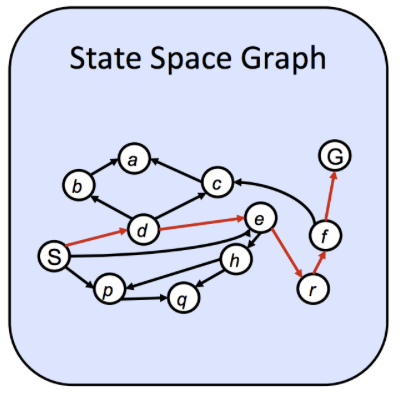

# 1 Agents
在Artificial Intelligence中, 最核心的问题, 或者说所有问题的本质, 都是在解决“就是如何创建一个 **理性智能体(rational agent)**”.

### 1.1 agent
Definition: agent是一个拥有明确的 **目标/偏好** 的实体(entity), 尝试做出一系列 **行动**, 并生成符合其期望的 **best/optimal** 的输出.

理性智能体存在在一个特定的 **环境 environment** 中, 用 **传感器 sensor** 去感知环境并用 **行为器 actuators** 去与环境互动.

智能体和环境共同组成了一个 **世界 world**

有两种智能体模型:
#### 1.1 reflex agent
一个反射型智能体只关注当前world的state做出决策, 并不关心自己的一系列行为会引发什么后续的后果. 

其决策的过程类似人体的“条件反射”, 只关注当前state是否符合某些“条件”
```
if ... then ...
else if ... then ...
...
```

#### 1.2 planning agent
一个规划型智能体会维护一个世界的模型, “模拟, 推测”自己行为所引发的后果, 从而选择“最优的行为.

planning agent在某种意义上, 更接近AI “intelligence” 的含义, 像人类一样, “提前思考” 自己最佳的行为.

### 1.2 PEAS
我们使用 **PEAS**(**P**erformance Measure, **E**nvironment, **A**ctuator and **S**ensor)去描述任务环境:
+ **Performance Measure** 用于描述agent的表现, agent的目的就是提升Performance Measure.
+ **Environment** 用于描述agent在哪里行动以及行动的影响.
+ **Actuators** 与 **Sensor** 是agent用于与ecvironment交互, 获取信息的途径.

不难看出, 我们对agent的设计很大程度上取决于agent所处的环境! 我们有如下方式去特征化环境的种类:

# 2. Search Problem
### 2.1 对环境的特征化分类
1. Observable
   1. 在 **完全可观测 (Fully Observable)** 环境中, agent可以获取环境状态的全部信息
   2. 在 **不完全可观测 (Partially Observable)** 环境中, agent不能获取全部的状态信息, 所以必须对world的state进行一个评估.
2. Deterministic?
   1. 在一个 **确定 Deterministic** 的环境中, 每一步动作的后果都是唯一确定的, 我们可以精确的预测未来
   2. 在一个 **随机 Stochastic** 的环境中, 每一步动作的后果由多种可能.
3. Dynamic?
   1. 在一个 **动态的 Dynamic** 环境中, 环境随时间变化, 需要快速响应.
   2. 在一个 **静态的 Static**	环境在智能体“思考”时不变化.
4. multi?
   1. 在一个 **多智能体 multi-agents** 的环境中, 多个智能体相互作用, 也因此agent必须考虑的其他agent可能做出的行为.
   2. 在一个 **单智能体 single-agents** 的环境中, agent只需要考虑自己.

对环境进行大体分类后, 我们还需要一种 **数学化** 的方式去表示agent所处的环境, 也即世界的 **"状态 state"**.
而agent **抵达我们需要的/"好的" state 的路径**, 就是我们所希望找到的, 换而言之, 我们把创造一个理性智能体转化成了 **Search Problems**.

一个搜寻问题, 通常由如下元素所描述:
+ **状态空间 State Space** :包含了世界里所有可能的state的集合.
+ **行动空间 Action Space**: 包含了世界中, agent所有可能的行为的集合.
+ **转移模型 Transition Model**: 描述了在某状态下, 执行某action后state的变化(会转移到哪个state).
+ **行动代价 Action Cost**: 描述了执行某行为所带来的成本.
+ **初始状态 Start State**: agent初始所处的状态.
+ **目标测试 Goal Test**: 用于判断当前状态时候满足目标条件.

一般来说, 解决 Search Problem 通常是:
1. 从 **Start State** 出发
2. 利用 **Action** **Transition Model** 不断生成新的状态
3. 直到达到满足 **Goal Test** 的状态.

从这个角度, 如何让agent能选择一条合适的path(也被称作 **plan** ), 便是我们的目标.

agent选择action的过程, 被我们预先决定的 **strategy** 所确定. 

### 2.2 World State VS Search State
+ 世界状态（World State）：包含环境中 **所有信息** 的完整快照。
例如：Pacman 的位置、方向、已走过的路径、吃过的豆子、总得分、时间流逝……
+ 搜索状态（Search State）：只包含解决当前任务所需的关键信息，是为提高效率而抽象出的状态

例子见课件
[UCB CS188 Lec1.3](https://inst.eecs.berkeley.edu/~cs188/textbook/search/state.html)

### 2.3.1 State Space Size
从图的角度来看待搜索问题，我们可能会想：能否预先存储所有可能的状态，并用熟悉的图论算法（如 BFS、Dijkstra）来求解 AI 问题？然而，这在实践中往往不可行。

在搜索树中，每个状态节点的子节点数量等于从该状态出发可执行的动作所能到达的**不同后继状态**的数量。若不进行状态去重或剪枝，随着搜索深度增加，树中的节点总数可能以指数速度增长（例如，分支因子为 $ b $，深度为 $ d $ 时，节点数可达 $ O(b^d) $），这种现象称为**组合爆炸**（combinatorial explosion）。因此，完整显式地构建整个状态空间通常是不现实的。

上述想法即 **状态空间图 State Space Graphs**:
+ 节点 = 每个唯一的搜索状态（只出现一次）。
+ 边 = 动作（如“向北走”），可能带权重（如移动代价）。
+ 特点：
  + 每个状态仅出现一次；
  + 反映了状态之间的真实可达关系；
  + 通常 **太大** 无法完整存储，但用于理论分析很有用

<!---->
  
而在实际应用中, 我们考虑另一种结构:

### 2.3.2 Search Trees
**搜索树（Search Tree）**
+ 节点 = 从初始状态到当前状态的完整路径（即使状态相同，路径不同就算不同节点）
+ 边 = 动作
+ 特点:
  + 同一个状态可能多次出现（因为可通过不同路径到达）
  + 树的大小 ≥ 状态空间图
  + 实际搜索算法（如 BFS、DFS、A*）是在隐式构建搜索树

看似由于有重复结点, 完整搜索树的大小应不小于状态空间图, 但是在我们生成搜索树的过程中, 是按照某种算法的安排, 只生成我们想要的子结点, 从而高效的抵达目标状态. 也即 **按需生成子状态**.

只有在我们需要拓展某子结点的时候, 才会去调用 `getNextState`, `getAction`, `getActionCost`方法获得可能的子结点.


<!---->


# 3.  Uninformed Search & Informed Search
详见 
[最短路算法](../Data%20Structure%28CS61B%29/Markdown/Graph%20Traversal%20%26%20Shortest%20path.md#最短路算法)

# 4. Local Search
在某些问题中(如数独), 我们并不关心到达目标状态的路径, 而是 **只关注最终的目标状态**. 这时我们就不需要寻找path了. 这类问题有如下特点:
+ 每个状态都是一个完整的 **complete solutions**
+ 我们的目标是找到 **满足要求/使目标函数最优** 的状态

我们可以把local search problem抽象成一个“登山”的问题: 假设我们在一座二维的山上, 你只能看到你周围的地形, 要找到最高的山峰, 有如下几种解决策略:

<!---->

## 4.1 Hill-Climbing(Steepest-Ascent) Search
登山算法本质上是一种贪心算法, 我们考虑每次都向当前位置附近 **上升最陡峭** 的邻居状态行进, **不保存路径搜索树** 只关注当前状态, 直至无法上升. 

显然, 登山算法很容易陷入 **局部最大值** 而非 **全局最大值**, 并且在平地时找不到前进的方向.

登山算法有如下变种, 用于改善其缺陷:
+ Stochastic hill-climbing: 随机选择上升方向, 避免陷入同一条路
+ Random sideways moves: 允许侧向移动, 避免陷入 **肩部**, 跳出平地
+ Random-restart hill-climbing: 随机选择多个起点, 防止陷入局部最大值

> 登山算法时 **梯度下降 gradient descent** 的反面


## 4.2 Simulated Annealing Search
模拟退火算法尝试结合 **随机移动** 和登山算法的 **贪心的思想**, 获得一个 **完备 complete** 并 **高效** 的搜索算法. 因此, 在模拟退火中, 我们允许向比当前状态 “低” 的状态前进.

在每个时间单元中, 算法会选择一个随机的移动, 如果是上升就会被接受, 如果是下降的, 就会被 **有概率的接受**. 这个概率被 **温度参数 temperature parameter** 所决定, 这个参数出事很高, 但是随着我们下降而“降温”.

> 如果退火算法降温 **足够慢**, 那么他几乎必然能找到全局最大值

## 4.3 Local Beam Search
局部束搜索同样也是“登山算法”的变种.
我们对于初始状态, 选取他最优的 $k$ 个邻居, 这 $k$ 个状态被称为 **束 Beam**. 之后我们不断维护束的所有邻居中最好的 $k$ 个作为新的束.

显然如果 $k$ 个状态都聚集在同一局部最优附近, 算法同样还是会失败.

同样的也有 **Stochastic beam search** 作为其变种改进方案.

## 4.4 遗传算法 Genetic Algorithm
遗传算法算法是local beam‘s的优化变种. 正如其名, 遗传算法收到了生物生殖与进化的启发.
TODO: 后续填补