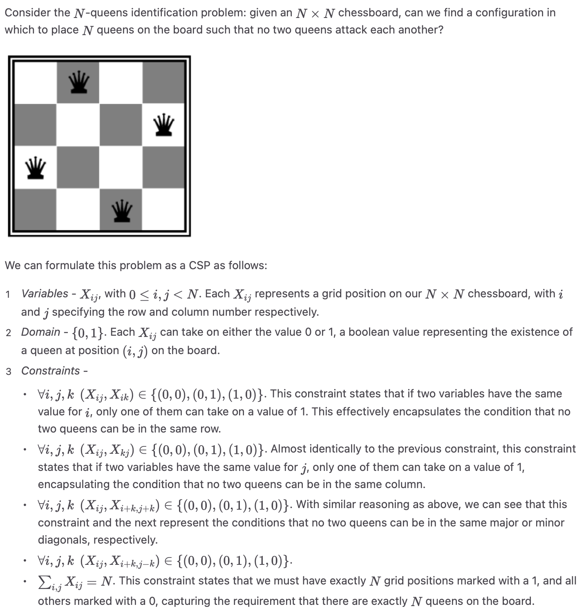
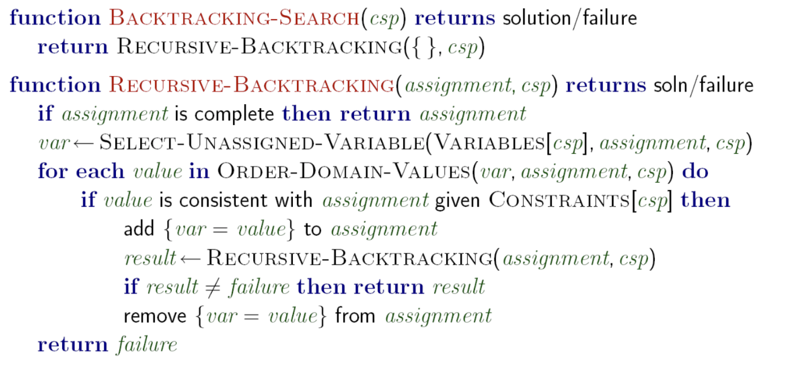

# 约束满足问题 CSP(Constraint Satisfaction Problem)

不同于Search Problem, 从初始状态出发, 经历一系列action, 从而达到goal state, CSP属于 **识别问题 Identification Problem**, 更专注于 **找到** 并 **辨别** 一个符合constrain的 **目标状态** . (PS. 感觉很像Lec1中提到的 Local Search)
CSP通常由如下三个因素定义:
1. Variables
2. Domain: 集合 $\{x_1, x_2,...x_d\}$ 表示一个变量 $X_i$ 的所有可能取值.
3. Constrains: 定义了变量的取值的限制.
> 我们这里仅考虑 **二元约束** , 也即两两变量之间存在直接的约束关系, 而不存在三者及以上的约束

以八皇后问题为例:

<!---->

由于CSP问题中, 变量的所有可能取值同样是指数级别的, 我们不能单纯的通过枚举+验证直接找到目标状态. 我们通常可以将CSP建模化作一个Search Problem.

1. 将 **states** 定义为 **部分赋值 partial assignment**, 也即暂时只赋值一部分变量, 另一部分留待后续操作
2. 将 **后继函数 successor function** 定义为一个新的变量(i.e. 先前未被赋值的变量)被 **赋值**.
3. 将 **goal test** 定义为所有变量均被 **赋值且满足constraints**

与传统的Search Problem 相比, CSP往往 **更加结构化**(由于有众多constrains), 也因此, 我们可以更好的利用 **启发式搜索**, 大幅减小时间复杂度, 在可行的时间找到solutions.

## 解决CSP的算法
### 1. 回溯算法 Backtracking Search

回溯算法是一种对 **DFS的剪枝优化**. 通常遵循如下两条原则.

1. 固定一个变量的 **次序**, 并在此后沿此顺序选择变量.
   1. 因为对变量的赋值是“可交换的”操作
   2. i.e. `a=1,b=2` $\Leftrightarrow$ `b=2,a=1`
2. 在为某变量赋值时, 只尝试不会违背constrains的变量, 如没有, 则退回前一变量(也就是DFS的回头)
伪代码:

<!---->

### 2. 滤波 Filtering
为提升我们搜索的效率, 我们可以通过 Filtering 操作, 提前 **剪枝** 未赋值变量的值域, 移除肯定违背constrains的取值, 从而减少 “state space”.

#### 2.1 Forward Checking
这是最简单也是最自然的剪枝思路. 每当我们赋值了一个新变量 $X$ 时, 检查所有与 $X$ 有约束联系的所有未赋值变量, 并剪去其domain內与 $X$ 冲突的值.

以地图染色问题为例, 当我们为某个国家染色以后, 立即检查所有与其相邻的国家,从他们颜色集合中删去这个颜色.

#### 2.2 Arc Consistency
我们考虑更 **一般化** 的Forward Checking算法: Arc Consistency
我们考虑将每个约束看作一对 **有向边** 被称作一对 **弧 Arc**, 也即:

对于变量 $X_i$ , $X_j$ , 他们之间的的约束是一组弧:
$$
(X_i, X_j), (X_j,X_i)
$$

我们的剪枝确保, 对于每个弧 $(X_i,X_j)$ , 对于$X_i$ 值域中的每个值 $u$ , 都 **至少存在** 一个属于$X_i$ 值域的值 $v$, 使得这组值 $(u, v)$ 满足约束条件. 若对于一个 $X_i$ 值域中的值 $u$ , 在 $X_j$ 的值域中找不到满足约束对应的值 $v$ , 则从 $X_i$ 的domain中删去 $u$.

##### implement
> 本实现为(**AC-3**, Arc Consistency Algorithm#3), 最 **简单易懂且典型** 的Arc Consistency的实现

在具体实现中, 我们通常使用队列来实现这个过程:
1. 初始化一个队列`Q`, 包含所有Arc
2. 弹出并删除队首元素(也即一条Arc) $(X_i,X_j)$
   1. 遍历 $X_i$ 的值域元素 $u$
   2. 对于 X_i$ 值域中的元素 $u$ , 如果在 $X_j$ 的值域中找不到满足约束的值, 则从 $$ 的值域中删除该值
   3. 若 $X_i$ 的值域发生更改, 则将所有指向 $X_i$ 的Arc: $(X_j, X_i)$重新入队.
3. 重复步骤2, 直到队列为空.

##### Time Complexity
通常来说, AC-3 算法的时间复杂度为 $O(ed^3)$ 
其中: $e$ 是有向弧的数量，$d$ 是最大值域大小
(我们假设验证每组值是否满足约束的时间为 $O(1)$ )

TODO: 其他Arc consistency实现

更一般化的 Arc Consistency算法是 **k-consistency**

#### 2.3. K-Consistency
对任意的 $k$ 个变量的集合, 我们确保其任意的大小为 $k-1$ 的子集若存在 **一致性 xonsistency** (i.e 存在一组值 $(x_1,x_2,\dots ,x_{k-1})$ , 使得这一组值不违背所有约束), 则其剩下的那个变量也必须存在一个值满足所有约束.

我们定义 **Strong k-consistency** 为满足如上定义的 $1,2,\dots,k$-consistency.

不难看出, Arc-Consistency 实际上是“2-consistency”.

### 3. 搜索次序
在搜索的过程中, 选取变量的顺序十分重要.

#### 3.1 最小剩余变量 Minimum Remaining Values (MRV)
我们优先选取 **具有最小有效值域** 的未赋值变量. 这种策略具有如下优点:
+ 这个变量 **最受限**, 更容易遍历完(无解, 然后回溯)
+ 提早结束有利于尽早 **发现冲突**, 减少遍历次数

#### 3.2 最受限元素 Least Constraining Value (LCV) 
对于变量赋值, 我们优先选取 **对其他未赋值变量影响最小** 的值.
在实现该策略是, 我们通常对每个候选值进行一次 **模拟赋值**, 检查其弧一致性/前向检查, 统计哪个值造成的删除的值更少, 使用.

需要额外计算, 但是能大幅减少后续回溯概率, 尤其在搜索早期非常有效

#### 3.3 利用CSP结构进行加速
我们可以通过CSP的结构, 进行优化搜索.
对于 **树结构CSP** (i.e. 不存在环), 我们可以通过优化, 将 $O(d^n)$ 的搜索时间复杂度优化到 $O(nd^2)$ .步骤如下:
1. 随机选取一个结点作为树的 **根节点**, 建立树结构
2. 将所有的无向边改为从父节点指向子结点的边
3. **线性化** 这棵树(实际上就是找到这个DAG中从刚才那个根节点出发的 **Topologically sort path** ), 得到 $X_1,X_2,...X_n$ , 其中 $X_1$ 是刚才选出的根节点, 所有的边指向都是左指向右

<!---->
4. 对所有的边(Arc)执行**后向检查**, 也即从队尾开始检查, 所有指向子结点的Arc, 都保证起点(祖先结点)的每个值都有子代的对应值
   1. i.e. 对任意节点 $X_i$ 确保所有 $(Parent(X_i), X_i)$ 的一致性
5. 开是 **前向赋值**, 也即从前向后赋值, 由于确保了一致性, 一次赋值即可通过.

#### 3.4 对于存在环的CSP
我们考虑 **割集条件化 cutset conditioning**, 即找到最小的约束图的割集, 使得移除这个割集以后, 获得的子图是一颗树.

当我们找到这个最小割集以后, 这个割集使用一般的CSP算法以指数级别时间复杂度解决, 剩余的树可以在多项式时间解决, 当包含环的割集数据规模很小时, 这个方法很有效.