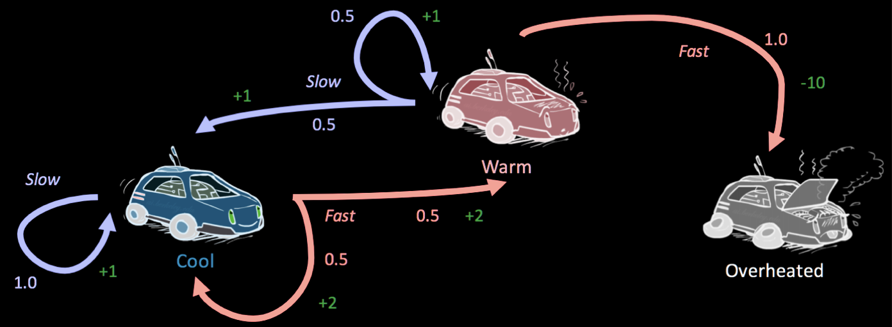

# 1 Markov Decision Processes
### 1.1 Definition
一个 MDP 由以下几个关键部分定义：

1. **state set 状态集合 $S$**  
   - 表示智能体可能处于的所有情况，例如“冷却”、“温热”、“过热”。
   - 和传统搜索问题中的状态类似。

2. **action set动作集合 $A$**  
   - 智能体在每个状态下可以采取的动作，如“慢速行驶”或“快速行驶”。

3. **起始状态（Start state）**  
   - 智能体开始时所处的状态。

4. **终止状态（Terminal states，可选）**  
   - 一旦进入这些状态，过程结束，不再有后续动作（例如“过热”后赛车报废）。

5. **折扣因子 $\gamma$（Discount factor，可选）**  
   - 用于衡量未来奖励的重要性（稍后详述）。

6. **转移函数 $T(s, a, s')$**  
   - 表示：在状态 $s$ 下执行动作 $a$ 后，转移到状态 $s'$ 的**概率**。  
   - 因为动作可能是**随机的（非确定性的）**，所以同一个动作可能导致多个不同的结果，每个结果都有对应的概率。  
   - 数学上：$T(s, a, s') = P(s' \mid s, a)$

7. **奖励函数 $R(s, a, s')$**  
   - 表示：从状态 $s$ 执行动作 $a$ 转移到 $s'$ 时，智能体获得的**即时奖励**。  
   - 奖励可以是正的（鼓励行为）或负的（惩罚行为）。  
   - 智能体的目标是**最大化整个轨迹（trajectory）上的总奖励**。

我们考虑以如下图的赛车问题为例:

<!---->
1. **state space**: $S=\{\text{cool, warm, overheated}\}$
2. **action set**: $A = \{\text{slow, fast}\}$
3. **transition function**: $T(s,a,s')$.   
   1. e.g. $T(cool, slow, cool) = 1$
4. **reward function**: R(s,a,s')
   1. e.g. $R(cool, slow, cool) = 1$

我们将agent在MDP中经过一个个timestep的运动轨迹(Trajectory)用如下方式表示:
$$
s_0 \xrightarrow{a_0} s_1 \xrightarrow{a_1} s_2 \xrightarrow{a_2} s_3 \xrightarrow{a_3} \cdots
$$
而我们所需要的就是让总效用最大, 也即所有奖励之和:
$$
U([s_0,a_0,s_1,a_1,\dots]) = R(s_0, a_0, s_1) + R(s_1, a_1, s_2) + R(s_2, a_2, s_3) + \cdots
$$

### 1.2 MDP to search tree(with Q-state)
我们考虑引入search tree, 解决MDP问题. 我们考虑一种特殊的树结点: **Q -states**, 也被称作**action state**:

对于状态 $s$, 他的每个action $a$后到达的结点被称作**Q-state**, Q-state $(s,a)$ 的所有子结点由state $s$ 经过 $a$ 后可能到达的successor $s'$ 组成. 如上述赛车例子可表示为下图:

<!---->

其中绿色结点即为Q-states.

Q-state表示“已经采取动作, 但未知结果”的状态, 类似**exceptmax中的chance node**, 并不是真实存在的一个状态, 而是方便我们建模所引入的一个定义.

e.g. 从 `cool` 状态选择 `fast` 动作，会进入一个 Q-状态 `(cool, fast)`，然后以 0.5 概率到 `cool`，0.5 到 `warm`。

### 1.3 Finite Horizons and Discounting
想象agent按照上述思路, 想要找到最大收益. 不难发现agent极有可能选择持续且平庸的收益
> e.g. 如果一直慢速行驶至无限远, 收益会趋近于无限.

我们有两种方法来解决这一问题:
#### 1.3.1 有限距离.
也即我们固定agent的最大步数, 也即限制这颗search tree的最大层数.
> 当最大步数被限制时, agent将会选择在有限步数内最高效取得收益的策略

#### 1.3.2 Discounting Factor
我们考虑使用一个**折扣因子 Discountign Factor** $\gamma\in(0,1)$
将总的效用更换为 **discounted utility**:
$$
\begin{aligned}
&U([s_0,a_0,s_1,a_1,\dots])\\
&=\gamma^0R(s_0, a_0, s_1) + \gamma^1R(s_1, a_1, s_2) + \gamma^2R(s_2, a_2, s_3) + \cdots\\
&= \sum_{t=0}^\infty \gamma^tR(s_t,a_t,s_{t+1}) \le\sum_{t=0}^\infty R_{max} =\frac{R_{max}}{1-\gamma}
\end{aligned}
$$
这里 $R_{max}$ 指最大的 $R$ .

### 1.4 Markovianess
MDP是基于 **Markov Property** 的假设, 也被称作 **Memoryless Property**, 即: 每个状态只与前一个状态相关, i.e. 每个状态 $s$ 的前一个状态 $s_{past}$ 与 $s$ 所有的successor $S_{future}$ 是独立/不相关的.

也即: 若 $S_t, A_t$ 是表示第 $t$ 步的状态和action的随机变量, 有:
$$
\begin{aligned}
T(s_t,a_t,s_{t+1}) &= P(S_{t+1} = s_{t+1} | S_{t} = s_{t},A_{t} = a_{t},S_{t-1} = s_{t-1},A_{t-1} = a_{t-1},S_{t-2} = s_{t-2},A_{t-2} = a_{t-2},\dots)\\
&=P(S_{t+1} = s_{t+1} | S_{t} = s_{t},A_{t} = a_{t})
\end{aligned}
$$

# 2. Solving MDP
### 2.1 policy 策略
在一个 **deterministic**, **non-adversarial** search问题中, 解决这个问题意味着找到一个最优的策略以抵达目标态.

我们定义: 一个 **策略(policy)** $\pi^*:S\rightarrow A$ 是一个 **funxtion**, 从每个state $s\in S$ 映射到一个特定的action $a\in A$ .

一个**显式策略(explicit policy)** $\pi$ 定义了一个**反射智能体(reflex agent)**, 这个agent在 $s$ 时会直接选择action $a=\pi(s)$ 作为下一个动作, 而不会考虑这个动作的后果.

### 2.2 The Bellman Equation
我们引入如下概念:
+ 状态 $s$ 的最优值:  $V^*(s)$ 
  + 表示在这个状态下, 在之后的所有successors中能获得的最大期望折扣奖励.
  + 也即通过一个“optimally-behaving agent”, 在状态 $s$ 下所能获得的折扣效用的期望
+ Q-state $(s,a)$ 的最优值:  $Q^*(s,a)$ 
  + Q-state $(s,a)$ 下, 通过一个最优表现agent所能获得的折扣效用的期望

我们借此定义得到了 **Bellman Equation**:
$$
V^*(s)=\max_a\sum_{s'}T(s,a,s')[R(s,a,s') + \gamma V^*(s')]
$$

而类似的, 我们定义optimal Q-value:
$$
Q^*(s,a) = \sum_{s'}T(s,a,s')[R(s,a,s') + \gamma V^*(s')]
$$

我们不难发现, optimal value即为其最大的Q-value, i.e.:
$$
V^*(s)=\max_a Q^*(s,a)
$$

而最优策略由如下公式计算得出:
$$
\pi^*(s) = \argmax_a(Q^*(s,a))
$$

这个公式意味着, 一个state的optimal value包含两部分:
1. 这次action的即时收益 $R(s,a,s')$ 
2. 其successor的累积折扣效用 $V^*(s')$

Bellman Equation本质上是一个**动态规划方程**, 具有递归结构. 每一个值的更新取决于其successor的值.

从另一个视角, 如果我们能找到一组 $V(s)$ , 使得每个 $V(s)$ 都满足Bellman Equation(i.e. $\forall s\in S, V(s)=V^*(s)$), 那么这组 $V(s)$ 就是最优的. i.e. Bellman Equation不仅是计算最优的方法, 也是判断最优的条件.

# 3. Value Interation
我们考虑如何实际算出这些 $V^*(s)$ . 我们引入 **有限时间步的价值函数**:
+ 我们记 $V_k(s)$ 表示从state $s$ 出发, 考虑 $k$ 步行动所能获得的 **最大期望累积折扣收益**
  + More precisely, in an infinite-horizon MDP, $V_k$ is the expected discounted utility by following the optimal policy for the first $k$ steps, and receives 0 reward thereafter.
  + Equivalently, $V_k$ results from unrolling the Bellman optimality equation $k$ steps into the future, assuming zero future value thereafter.
+ i.e. 在MDP的search tree上进行一个深度为 $2k$ 的 **expectimax**.
  + 每次action对应着一个state node和一个Q-state node

## 3.1 值迭代算法 Value Iteration
**值迭代**是一种**动态规划算法**, 通过不断延长允许的时间步数 (即增大 $k$), 逐步逼近最优价值函数 $V^*$:
算法步骤:
1. initialization:
   1. 对所有state $s\in S$,  设 $V_0(s) = 0$(显然)
2. 重复更新, 直到 **收敛**
   1. $V_{k+1}(s)\leftarrow\max_a\sum_{s'} T(s, a, s') \left[ R(s, a, s') + \gamma V_k(s') \right]$
   2. 收敛即为 $V_{k+1}\approx V_k$

To represent the update process more succinctly, we introduce **optimal Bellman Operator
最优贝尔曼算子**. Each time we apply Bellman operator we call it a **Bellman Backup**.

$$
V_{k+1} = BV_k
$$

The effect of $B$ is apply the above **max-sum** update to all state. Note that $B$ is a **Contraction Mapping 压缩映射**, the contraction factor is the discout $\gamma\in(0,1)$

> Contraction mapping $f:A\rightarrow B$ satisfy that: $\exist\gamma, \forall a,b\in A, \mid \mid f(a)-f(b)||\le \gamma||a-b||$

i.e. After each round of iteration, the maximum difference between $V_k$ and $V_{k+1}$ will at least shrink $\gamma$ times.

### 3.2 Policy Extraction 策略提取
For design an agent, what we really need is the **optimal policy $\pi^*$**. Obviously, when we get the optimal value $V^*(s)$ for all state, then we can get the optimal policy by **policy extraction**, i.e.
$$
\pi^*(s) = \arg\max_{a} Q^*(s, a) = \arg\max_{a} \sum_{s'} T(s, a, s') \left[ R(s, a, s') + \gamma V^*(s') \right]
$$

Note that if we only store all the $V^*(s)$, each time we extract the policy, we need to recompute the Q-values using the transition model(Equivalent perform an exceptimax with deep 1 on each state). This suggest that we can directly iterate Q-value!

### 3.3 Q-value iteration Q值迭代

Same as $V^*$ Iteration, we have the following state transition equation:
$$
Q_{k+1}(s,1)\leftarrow \sum_{s'}T(s,a,s')[R(s,a,s')+\gamma\max_{a'}Q_k*(s', a')]
$$

And obviously the optmal policy $\pi^*(s) = \argmax_aQ^*(s,a)$

# 4. Policy Iteration 策略迭代

There are two problem of **Value Iteration**:
1. Slow. Assume that there is $|S|$ states to compute, each state has $|A|$ actions, each state has at most $|S|$ successor state, then the total time complexity is:
   $$
   O(|S|^2|A|)
   $$
2. Excessive computation. Policy often converges before value converges.

So to more efficiently train agent, we can directly iterate policy!

### 4.1 The process of Policy Iteration
Policy Iteration follows the alternating cycle mode: **"Evaluate-Improve"**
> i.e. Fix a policy $\rightarrow$ Evaluate its reward precosely $\rightarrow$ Improve the policy $\rightarrow$ Repeat above process until no futher improvement
 
1. Initialize a policy $\pi_0$
   1. Can be any policy, even always perform simple action
   2. The policy the closer to optimal policy, the faster it converges.
2. Repeat the following two stpe until no futher improvement can be made.
   1. Policy Evaluation:
      1. Compute the value function $V^{\pi_i}(s) of the policy $\pi_i$ (i.e. What's the expect reward is we follow $\pi_i$ from state $s$?)
      2. $$V^{\pi_i}(s)=\sum_{s'}T(s,\pi_i(s),s')[R(s,\pi_i(s),s')+\gamma V^{\pi_i}(s')]$$
      3. In fact, because the policy is fixed, it's just a **Linear system of equations** that can be directly solved(by Gaussian Elimination). It also can be solved by iteration, but is quite slower than solve linear system of equations.
   2. Policy improvement.
      1. For each $s$, reselect the actions(policy) **which seems to be the best at present**.
      2. Essentially its **Policy Extraction**. The new policy is definitely no worse than (usually better than) the old policy.
   3. Stop condition: $\pi_{i+1}=\pi_i$