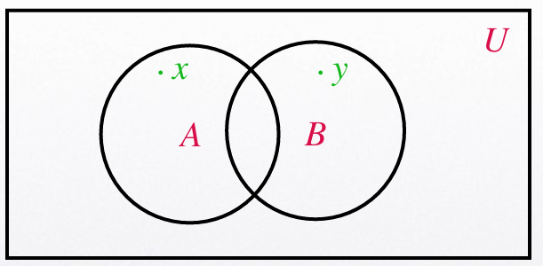

# Lec6 Set Theory

Created: 2025年3月7日 18:46
Class: COMP2121

# Set

## Definition:

A Set is an unordered collection of distinct objects, called elements or members
of the set.

a ∈ A denotes that a is an element of set A.

a ∉ A denotes that a is not an element of set A.

## Set Notation:

### Roster Method

A notation to describe a set by listing all elements of the set between braces.

e.g.

$$
\{114, 514, abc\}
$$

### Set Builder Notation:

An alternative method to describe a set in terms of the properties that the elements of the set must have.

e.g.

$$
\{n|n=2k+1, k\in Z^+\}
$$

### Some Special Sets:

$N$: Natural numbers

$Z$: Integers

$Q$: Rational numbers

$R$: Real numbers

$C$: Complex numbers

$∅$ or $\{\}$: Empty Set or the Null Set

### Venn Diagrams

Sets can be represented graphically using Venn Diagrams. In a Venn Diagram, the Universal Set U is represented by a rectangle. Inside the Universal Set, circles or ellipses are used to represent individual sets. Individual elements of the sets are represented by points.

## Subsets

$A$ set $A$ is a Subset of $B$ if and only if every element of $A$ is also an element of $B$.
Set $B$ is then said to be a **Superset** of set $A$.
The notation $A ⊆ B$ is used to indicate that $A$ is a **subset** of $B$.
$A ⊆B$ if and only if $∀x(x ∈ A → (x ∈ B))$

## Cardinality of a Set

Let S be a set. If there are exactly n distinct elements in S, we say that S is a finite set and that n is the cardinality of S.
The cardinality of a set S is denoted by |S|.

## Power Sets

Given a set $S$, the **Power Set** of $S$ is the set of all subsets of the set $S$.
The power set of $S$ is denoted by $𝒫(S)$.

## Cartesian Product of Sets

The ordered n −tuple $(a_1,a_2,…,a_n)$ is the ordered collection with $a_1$ being the first element, $a_2$ being the second element,…, an being the n-th element.

Ordered n −tuples are equal if and only if each corresponding pair of elements is equal.

Let $A$ and $B$ be sets. The **Cartesian Product** of $A$ and $B$ denoted by $A × B$, is the set of all ordered pairs $(a, b)$ where $a ∈ A$ and $b ∈ B$. $A×B=\{(a, b)|(a ∈ A)∧(b ∈ B)\}$.

- e.g.
    
    The Cartesian Product of A = {0,1} and B = {1,2,3} is the set
    A×B={(0,1), (0,2), (0,3), (1,1), (1,2), (1,3)}.
    

The Cartesian Product of the sets $A_1, A_2,…, A_n$ denoted by $A_1 × A_2 × … × A_n$, is the set of ordered n − tuples $(a_1,a_2,…,a_n)$ where ai ∈ Ai for i = 1,2,…,n. 

That is, $A_1 × A_2 × …× A_n = \{(a_1,a_2,…,a_n)|a_1 ∈ A_1∧a_2 ∈ A_2∧…∧a_n ∈ A_n\}$.

## Truth Set

Given a predicate $P$ and a domain $D$, the Truth Set of P is the set of elements  $x ∈ D$ for which $P(x)$ is true. The Truth Set of $P(x)$ is denoted by $\{x ∈ D|P(x)\}$

## Union of Sets

Let $A$ and $B$ be sets. The Union of the sets $A$ and $B$, denoted by $A∪B$, is the set that contains those
elements that are either in A or in B, or in both.
That is, $A ∪ B = \{x|(x ∈ A)∨(x ∈ B)\}$

The blue shaded area is the set $A ∪ B$.

## Intersection of Sets

Let A and B be sets. The Intersection of the sets A and B, denoted by A ∩ B, is the set that contains those elements that are in both A and B. A∩B={x|x ∈ A∧x ∈B}

### The Principle of Inclusion-Exclusion states that: $|A ∪ B| = |A| + |B| − |A ∩ B|$.

## Difference of Sets

Let A and B be sets. The Difference of A and B, denoted by A −B, or A∖B is the set that contains those elements that are in A but not in B. A − B is also called the complement of B with respect to A.
That is, $A − B = \{x|(x ∈ A)∧ (x ∉ B)\}$

## Complement of Sets

Let U be the Universal Set. The Complement of a set A denoted by with respect to U. In other words, A= U −A.
Or alternatively we may write A, is the complement of A, A ={x|x ∈ U∧x ∉ A}

# Set Identities

## Set Identities

## Membership Tables

In a membership table, we consider each combination of the basic sets that an element can belong to. We indicate membership in the set by a 1 and use a 0 to indicate that an element is not in the set.

e.g. 

## Generalised Unions

The Union of a collection of sets is the set that contains those elements that are members of at least one set in the collection.
We use the notation $A_1 ∪ A_2 ∪…∪A_n =\bigcup^n_{i=1} A_i$ to denote the union of $A_1, A_2,…, A_n$.
Note that by the Associative Law, this notation is clear and we do not have to use parentheses.

## Generalised Intersections

The Intersection of a collection of sets is the set that contains those elements that are members of all the sets in the collection.
We use the notation $A_1 ∩ A_2 ∩…∩ A_n =\bigcap ^n_{i=1}A_i$ to denote the intersection of $A_1, A_2,…, A_n$