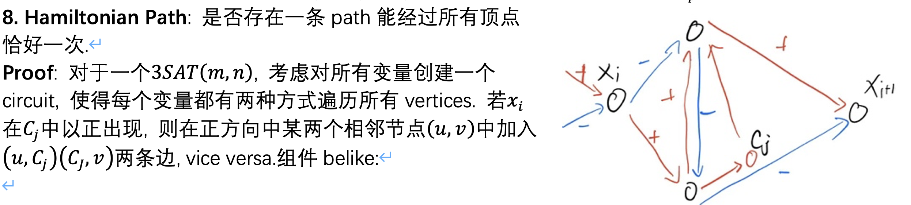

# NP-Completeness

# 1. Definition
+ **Polynomial Time (P)**: 
  + The **decision problem** that can be solved in polynomial time by a **deterministic Turing machine (DTM)** is called **P**.
  + **Decision Problem**: A problem with a yes/no answer.
  + **Deterministic Turing Machine (DTM)**: 
    + A theoretical model of computation that can simulate any algorithm's logic in a step-by-step manner.
    + Each time the next operation of DTM is **determined** by its current state and the symbol it reads from the tape.
    + The computer that we use in real life is also a DTM.
+ **Nondeterministic Polynomial Time (NP)**:
  + The **decision problem** that can be verified in polynomial time by a DTM is called **NP**.
  + More precisely, if we can verify a solution to a problem in polynomial time, then the problem is in NP.
  + e.g. **Subset Sum Problem**: Given a set of integers, is there a non-empty subset that sums to zero?
+ **NP-Complete**:
  + A problem is **NP-Complete** if it is in NP and every problem in NP can be reduced to it in polynomial time. A problem  $A$ is NP-Complete IFF:
    1. $A\in NP$. 
    2. Every problem in NP can be reduced to $A$ in polynomial time.
+ The containment relationship between P, NP, and NP-Complete is as follows:
    $$
    P \subseteq NP \subseteq NP\text{-Complete}
    $$
+ **NP-Hard**: 
  + The problem that is at least as hard as the hardest problems in NP. A problem is NP-Hard if every problem in NP can be reduced to it in polynomial time, but it does not have to be in NP itself.
  + NP-Complete is actually the intersection of NP and NP-Hard. 

# 2. Proving NP-Completeness
How to prove that a problem is NP-Complete? By the definition, it seems that we need to show that every problem in NP can be reduced to it in polynomial time, which is very difficult. However, we can use the following approach:
1. Prove that the problem is in NP.
   1. e.g. Give a polynomial-time algorithm to verify a solution to the problem.
2. Find a known NP-Complete problem and reduce it to the problem in polynomial time.
   1. If a problem $A$ can be reduced to another problem $B$ in polynomial time, we denote it as $A \leq_p B$.
   2. Reduce means that we can transform an instance of problem $A$ to an instance of problem $B$ in polynomial time, such that the answer to the instance of problem $A$ is yes if and only if the answer to the instance of problem $B$ is yes.

# 3. NP-Complete Problems
+ **SAT (Satisfiability Problem)**:
   + Given a **Boolean formula**(Expressions that structured by variables and logical operators), is there an assignment of truth values to the variables that makes the formula true?
   + The first problem that was proven to be NP-Complete.
   + Proof of NP-Completeness(Cook-Levin Theorem):
     1. Each process of verifying a solution to a problem in NP can be represented as a Boolean formula.
     2. Therefore, if we can be reduced to SAT in polynomial time.
     3. Q.E.D.
+ *Conjunctive Normal Form (CNF)*: 
  + A Boolean formula is in CNF if it is a conjunction of disjunctions of literals.
  + The more information about CNF can be found in the [SAT](../Finished/UCB%20CS188/10.%20Logic.md) page.
  + Proof:
    + Each boolean formula can be converted to an equivalent CNF formula in polynomial time.
    + Hence we have $SAT \leq_p CNF-SAT$.
+ **3-SAT**:
   + A special case of SAT where each clause has exactly three literals.
   + Proof:
     + We can convert any CNF formula to an equivalent 3-CNF formula in polynomial time.
     + Hence we have $CNF-SAT \leq_p 3-SAT$
+ **Clique Problem**:
   + Given a graph $G$ and an integer $k$, does $G$ contain a **clique** of size at least $k$?
   + A **clique** is a subset of vertices such that every two distinct vertices are adjacent.
     + i.e. A complete subgraph of $G$.
   + Proof:
     + We can reduce 3-SAT to the Clique Problem by:
       1. Suppose the 3-SAT formula is $F$ with $m$ clauses and $n$ variables.
       2. We structure a graph $G$ with $3m$ vertices, each vertices corresponds to a literal in the 3-SAT formula.
       3. We connect two vertices if and only if they correspond to literals that are not in the same clause and are not negations of each other.
       4. If there is a clique of size $m$ in $G$, then we can assign the corresponding literals to be true, which satisfies the 3-SAT formula. Conversely, if there is a satisfying assignment for the 3-SAT formula, then we can find a clique of size $m$ in $G$ by selecting the vertices corresponding to the literals that are assigned to be true.
       5. Therefore, we have $3-SAT \leq_p Clique$.
+ **Vertex Cover Problem**:
   + Given a graph $G$ and an integer $k$, does $G$ contain a **vertex cover** of size at most $k$?
   + A **vertex cover** is a subset of vertices such that every edge in the graph is incident to at least one vertex in the subset.
   + Proof:
     + We can reduce the Clique Problem to the Vertex Cover Problem by:
       1. Suppose we have a graph $G$ and an integer $k$ for the Clique Problem.
       2. We construct a new graph $G'$ by taking the complement of $G$, which means that we connect two vertices in $G'$ if and only if they are not connected in $G$.
       3. We set the integer for the Vertex Cover Problem to be $|V(G)| - k$, where $|V(G)|$ is the number of vertices in $G$.
       4. If there is a clique of size at least $k$ in $G$, then there is a vertex cover of size at most $|V(G)| - k$ in $G'$. Conversely, if there is a vertex cover of size at most $|V(G)| - k$ in $G'$, then there is a clique of size at least $k$ in $G$.
       5. Therefore, we have $Clique \leq_p Vertex\ Cover$.
+ **Subset Sum Problem**:
   + Given a set of integers, is there a non-empty subset that sums to a given integer $a$?
   + Proof:
     + We can reduce the 3-SAT problem to the Subset Sum Problem by:
       1. Suppose we have a 3-SAT formula $F$ with $m$ clauses and $n$ variables.
       2. We construct a set of integers as follows:
          + For each variable $x_i$, we create two integers: $t_i = f_i = 10^i$.
          + For each clause $C_j$, for each literal $x_k$ in the clause:
            + We add $10^{n+j}$ to $t_k$ if the literal is positive, and we add $10^{n+j}$ to $f_k$ if the literal is negative.
            + Create two $10^{n+j}$ for each clause $C_j$. 
       3. We set the target sum to be $a = 33...311...1$ where we have $m$ 3's and $n$ 1's.
       4. If there is a satisfying assignment for the 3-SAT formula, then there is a non-empty subset of the integers that sums to $a$. Conversely, if there is a non-empty subset of the integers that sums to $a$, then there is a satisfying assignment for the 3-SAT formula.
       5. Therefore, we have $3-SAT \leq_p Subset\ Sum$.
+ **Equal-sum Partition Problem**:
   + Given a set of integers, can it be partitioned into two subsets such that the sum of the integers in each subset is equal?
   + Proof:
     + We can reduce the Subset Sum Problem to the Equal-sum Partition Problem by:
       1. Suppose we have a set of integers for the Subset Sum Problem.
       2. We calculate the total sum of the integers in the set, denoted as $S$.
       3. If $S$ is odd, then we cannot partition the set into two subsets with equal sum, so we return false.
       4. If $S$ is even, we set the target sum for the Subset Sum Problem to be $S/2$.
       5. If there is a non-empty subset of the integers that sums to $S/2$, then we can partition the set into two subsets with equal sum. Conversely, if there is a partition of the set into two subsets with equal sum, then there is a non-empty subset of the integers that sums to $S/2$.
       6. Therefore, we have $Subset\ Sum \leq_p Equal\text{-}sum\ Partition$.
+ **General Knapsack Problem**:
   + Given a set of items, each with a weight and a value, and a maximum weight capacity, is there a subset of items that can be included in the knapsack such that the total weight does not exceed the capacity and the total value is at least a given target value?
   + Proof:
     + We can reduce the Subset Sum Problem to the General Knapsack Problem by:
       1. Suppose we have a set of integers for the Subset Sum Problem.
       2. We create an item for each integer, where the weight and value of the item are both equal to the integer.
       3. We set the maximum weight capacity to be the target sum for the Subset Sum Problem.
       4. We set the target value to be the same as the target sum for the Subset Sum Problem.
       5. If there is a non-empty subset of the integers that sums to the target sum, then there is a subset of items that can be included in the knapsack such that the total weight does not exceed the capacity and the total value is at least the target value. Conversely, if there is a subset of items that can be included in the knapsack such that the total weight does not exceed the capacity and the total value is at least the target value, then there is a non-empty subset of the integers that sums to the target sum.
       6. Therefore, we have $Subset\ Sum \leq_p General\ Knapsack$.
+ **Hamiltonian Path Problem**:
   + Given a graph $G$, does there exist a path that visits each vertex exactly once?
   + Proof:
     
+ **Directed Hamiltonian Cycle Problem**:
   + Given a directed graph $G$, does there exist a cycle that visits each vertex exactly once?
   + Proof:
     + We can reduce the Hamiltonian Path Problem to the Directed Hamiltonian Cycle Problem by:
       1. Suppose we have a directed graph $G$ for the Hamiltonian Path Problem.
       2. We construct a new directed graph $G'$ by adding a new vertex and connecting it to all vertices in $G$.
       3. If there is a Hamiltonian path in $G$ that visits each vertex exactly once, then there is a Hamiltonian cycle in $G'$ that visits each vertex exactly once. Conversely, if there is a Hamiltonian cycle in $G'$ that visits each vertex exactly once, then there is a Hamiltonian path in $G$ that visits each vertex exactly once.
       4. Therefore, we have $Hamiltonian\ Path \leq_p Directed\ Hamiltonian\ Cycle$. 
+ **Undirected Hamiltonian Cycle Problem**:
   + Given an undirected graph $G$, does there exist a cycle that visits each vertex exactly once?
   + Proof:
     + We can reduce the Directed Hamiltonian Cycle Problem to the Undirected Hamiltonian Cycle Problem by:
       1. Suppose we have a directed graph $G$ for the Directed Hamiltonian Cycle Problem.
       2. We construct a new undirected graph $G'$ by replacing each directed edge ¥ in $G$ with two undirected edges $(u, mid_{uv})$ and $(mid_{uv}, v)$, where $mid_{uv}$ is a new vertex.
       3. If there is a Hamiltonian cycle in $G$ that visits each vertex exactly once, then there is a Hamiltonian cycle in $G'$ that visits each vertex exactly once. Conversely, if there is a Hamiltonian cycle in $G'$ that visits each vertex exactly once, then there is a Hamiltonian cycle in $G$ that visits each vertex exactly once.
       4. Therefore, we have $Directed\ Hamiltonian\ Cycle \leq_p Undirected\ Hamiltonian\ Cycle$.
+ **Traveling Salesman Problem (TSP)**:
   + Given a list of cities and the distances between each pair of cities, is there a tour that visits each city exactly once and returns to the starting city with a total distance less than or equal to a given target distance?
   + Proof:
     + We can reduce the Hamiltonian Cycle Problem to the Traveling Salesman Problem by:
       1. Suppose we have an undirected graph $G$ for the Hamiltonian Cycle Problem.
       2. We construct a new complete graph $G'$ where each vertex corresponds to a vertex in $G$ and the weight of the edge between two vertices is 1 if there is an edge between the corresponding vertices in $G$, and 2 otherwise.
       3. We set the target distance to be equal to the number of vertices in $G$.
       4. If there is a Hamiltonian cycle in $G$ that visits each vertex exactly once, then there is a tour in $G'$ that visits each vertex exactly once and returns to the starting vertex with a total distance less than or equal to the target distance. Conversely, if there is a tour in $G'$ that visits each vertex exactly once and returns to the starting vertex with a total distance less than or equal to the target distance, then there is a Hamiltonian cycle in $G$ that visits each vertex exactly once.
       5. Therefore, we have $Undirected\ Hamiltonian\ Cycle \leq_p TSP$.
+ **Longest Path Problem**:
   + Given a graph $G$ and an integer $k$, does there exist a simple path in $G$ that has length at least $k$?
   + Proof:
     + We can reduce the Hamiltonian Path Problem to the Longest Path Problem by:
       1. Suppose we have a graph $G$ and an integer $k$ for the Hamiltonian Path Problem.
       2. We set the integer for the Longest Path Problem to be equal to the number of vertices in $G$ minus 1.
       3. If there is a Hamiltonian path in $G$ that visits each vertex exactly once, then there is a simple path in $G$ that has length at least $k$. Conversely, if there is a simple path in $G$ that has length at least $k$, then there is a Hamiltonian path in $G$ that visits each vertex exactly once.
       4. Therefore, we have $Hamiltonian\ Path \leq_p Longest\ Path$.