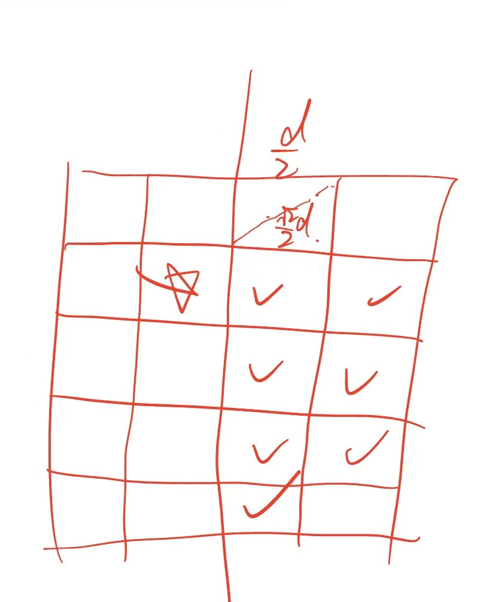

# 1.Divide and conquer

## 1.1. Master Theorem
$$
T(n) = aT(\frac{n}{b}) + f(n)
$$
- $a$: the number of subproblems
- $b$: the factor by which the subproblem size is reduced
- $f(n)$: the cost of the work done outside the recursive calls
$$
T(n) = \begin{cases}
\Theta(n^{\log_b a}) & \text{if } f(n) = O(n^{\log_b a - \epsilon}) \text{ for some } \epsilon > 0 \\
\Theta(n^{\log_b a} \log^{k+1} n) & \text{if } f(n) = \Theta(n^{\log_b a} \log^k n) \text{ for some } k \geq 0 \\
\Theta(f(n)) & \text{if } f(n) = \Omega(n^{\log_b a + \epsilon}) \text{ for some } \epsilon > 0 \text{ and } af(\frac{n}{b}) \leq cf(n) \text{ for some } c < 1 \text{ and sufficiently large } n
\end{cases}
$$

## 1.2. Merge Sort
+ **Divide**: Split the array into two halves
+ **Conquer**: Recursively sort each half
+ **Combine**: Merge the two sorted halves
+ $$T(n) = 2T(\frac{n}{2}) + O(n) = O(n \log n)$$

## 1.3  Select k-th
+ **Divide**:
  + Choose a pivot $p$ element from the array
  + Partition the array into three parts: 
    + Elements less than the pivot $L$
    + Elements equal to the pivot $M$
    + Elements greater than the pivot $R$
+ **Conquer**:
  + If $k \leq |L|$, then the k-th smallest element is in $L$, so we recursively select the k-th smallest element in $L$.
  + If $k > |L| + |R|$, then the k-th smallest element is in $M$, so we recursively select the (k - |L| - |R|)-th smallest element in $M$.
  + If $|L| < k \leq |L| + |R|$, then the k-th smallest element is the pivot $p$.
+ **Combine**: No need to combine as we are directly returning the result from the recursive calls.
+ Suppose the pivot is at least $\geq$ and $\leq \lambda$ elements ($\lambda\in (0, 0.5)$), then we have:
  + $$T(n) = T(a\cdot n) + O(n) = O(n)$$
+ How to find a g**ood pivot**?
  1. Randomly select a pivot: Average case is O(n), but worst case can be O(n^2) if the pivot is consistently the smallest or largest element.
  2. Median of Medians: The pivot is garanteed to bigger that 30% of the elements and smaller than 30% of the elements, so the worst case is O(n):
     1. Divide the array into groups of 5 elements (the last group may have less than 5 elements).
     2. Find the median of each group (which can be done in O(1) time since the group size is constant).
     3. Collect the medians into a new array and recursively find the median of this new array, which will be the pivot.

## 1.4 Closest Pair of points
+ **Divide**: Split the points into two halves by a vertical line, which approximately divides the points into two equal sets.
+ **Conquer**: Recursively find the closest pair of points in each half, resulting in two distances: $d_L$ and $d_R$.
+ **Combine**:
  + Only need to consider points within a distance of $d_m = \min(d_L, d_R)$ from the dividing line.
    + i.e. $x\in [mid - d_m, mid + d_m]$
  + Sort these points by their y-coordinates.
  + For each point in this sorted list, only need to check the next 7 points whose y-coordinates are smaller that the current point's y-coordinate.
    + For any two indices $i$ and $j$ in the sorted list, if $j > i + 7$, then the distance between points $i$ and $j$ is greater than $\min(d_L, d_R)$, so we can stop checking further points for index $i$.
    + 
+ $$T(n) = 2T(\frac{n}{2}) + O(n) = O(n \log n)$$

## 1.5 Integer Multiplication
+ Karatsuba's algorithm
+ **Divide**: Split each number into two halves. For example, if we have two **n-digit(binary)** numbers $X$ and $Y$, we can represent them as:
  + $X = a \cdot 2^{m} + b$
  + $Y = c \cdot 2^{m} + d$      
  + Where $m = \lceil n/2 \rceil$, so that $a,b,c,d\leq 2^m$
+ **Conquer**:
  + $$XY = ac \cdot 2^{2m} + (ad + bc) \cdot 2^{m} + bd = ac \cdot 2^{2m} + ((a+b)(c+d) - ac - bd) \cdot 2^{m} + bd$$
  + This requires three multiplications of n/2-digit numbers: $ac$, $bd$, and $(a+b)(c+d)$.
+ **Combine**: Use the results of the three multiplications to compute the final product.
+ $$T(n) = 3T(\frac{n}{2}) + O(n) = O(n^{\log_2 3}) \approx O(n^{1.585})$$

## 1.6 Matrix Multiplication
+ Strassen's algorithm
+ **Divide**: 
  + Split each matrix into four submatrices.
  + $$A = \begin{bmatrix}A_{11} & A_{12} \\ A_{21} & A_{22} \end{bmatrix}, B = \begin{bmatrix}B_{11} & B_{12} \\ B_{21} & B_{22} \end{bmatrix}$$
+ **Conquer**:
  + Compute the following seven products:
    1. $M_1 = (A_{11} + A_{22})(B_{11} + B_{22})$
    2. $M_2 = (A_{21} + A_{22})B_{11}$
    3. $M_3 = A_{11}(B_{12} - B_{22})$
    4. $M_4 = A_{22}(B_{21} - B_{11})$
    5. $M_5 = (A_{11} + A_{12})B_{22}$
    6. $M_6 = (A_{21} - A_{11})(B_{11} + B_{12})$
    7. $M_7 = (A_{12} - A_{22})(B_{21} + B_{22})$
  + These products can be computed using recursive calls to the same algorithm.
+ **Combine**: Use the results of the seven products to compute the final product matrix $C$:
  + $C_{11} = M_1 + M_4 - M_5 + M_7$
  + $C_{12} = M_3 + M_5$
  + $C_{21} = M_2 + M_4$
  + $C_{22} = M_1 - M_2 + M_3 + M_6$
+ $$T(n) = 7T(\frac{n}{2}) + O(n^2) = O(n^{\log_2 7}) \approx O(n^{2.81})$$
+ The newest algorithm for matrix multiplication has a time complexity of $O(n^{2.3728596})$.

## 1.7 Multiplication of polynomials
+ We have 2 steps:
  1. Evaluate the $deg(pq)+1$ distinct values of the resulting polynomial $pq$.
     1. Which is actually FFT.
  2. Use inverse to compute the coefficients of $pq$ from the values obtained in step 1.
### 1. Value computation:
+ Input: Two polynomials $p(x)$ and $q(x)$ of degree at most $n-1$, where $n$ is a power of 2.
+ Output: $2n$ pairs of values of the resulting polynomial $pq$: $(r, (pq)(r))$
+ **Divide**:
  + Split each polynomial into two halves.
  + $$p(x) = p_{odd}(x^2)+ x\cdot p_{even}(x^2), q(x) = q_{odd}(x^2)+ x\cdot q_{even}(x^2)$$
  + So that: $(pq)(x) = p_{odd}(x^2)q_{odd}(x^2) + x \cdot(p_{odd}(x^2)q_{even}(x^2) + p_{even}(x^2)q_{odd}(x^2)) + x^2 \cdot p_{even}(x^2)q_{even}(x^2)$
  + We only need to compute: $p_{odd}(x^2), p_{even}(x^2), q_{odd}(x^2), q_{even}(x^2)$. 
  + Note that the n-root of unity $\omega$ satisfies $(\omega_n^k)^2 = \omega_n^{2k} = \omega_{n/2}^k$.
    + i.e. $\omega_n^{2k} = \omega_{n/2}^k = \omega_n^{2(k+n/2)}$
  + So we choose $\omega_{2n}^k$ for $k = 0, 1, \ldots, n-1$ as the $2n$ distinct values to evaluate $pq$.
+ **Conquer**:
  + Recursively compute $p_{odd}(\omega_{n}^k), p_{even}(\omega_{n}^k), q_{odd}(\omega_{n}^k), q_{even}(\omega_{n}^k)$ for $k = 0, 1, \ldots, n - 1$.
+ **Combine**: 
  + Just compute the values of $pq$ at $\omega_{2n}^k$ for $k = 0, 1, \ldots, 2n - 1$ using the results from the recursive calls.
+ Compute $2n$ values of degree $2n$ ($T(n)$) -> Compute $4n$ values of degree $n$ ($2T(n/2)$).
+ $$T(n) = 2T(\frac{n}{2}) + O(n) = O(n\log n)$$
  
## 1.8 FFT
+ Input: 
  + A polynomial $p(x) = a_0 + a_1 x + a_2 x^2 + \ldots + a_{n-1} x^{n-1}$ of degree at most $n-1$.
  + An integer $n$ which is a power of 2.
+ Output: 
  + The values of the polynomial at the n-th roots of unity.
  + i.e. $y_k = p(\omega_n^k) = \sum_{j=0}^{n-1} a_j (\omega_n^k)^j$ for $k = 0, 1, \ldots, n-1$.
+ **Divide**:
  + Split the polynomial into two halves.
  + $$p(x) = p_{odd}(x^2)+ x\cdot p_{even}(x^2)$$
+ **Conquer**:
  + Recursively compute $p_{odd}(\omega_{n/2}^k)$ and $p_{even}(\omega_{n/2}^k)$ for $k = 0, 1, \ldots, n/2 - 1$.
+ **Combine**: No need to combine as we are directly returning the results from the recursive calls.
+ $$T(n) = 2T(\frac{n}{2}) + O(n) = O(n \log n)$$

+ Note that the FFT is actually transform the $n$ coefficients of the polynomial into $n$ values at the n-th roots of unity.
+ i.e. 
    $$
    \begin{bmatrix}y_0 \\ y_1 \\ \vdots \\ y_{n-1} \end{bmatrix}
    =
    M_{FFT}
    \begin{bmatrix}a_0 \\ a_1 \\ a_2 \\ \vdots \\ a_{n-1} \end{bmatrix}
    = 
    \begin{bmatrix}1 & 1 & 1 & \vdots & 1 \\ 1 & \omega_n & \omega_n^2 & \vdots & \omega_n^{n-1} \\ 1 & \omega_n^2 & \omega_n^4 & \vdots & \omega_n^{2(n-1)} \\ \vdots & \vdots & \vdots & \ddots & \vdots \\ 1 & \omega_n^{n-1} & \omega_n^{2(n-1)} & \vdots & \omega_n^{(n-1)(n-1)} \end{bmatrix}
    \begin{bmatrix}a_0 \\ a_1 \\ a_2 \\ \vdots \\ a_{n-1} \end{bmatrix}
    $$
+ So the inverse FFT is actually the inverse of the above matrix multiplication, which can be computed in O(n) time using the same divide and conquer approach as the FFT, but with $\omega_n$ replaced by $\omega_n^{-1}$.
$$
M_{FFT}^{-1} 
= \frac{1}{n} M_{FFT}^* 
= \frac{1}{n} \begin{bmatrix}1 & 1 & 1 & \vdots & 1 \\ 1 & \omega_n^{-1} & \omega_n^{-2} & \vdots & \omega_n^{-(n-1)} \\ 1 & \omega_n^{-2} & \omega_n^{-4} & \vdots & \omega_n^{-2(n-1)} \\ \vdots & \vdots & \vdots & \ddots & \vdots \\ 1 & \omega_n^{-(n-1)} & \omega_n^{-2(n-1)} & \vdots & \omega_n^{-(n-1)(n-1)} \end{bmatrix}
$$
  
# 2. Dynamic programming
## 2.1 Knapsack problem
### Problem:
$n$ items, each item has a weight $w_i$ and a value $v_i$. A knapsack with capacity $W$. Find the maximum total value of items that can be put in the knapsack without exceeding the capacity.
### Algorithms:
+ Greedy: Don't promise optimization.
+ Brute-force: $O(2^n)$ time complexity.
+ Dynamic programming: $O(nW)$ time complexity.
  + Define $dp[i][j]$ as the maximum total value of items that can be put in a knapsack with capacity $j$ using the first $i$ items.
  + The recurrence relation is:
    $$
    dp[i][j] = \begin{cases}
    dp[i-1][j] & \text{if } w_i > j \\
    \max(dp[i-1][j], dp[i-1][j-w_i] + v_i) & \text{if } w_i \leq j
    \end{cases}
    $$
  + The answer is $dp[n][W]$.
  
But when $W$ is large, the above time complexity is not efficient. So we consider a "approach enough" algorithm that can find a solution with value at least $(1-\epsilon)$ times the optimal solution.   
i.e. If the optimal solution has value $OPT$, then the algorithm can find a solution with value at least $(1-\epsilon)OPT$. We call such an algorithm a $(1-\epsilon)$-approximation algorithm, and the approximation ratio is $\frac{OPT}{(1-\epsilon)OPT} = \frac{1}{1-\epsilon}$.

### Approximation algorithm:
+ Greedy: Also can't promise optimization and the approximation ratio isn't determined.
+ Advanced greedy: 
  + 2-approximation algorithm.
  + Procedure:
    + Sort the items by their value-to-weight ratio $r_i = \frac{v_i}{w_i}$ in non-increasing order.
    + Initialize $total\_value = 0$ and $remaining\_capacity = W$.
    + For each item in the sorted order:
      + If the item's weight $w_i$ is less than or equal to the remaining capacity, add the entire item to the knapsack, update $total\_value$ and decrease $remaining\_capacity$ by $w_i$.
      + If the item's weight $w_i$ is greater than the remaining capacity, then return $\max(total\_value, r_i)$ as the final solution.
  + The approximation ratio of this algorithm is at most 2, because in the worst case, it can select an item that has a value-to-weight ratio that is half of the optimal solution's value-to-weight ratio.
  + Correctness:
    + Consider we can partition the items and take a fraction of an item. 
    + Suppose the items is sorted by their value-to-weight ratio, and the algorithm selects the first $k$ items.
    + So the actually OPT is the first $k$ items and a fraction of the $k+1$-th item.
    + So we have:
    $$
    OPT = \sum_{i=1}^{k} v_i + \frac{W - \sum_{i=1}^{k} w_i}{w_{k+1}} v_{k+1} \leq \sum_{i=1}^{k} v_i + v_{k+1} \leq 2\sum_{i=1}^{k} v_i
    $$
    Q.E.D.
+ Dynamic programming with value scaling:
  + FPTAS's algorithm
  + $(1-\epsilon)$-approximation algorithm.
  + Procedure:
    + Let $v_{max}= \max_{1 \leq i \leq n} v_i$.
    + Define the scaled value: $k = \frac{\epsilon v_{max}}{2n}$, and $v_i' = \lfloor \frac{v_i}{k} \rfloor$.
    + We perform dynamic programming on the scaled values $v_i'$ instead of the original values $v_i$.
      + $dp[i][j]$ donate the minimum total weight of items that can achieve a total scaled value of $j$ using the first $i$ items.
      + The recurrence relation is:
        $$
        dp[i][j] = \begin{cases}
        dp[i-1][j] & \text{if } v_i' > j \\
        \min(dp[i-1][j], dp[i-1][j-v_i'] + w_i) & \text{if } v_i' \leq j
        \end{cases}
        $$

    + The result $V(S')$ is promised to be at least $(1-\epsilon)OPT$, where $W' = \lfloor \frac{W}{k} \rfloor$.
  + Correctness:
    + Let $S$ be the optimal solution, and $S'$ be the solution found by the algorithm.
    + We have:
    $$
    V(S) = \sum_{i \in S} v_i \leq \sum_{i \in S} (v_i'k + k) = k\sum_{i \in S} v_i' + kn \leq k\sum_{i \in S'} v_i' + kn = V(S') + kn
    $$
    So we have:
    $$
    V(S') \geq V(S) - kn = OPT - kn = OPT - \frac{\epsilon v_{max}}{2n}n \ge (1-\epsilon)OPT
    $$
  + Time complexity:
    + The time complexity of the dynamic programming on the scaled values is $O(n V') = O(n \cdot \frac{2n}{\epsilon v_{max}} \cdot v_{max}) = O(\frac{n^2}{\epsilon})$.

## 2.2 Job scheduling problem
+ $dp[i]$ donate the maximum total value of jobs that can be scheduled from the first $i$ jobs.
+ The recurrence relation is:
$$dp[i] = \max(dp[i-1], dp[j] + v_i) \text{ for } j < i \text{ and } f_j \leq s_i$$
+ Time complexity: $O(n\log n)$, where $n$ is the number of jobs.
  + We can sort the jobs by their finish time, and use binary search to find the largest index $j$ such that $f_j \leq s_i$ for each job $i$.

## 2.3 Longest common subsequence
+ $dp[i][j]$ donate the length of the longest common subsequence of the first $i$ characters of string $A$ and the first $j$ characters of string $B$.
+ The recurrence relation is:
$$dp[i][j] = \begin{cases}
dp[i-1][j-1] + 1 & \text{if } A[i] = B[j] \\
\max(dp[i-1][j], dp[i][j-1]) & \text{if }A[i] \neq B[j]
\end{cases}$$
+ Time complexity: $O(mn)$, where $m$ and $n$ are the lengths of the two strings.

## 2.4 Matrix chain multiplication
+ $dp[i][j]$ donate the minimum number of scalar multiplications needed to compute the product of matrices from $i$ to $j$.
+ The recurrence relation is:
$$dp[i][j] = \begin{cases}
0 & \text{if } i = j \\
\min_{i \leq k < j} (dp[i][k] + dp[k+1][j] + p_{i-1}p_kp_j) & \text{if } i < j
\end{cases}$$
+ Time complexity: $O(n^3)$, where $n$ is the number of matrices.

# 3. Graph algorithms
## 3.1 Storage of graph
+ Adjacency matrix:
  + $[M]_{ij} = w_{ij}$ if there is an edge from vertex $i$ to vertex $j$ with weight $w_{ij}$, and $0$ otherwise.
  + Space complexity: $O(|V|^2)$, where $|V|$ is the number of vertices.
  + Time complexity:
    + Check if there is an edge from vertex $i$ to vertex $j$: $O(1)$.
    + Iterate over all edges from/to vertex $i$: $O(|V|)$.
+ Adjacency list:
  + Each vertex has a list of its adjacent vertices and the corresponding edge weights.
  + $L[i]$ stores all edges from vertex $i$ to its adjacent vertices, where each edge is represented as a pair $(j, w_{ij})$.
  + Space complexity: $O(|V| + |E|)$, where $|E|$ is the number of edges.
  + Time complexity:
    + Check if there is an edge from vertex $i$ to vertex $j$: $O(\text{degree}(i))$, where $\text{degree}(i)$ is the number of edges from vertex $i$.
    + Iterate over all edges from/to vertex $i$: $O(\text{degree}(i))$.

## 3.2 Traversal of graph
+ Depth-first search (DFS):
  + Procedure:
    1. Start from a given vertex.
    2. Mark it as visited or after step 4.
    3. Recursively visit all unvisited adjacent vertices of the current vertex.
    4. After visiting all adjacent vertices, backtrack to the previous vertex and continue the process until all reachable vertices are visited.
  + Time complexity: $O(|V| + |E|)$.
  + Space complexity: $O(|V|)$ in the worst case (when the graph is a tree).
+ Breadth-first search (BFS):
  + Procedure:
    1. Start from a given vertex.
    2. Mark it as visited and enqueue it.
    3. While the queue is not empty:
      + Dequeue a vertex from the queue and process it.
      + For each unvisited adjacent vertex of the dequeued vertex, mark it as visited and enqueue it.
  + Time complexity: $O(|V| + |E|)$.
  + Space complexity: $O(|V|)$ in the worst case (when the graph is a complete graph).

## 3.3 Connected components
In a directed graph.
+ Strongly connected components: A strongly connected component (SCC) is a maximal subgraph in which any two vertices are reachable from each other.
+ Metagraph: A meta graph is a directed acyclic graph (DAG) where each vertex represents a strongly connected component of the original graph.
+ Algorithm to find all strongly connected components:
  + Kosaraju's Algorithm:
  1. Perform a depth-first search (DFS) on the original graph to compute the finishing times of each vertex.
     1. Finishing time of a vertex is the time when we finish processing all its adjacent vertices and backtrack to it.
  2. Reverse the graph (i.e., reverse the direction of all edges).
  3. Perform a DFS on the reversed graph, but in the order of decreasing finishing times obtained from step 1. Each DFS call will yield one strongly connected component.
  4. **!!!The order of SCCs we get from step 3 is the topological order of the meta graph.**
 + Tarjan's Algorithm:
  1. Randomly select a unvisited vertex.
  2. Perform a depth-first search (DFS) from the selected vertex, keeping track of the discovery times and low values of each vertex.
     1. Discovery time is the time when a vertex is first visited.
     2. Low value is the smallest discovery time reachable from that vertex, including itself.
  3. If the discovery time of a vertex is equal to its low value, then it is the root of a strongly connected component. Pop all vertices from the stack until we reach this vertex, and those vertices form a strongly connected component.
  4. Repeat steps 1-3 until all vertices are visited.
    ```pseudocode
    function tarjan(v):
        dfn[v] = low[v] = index
        index += 1
        stack.push(v)
        onStack[v] = true

        for each neighbor w of v:
            if dfn[w] == -1:               // w is not visited
                tarjan(w)
                low[v] = min(low[v], low[w])
            else if onStack[w]:            // w is part of the current search path
                low[v] = min(low[v], dfn[w])

        if low[v] == dfn[v]:               // v is the root of a SCC
            component = []
            repeat:
                w = stack.pop()
                onStack[w] = false
                component.add(w)
            until w == v
            output component as a SCC
    ```
## 3.4 Topological sort
+ Definition: A topological sort of a directed acyclic graph (DAG) is a linear ordering of its vertices such that for every directed edge $(u, v)$ from vertex $u$ to vertex $v$, $u$ comes before $v$ in the ordering.
+ Kahn's Algorithm:
  + BFS-based algorithm to find a topological sort of a DAG.
  1. Compute the in-degree of each vertex (the number of incoming edges).
  2. Initialize a queue and enqueue all vertices with in-degree zero (i.e., vertices with no dependencies).
  3. Initialize an empty list to store the topological order.
  4. While the queue is not empty:
     1. Dequeue a vertex $u$ from the queue and add it to the topological order list.
     2. For each vertex $v$ adjacent to $u$ (i.e., for each edge $(u, v)$):
        - Decrease the in-degree of $v$ by one.
        - If the in-degree of $v$ becomes zero, enqueue $v$.
  5. If the topological order contains all vertices, return the order; otherwise, the graph has a cycle and a topological sort is not possible.
+ DFS-based algorithm to find a topological sort of a DAG.
    1. Select an unvisited vertex.
    2. Perform a depth-first search (DFS) from the selected vertex, marking it as visited.
    3. After visiting all adjacent vertices of the current vertex, add the current vertex to the front of a list (or push it onto a stack).
    4. Repeat steps 1-3 until all vertices are visited.
    5. The list (or stack) will contain the vertices in reverse topological order, so reverse the list (or pop all elements from the stack) to get the correct topological order.

## 3.5 Shortest path problem
+ 3.5.1 **Floyd's Algorithm**
   + Dynamic programming-based algorithm.
   + $dp[i][j][k]$ donate the length of the shortest path from vertex $i$ to vertex $j$ using only vertices from the set $\{1, 2, \ldots, k\}$ as intermediate vertices.
   + The recurrence relation is:
   $$dp[i][j][k] = \begin{cases}
    0 & \text{if }i = j \\
    w_{ij} & \text{if } k = 0 \text{ and there is an edge from } i \text{ to } j \\
    \infty & \text{if } k = 0 \text{ and there is no edge from } i \text{ to } j \\
    \min(dp[i][j][k-1], dp[i][k][k-1] + dp[k][j][k-1]) & \text{if } k > 0
    \end{cases}$$
   + Time complexity: $O(|V|^3)$, where $|V|$ is the number of vertices.
+ 3.5.2 **Bellman-Ford Algorithm**
  + Dynamic programming-based algorithm.
  + $dp[i][k]$ donate the length of the shortest path from the source vertex to vertex $i$ using at most $k$ edges.
  + The recurrence relation is:
  $$dp[i][k] = \min_{(j, i) \in E} (dp[j][k-1] + w_{ji})$$
  + Each round relaxes all edges, and after at most $|V|-1$ rounds, we have the shortest path from the source vertex to all other vertices.
  + Time complexity: $O(|V||E|)$, where $|V|$ is the number of vertices and $|E|$ is the number of edges.
+ 3.5.3 **Dijkstra's Algorithm**
  + Greedy algorithm.
  + Procedure:
    1. Initialize a priority queue (min-heap) to store the vertices based on their current shortest distance from the source vertex. Initially, the distance to the source vertex is set to 0, and the distances to all other vertices are set to infinity.
    2. While the priority queue is not empty:
       1. Extract the vertex $u$ with the smallest distance from the priority queue.
       2. For each adjacent vertex $v$ of $u$ (i.e., for each edge $(u, v)$):
          - If the distance to $v$ through $u$ is less than the current distance to $v$, update the distance to $v$ and decrease its key in the priority queue.
  + Note: Dijkstra's algorithm does not work correctly if there are negative weight edges in the graph.
  + Time complexity: $O((|V| + |E|) \log |V|)$ using a priority queue (min-heap), where $|V|$ is the number of vertices and $|E|$ is the number of edges.
+ 3.5.4 **Johnson's Algorithm**
  + Algorithm to find the shortest paths between all pairs of vertices in a graph that may contain negative weight edges but no negative weight cycles.
  + Procedure:
    1. Add a new vertex $q$ to the graph and connect it to every other vertex with an edge of weight 0.
    2. Run Bellman-Ford algorithm from the new vertex $q$ to find the shortest distance $h(v)$ from $q$ to each vertex $v$ in the original graph. If a negative weight cycle is detected, return an error.
    3. Reweight the edges of the original graph using the distances found in step 2: for each edge $(u, v)$ with weight $w_{uv}$, set the new weight to $w'_{uv} = w_{uv} + h(u) - h(v)$.
    4. Remove the added vertex $q$ and its edges from the graph.
    5. Run Dijkstra's algorithm for each vertex as the source to find the shortest paths in the reweighted graph.
    6. Convert the distances back to the original weights: for each pair of vertices $(u, v)$, the shortest path distance is given by $d(u, v) = d'(u, v) + h(v) - h(u)$, where $d'(u, v)$ is the distance found in step 5.
  + Time complexity: $O(|V||E| + |V|^2 \log |V|)$, where $|V|$ is the number of vertices and $|E|$ is the number of edges.

## 3.6 Minimum spanning tree
+ 3.6.1 **Kruskal's Algorithm**
  + Greedy algorithm.
  + Procedure:
    1. Sort all $m$ edges in non-decreasing order of their weights.
    2. Initialize a forest (a collection of trees), where each vertex is a separate tree.
    3. For each edge in the sorted order:
       - If the edge connects two different trees, add it to the forest, merging the two trees into a single tree.
       - If the edge connects two vertices in the same tree, discard it to avoid creating a cycle.
    4. Repeat step 3 until there are $|V|-1$ edges in the forest, where $|V|$ is the number of vertices.
  + Time complexity: $O(|E| \log |E|)$ due to sorting the edges, where $|E|$ is the number of edges.
+ 3.6.2 **Prim's Algorithm**
  + Greedy algorithm.
  + Procedure:
    1. Initialize a tree with a single vertex, chosen arbitrarily from the graph.
    2. While the tree does not contain all vertices:
       - Find the edge with the smallest weight that 
         - Connects a vertex in the tree to a vertex outside the tree, or
         - Does not create a cycle.
       - , and add that edge to the tree.
  + Time complexity: $O((|V| + |E|) \log |V|)$ using a priority queue (min-heap), where $|V|$ is the number of vertices and $|E|$ is the number of edges.

# 4. Greedy algorithms
## 4.1 Idea of proving greedy algorithms
+ Exchange argument: 
  + From any optimal solution, we can exchange some elements to get a new solution that is also optimal and has the same or better value as the greedy solution.
  + This shows that the greedy solution is also optimal.
+ Greedy stays ahead:
  + We can show that at each step of the algorithm, the greedy solution is at least as good as any other solution that could be constructed by making different choices at that step.
  + This implies that the greedy solution is optimal.
## 4.2 MST
+ Kruskal's algorithm(Same as 3.6.1)
+ Prim's algorithm(Same as 3.6.2)
## 4.3 Dijkstra's algorithm(Same as 3.5.3)
## 4.4 Johnson's algorithm(Same as 3.5.4)
## 4.5 Horn Formula
1. **Definition**: 
  + **Boolean variables**: A variable which domain is $\set{0, 1} or \set{False, True}$.
  + **Literal**: A boolean variable or its negation. 
    + e.g. $x$ and $\neg x$ are literals.
  + **Clause**: A disjunction of literals. There are only two types of clauses in a Horn formula:
    1. **Implication clause**:
      + Form: 
        $$(A_1 \wedge A_2 \wedge \dots \wedge A_n) \rightarrow B$$
        Which is equivalent to:
        $$\neg A_1 \vee \neg A_2 \vee \dots \vee \neg A_n \vee B$$
      + Where $A_i$ and $B$ are literals, and $B$ is a positive literal (i.e., not negated).
    2. **Negative clause**:
      + Form:
        $$\neg A_1 \vee \neg A_2 \vee \dots \vee \neg A_n$$
      + Where $A_i$ are literals.
  + **Horn formula**: A conjunction of Horn clauses.
  + **Satisfiability problem for Horn formulas**: Given a Horn formula, determine if there exists an assignment of boolean variables that makes the formula true.
2. **Algorithm**:
   1. Initialize all variables to false.
   2. Repeat until no changes are made:
      1. For each implication clause $(A_1 \wedge A_2 \wedge \dots \wedge A_n) \rightarrow B$ which hasn't been satisfied yet:
         - If all $A_i$ are true, set $B$ to true.
   3. If all clauses are satisfied, return true; otherwise, return false.
3. **Time complexity**: $O(n + m)$, where $n$ is the number of variables and $m$ is the number of clauses.
4. The model we find is the minimal model, which has the least number of variables set to true among all models that satisfy the formula. 

## 4.6 Set cover problem
+ Problem: Given a universe $U$ of elements and a collection of subsets $S_1, S_2, \ldots, S_m$ of $U$, find the smallest number of subsets whose union equals $U$.
+ Greedy algorithm:
  1. Initialize an empty set $C$ to store the selected subsets and a set $U'$ to keep track of the uncovered elements, initially set to $U$.
  2. While $U'$ is not empty:
     1. Select the subset $S_i$ that covers the largest number of uncovered elements in $U'$ (i.e., the subset that maximizes $|S_i \cap U'|$).
     2. Add $S_i$ to the set $C$ of selected subsets.
     3. Remove the elements covered by $S_i$ from $U'$ (i.e., update $U' = U' \setminus S_i$).
  3. Return the set $C$ of selected subsets.
+ Approximation ratio: 
  + Let $OPT$ be the size of the optimal solution, the result of the greedy algorithm has size at most $OPT \cdot \ln |U|$.
  + Proof:
    1. We suppose that after $t$ iterations of the greedy algorithm, there are $n_t$ uncovered elements left in $U'$. Initially, $n_0 = |U|$.
    2. The optimal solution can cover all elements with $OPT$ subsets, so on average, each subset in the optimal solution covers at least $\frac{n_t}{OPT}$ of the remaining uncovered elements.
    3. The greedy algorithm selects the subset that covers the largest number of uncovered elements, so it must cover at least $\frac{n_t}{OPT}$ elements.
       1. i.e. $n_{t+1}\le n_t(1 - \frac{1}{OPT})$.
    4. By iterating this process, we have:
       1. $n_t \le n_0 (1 - \frac{1}{OPT})^t$.
    5. When $t = OPT \cdot \ln |U|$, we have:
       1. $n_t \le n_0 (1 - \frac{1}{OPT})^{OPT \cdot \ln |U|} \le n_0 e^{-\ln |U|} = 1$.
       2. So all elements are covered, and the size of the selected subsets is at most $OPT \cdot \ln |U|$.
## 4.7 Huffman coding
> The more detailed explanation of the Entropy and Huffman coding is in such note:   
> [Compression and Complexity](../Finished/Data%20Structure%28UCB%20CS61B%29/Markdown/Compression%20and%20Complexity.md)

### 4.7.1 Information Entropy
+ **Definition**: The information entropy of a random variable $X$ with possible values $\{x_1, x_2, \ldots, x_n\}$ and corresponding probabilities $\{p_1, p_2, \ldots, p_n\}$ is defined as:
$$H(X) = -\sum_{i=1}^{n} p_i \log_2 p_i$$

### 4.7.2 Huffman coding
+ **Core Idea**: 
  + We consider to encode the most frequent symbols with shorter codes vice versa. 
  + To avoid ambiguity, i.e. the code-string can be decoded in unique way, we use prefix codes, which means no code is a prefix of another code.
+ **Algorithm**:
  1. Create a priority queue (min-heap) to store the symbols and their frequencies. Initially, each symbol is a separate node in the queue.
  2. While there is more than one node in the queue:
     1. Remove the two nodes with the smallest frequencies from the queue. Let's call these nodes $A$ and $B$.
     2. Create a new internal node $C$ with $A$ and $B$ as its children, and the frequency of $C$ is the sum of the frequencies of $A$ and $B$.
     3. Insert the new node $C$ back into the priority queue.
  3. The remaining node in the queue is the root of the Huffman tree.
  4. Assign binary codes to each symbol by traversing the Huffman tree from the root to the leaves, assigning '0' for left edges and '1' for right edges.

+ The theoretical optimality of compression is given by the information entropy, which states that the average length of the code per symbol cannot be less than the entropy of the source. Huffman coding achieves this optimality for a given set of symbol frequencies, making it an efficient method for lossless data compression.

## 4.8 Single processor scheduling
+ **Problem**:
  + There are $n$ jobs, each job $j$ has:
    + Processing time $p_j$.
    + Deadline $d_j$.
    + Start time $s_j$ (which is the time when the job can start processing).
  + And the jobs are preemptive, which means we can interrupt a job and resume it later.
  + We want to schedule these jobs on a single processor such that all jobs are completed by their deadlines.
+ **Earliest Deadline First (EDF) Algorithm**:
  + At each time step, schedule the job with the earliest deadline among the available jobs (i.e., jobs that have arrived and are not yet completed).
  + **Correctness**: Exchange argument.
    1. Suppose there is an optimal schedule $OPT$ that is different from the schedule $OPT_{EDF}$ produced by the EDF algorithm.
    2. Let $t$ be the earliest time at which $OPT$ and $OPT_{EDF}$ differ. 
       + i.e. $OPT$ schedule the job $J'$ instead of the job $J$  which has the earliest deadline at time $t$.
    3. Since $J$ has the earliest deadline, we have $d_J \leq d_{J'}$.
    4. We can exchange the schedule of $J$ and $J'$ in $OPT$ without violating the deadlines, which gives us a new schedule $OPT'$ that is at least as good as $OPT$ and agrees with $OPT_{EDF}$ up to time $t$.
    5. By repeating this process, we can transform $OPT$ into a schedule that is identical to $OPT_{EDF}$, which shows that $OPT_{EDF}$ is also optimal.
  + **Time complexity**: $O(n \log n)$, where $n$ is the number of jobs, due to the need to sort the jobs by their deadlines and to maintain a priority queue of available jobs.