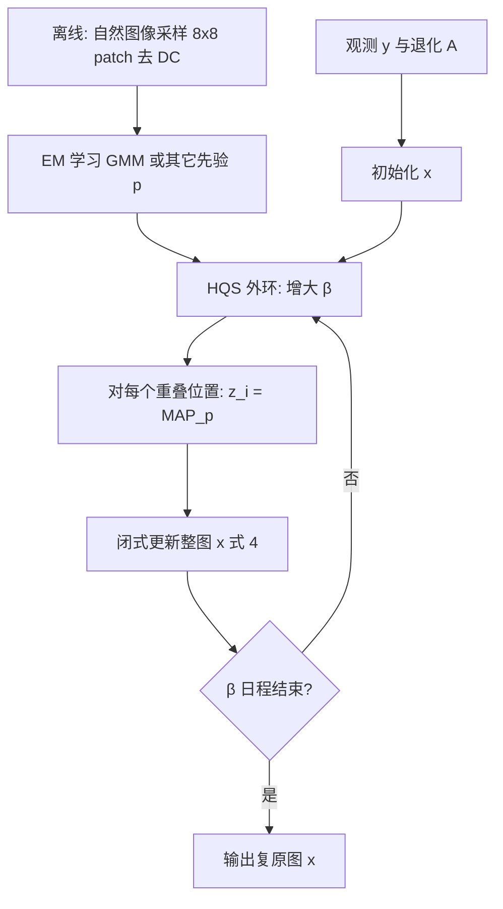

# 中文详解 · 逐节梳理

> 论文：D. Zoran & Y. Weiss, *From Learning Models of Natural Image Patches to Whole Image Restoration*, ICCV 2011  
> 课题语境：MIT 6.S978 Lec1（自然图像先验 / patch 模型 / 生成建模前史）  
> 阅读说明：每节含「梳理」「提取」「分析」；「论文事实」与「批判性分析」分开标注。

---

## Abstract（摘要）

### 梳理

摘要提出三问并预告答案：高似然先验是否带来更好复原；能否用 patch 先验做整图复原；能否学到更好的 patch 先验。贡献包括：似然–复原相关性实证、通用 EPLL 框架、以及一个 surprisingly simple 的 GMM 先验，在去噪、去模糊、修复上优于其他**通用**先验方法。

### 提取

- 工作对象：自然图像 **patch** 先验 → **whole image** restoration。
- 方法关键词：MAP / approximate MAP、cost function、optimization、GMM。
- 任务：denoising、deblurring、inpainting。

### 分析

**论文事实**：声称相对「所有其他 generic prior methods」更优。  
**批判性分析**：摘要的「outperforms all other generic prior」在正文 Table 2a 有支撑；与 BM3D/LLSC 等 image-based 方法是「competitive」而非全面超越（Table 2b）。阅读时不要把「generic」漏读成「一切方法」。

---

## 1. Introduction

### 梳理

图像先验广泛用于去噪、修复等。整图高维导致学习/推断/优化困难，故大量工作在小 patch 上学习先验。本文明确三个问题：

1. 高似然 patch 先验 → 更好的 **patch** 复原？
2. 高似然 patch 先验 → 更好的 **整图** 复原？
3. 能否学到更好的 patch 先验？

### 提取

- 动机链条：先验重要 → 整图难 → patch 可行 → 三个科学问题。
- 相关任务引用：denoising [1–6]、inpainting [6]、更多 [7]。

### 分析

**批判性分析**：引言未给出定量基线，问题设定清晰，适合作为 Lec1「为什么先建局部概率模型」的叙事骨架。三个问题分别对应 Section 2、3、4。

---

## 2. From Patch Likelihoods to Patch Restoration

### 梳理

在 patch 上，许多先验可闭式算 log-likelihood、BLS、MAP。问题：高似然是否意味着更好去噪？整图 MRF 上该问题极难回答（似然与 MAP 往往不可精确计算 [9]）。

实验设定（**论文事实**）：

- 50,000 个 $8\times 8$ patch，去 DC，来自 Berkeley 训练集 [10]；
- 在未见测试 patch 上比 log-likelihood；
- 用 **MAP** 做 patch 去噪比 PSNR；
- 模型：Ind. Pixel、MVG、Independent PCA（非高斯边际）、ICA（学边际）。细节见 Supplementary。

Figure 1：似然越高，patch 去噪 PSNR 越好。

### 提取（概念）

| 模型（粗） | 直觉 |
|---|---|
| Ind. Pixel | 像素独立，只学一维边际 |
| MVG | 单高斯，学协方差（二阶相关） |
| PCA + 非高斯边际 | 去相关后再学各系数边际 |
| ICA + 边际 | 独立成分 + 边际，通常比 PCA 更贴自然图像统计 |

**似然高 = 模型把真实自然 patch 放在高密度处**；去噪时先验项更「认得」干净信号。

### 分析

**论文事实**：在所比较的「货架先验」上，似然与 MAP 去噪正相关。  
**批判性分析**：

- 相关不等于任意模型族都成立；且 Figure 1 柱状精确读数正文未列表（完整数字见 Table 1 同设定复用）。
- 只用 MAP、未在 Figure 1 展开 BLS（Table 1 补了 BLS）。
- DC 去除：先验刻画的是对比度结构而非绝对亮度——对去噪合理，但解释「自然图像完整分布」时要记得已减均值。

---

## 3. From Patch Likelihoods to Whole Image Restoration

### 梳理

Motivated by Section 2：高似然先验能否服务整图？先要解决「如何用 patch 先验复原整图」。

#### Figure 2 思想实验（步骤级）

1. 从一张训练图取所有重叠 patch，去 DC，建直方图先验（频次 = 概率）。
2. 平坦 patch 最可能，其次是短边缘尖端等。
3. 对新噪声图，若：
   - **非重叠 MAP 拼接** → 边界伪影；随机取复原图中的 patch，可能先验概率为 0。
   - **重叠中心像素** → 仍有问题。
   - **重叠平均 (PA)** → 更好，但平均制造的新 patch 仍可能不像先验。
4. **EPLL**：要求复原图中**每个**（随机）patch 在先验下都可能，同时贴近观测 → Figure 2g 明显更好。

**关键直觉（一句话）**：不要只保证「每个输入脏 patch 各自干净」，而要保证「输出整图上的每个局部窗口都像自然 patch」。

---

### 3.1 Framework and Optimization

#### 3.1.1 EPLL 定义

**论文事实**：

$$
\mathrm{EPLL}_p(x)=\sum_i\log p(P_i x)\tag{1}
$$

$$
f_p(x\mid y)=\frac{\lambda}{2}\|Ax-y\|^2-\mathrm{EPLL}_p(x)\tag{2}
$$

- $P_i$：抽取第 $i$ 个重叠 patch 的矩阵。
- EPLL = 均匀随机选 patch 时的期望 log-likelihood（差 $1/N$）。
- (2) 形似「似然项 + 先验项」，但 EPLL **不是**整图 log-prob（双重计数）。

退化 $\|Ax-y\|^2$ 覆盖去噪、修复、去模糊等。

#### 3.1.2 Optimization（Half-Quadratic Splitting）——步骤级流程

引入 $\{z_i\}$：

$$
c_{p,\beta}=\frac{\lambda}{2}\|Ax-y\|^2+\sum_i\Big(\frac{\beta}{2}\|P_ix-z_i\|^2-\log p(z_i)\Big)\tag{3}
$$

**算法流程（复现级）**：

```
输入: 观测 y, 退化算子 A, 先验 p, λ, β 日程 {β1…βT}
初始化: x ← y（或其它）
for t = 1 … T:
    β ← β_t
    for 内迭代约 4–5 次:
        // Step Z: 各 patch 的（近似）MAP
        for 每个重叠位置 i:
            z_i ← MAP_p( 观测=P_i x, 噪声尺度=1/√β )
        // Step X: 整图二次问题闭式解
        x ← (λ AᵀA + β Σ_j P_jᵀP_j)^{-1} (λ Aᵀy + β Σ_j P_jᵀ z_j)   // (4)
输出: x
```

**子问题直觉**：

| 步骤 | 在干什么 |
|---|---|
| 求 $z_i$ | 「在先验眼里，这个脏窗口最像哪块干净自然 patch？」 |
| 求 $x$ | 「把所有干净窗口粘回整图，并仍尊重观测 $y$」 |
| 增大 $\beta$ | 「越来越强迫窗口与整图一致」 |

**$\beta$ 选择（论文事实）**：

- 在训练图上手工/暴力搜日程；或
- 去噪时估当前噪声 $\hat\sigma$，设 $\beta=1/\hat\sigma^2$（噪声估计用 [12]）。

Figure 3：固定日程与自动估 $\beta$ 下，原代价 (2) 随迭代下降；即使用 BLS 替代 MAP，代价仍可降——说明子问题不必精确最优，改进即可。

**三点吸引力（作者总结）**：

1. 可用任意 patch 先验；
2. 运行时间约 PA 的 4–5 倍；
3. 不必学习整图 $P(x)$，只需 patch 模型。

#### 3.1.3 Denoising, Deblurring and Inpainting

| 任务 | $A$ | 求解含义 |
|---|---|---|
| Denoising | $I$ | $x$ 步 = 噪声图与辅助 patch 叠回的加权平均；$\lambda\sim 1/\sigma^2$ |
| Deblurring（非盲） | 卷积矩阵 | 数据项编码已知模糊核 |
| Inpainting | 对角掩码 | 缺失像素 ≈ 无限噪声；其余 ≈ 零噪声 |

**退化解**：$\lambda=0$、$\beta=1/\sigma^2$、$x$ 初值 $y$、只一步 → 等于简单 patch averaging。EPLL 差别：$\lambda\neq 0$ + 多轮升 $\beta$。

Inpainting 例子见 Supplementary；正文 **未报告** PSNR 表。

### 分析（3.1）

**批判性分析**：

- HQS 在 $\beta\to\infty$ 时与 (2) 一致是标准论证；有限 $\beta$ 日程依赖调参，理论全局最优 **未声称**。
- $\sum_j P_j^\top P_j$ 对均匀重叠是对角加权（边界像素被覆盖次数少）——实现时要注意边界，正文未展开数值处理细节（**未报告**具体边界策略）。
- 「任意先验」前提是 patch MAP 可算；对极复杂先验，Z 步可能很贵。

---

### 3.2 Related Methods

### 梳理与提取

| 方法 | 与 EPLL 关系（论文观点） |
|---|---|
| **FoE** [6] | 学习难（配分函数，contrastive divergence）。**推断**可视为用独立先验（如 ICA）优化类似 (2)；EPLL 学习更易，故可插入更丰富先验 |
| **Composite likelihood / directed models** [13,14] | 用局部边际/条件近似**全局** log-prob；EPLL **不**声称近似全局，只服务复原 |
| **KSVD** [3] | 独立去噪重叠 patch 再平均，可迭代；字典可全局或从噪声图学。稀疏先验时代价与 EPLL **同型**；但 EPLL 允许更丰富、预先学好的先验 |
| **非局部族** NL-means / BM3D / LLSC [2,5,8] | 利用同图相似 patch；共同点几乎都是 **clean patch 平均** → Section 3 认为未必最优 |

### 分析

**批判性分析**：把 KSVD/FoE 推断写成 EPLL 特例，有助于统一视角，但学习目标与模型类仍不同；「平均不是最优」是本文相对非局部方法的核心批评——正文用 GMM-EPLL 在去噪上追平、在去模糊上凸显通用先验，但并未把 BM3D/LLSC 的平均步骤替换为 EPLL 做实验（Discussion 留作 open）。

---

### 3.3 Patch Likelihoods and the EPLL Framework

### 梳理

回到 Section 2 的先验：高似然是否也带来更好的**整图** EPLL 去噪？

- 5 张 Berkeley **训练**图，$\sigma=25$；
- 比较 PA vs EPLL（Figure 4）。

结论（**论文事实**）：更好似然 → 更好整图去噪；且 EPLL 相对 PA 显著提升。于是引出 Section 4：能否学更好先验？

### 提取

Figure 4a：左柱 Log L，右柱 PSNR（整图 EPLL）。  
Figure 4b：PA vs EPLL 分组柱（约 25–30 dB 量级）。精确表见 Table 1。

### 分析

小样本（5 张）用于 Figure 4；后续 SOTA 对比用 68 张测试集。Figure 4 更像机制验证而非最终榜单。

---

## 4. Can We Learn Better Patch Priors?

### 4.1 Learning and Inference with a Gaussian Mixture Prior

### 梳理

学习 patch 像素上的有限 GMM。许多先验可视为**受限** GMM；本文**不约束**均值、全协方差、混合权重，用 **EM** 学习。

$$
\log p(x)=\log\Big(\sum_{k=1}^{K}\pi_k\mathcal{N}(x\mid\mu_k,\Sigma_k)\Big)\tag{5}
$$

- **BLS**：后验仍为 GMM，闭式 [1]。
- **近似 MAP**（硬 EM 找 mode 的一步 [15]）：

  1. $\pi'_k=P(k\mid y)$；
  2. $k_{\max}=\arg\max_k\pi'_k$；
  3. Wiener：$\hat x=(\Sigma_{k_{\max}}+\sigma^2 I)^{-1}(\Sigma_{k_{\max}}y+\sigma^2 I\mu_{k_{\max}})$。

### 提取：GMM 直觉（面向未深学混合模型的读者）

**一句话**：假设自然 patch 来自 $K$ 个「原型高斯云」之一；每个云有自己的形状（协方差）。

- 生成：先掷骰子选 $k\sim\pi$，再 $x\sim\mathcal{N}(\mu_k,\Sigma_k)$。
- 去噪近似 MAP：先看脏 patch 更像哪朵云，再在该云的椭圆几何里做维纳滤波拉回。

这与「一个大高斯」相比能刻画多模态（边缘方向、纹理类型等）；与 ICA 相比，约束「一次只用一套基」。

### 分析

**批判性分析**：选单一分量忽略多峰后验；Table 1 中 GMM 的 BLS 与 MAP 几乎相同（30.26 vs 30.29），说明在该噪声/数据上近似尚可，但不保证普适。

---

### 4.2 Comparison

### 梳理（训练设定）

| 项 | 值 |
|---|---|
| 样本 | $2\times 10^6$ patch，去 DC，Berkeley [10] |
| $K$ | 200 |
| 均值 | 零（无约束均值 ≈ 0） |
| 协方差 | full |
| 训练时间 | ~30h，未优化 MATLAB |
| 代码注 | MathWorks File Exchange EM-GMM 链接 |

Table 1：GMM 在 Log L、BLS、MAP、PA、EPLL **全面最高**。

Figure 5：$\sigma=25$，68 测试图，EPLL-GMM vs EPLL-ICA，**所有点** GMM 更好；细节主观质量更高。

**为何有效（作者解释）**：

- 零均值 GMM ≈ 用所属分量主特征向量重构；
- 全部特征向量组成字典，但每样本仅 1/200 的分量基可激活，且**同分量共激活** → 极强结构化稀疏；
- 与 [16] 对 image-specific GMM 的 dual 解释独立呼应。

Figure 6：随机分量协方差特征向量——有的像 PCA，有的像遮挡/纹理边界/多方向边缘，不同于典型稀疏编码 Gabor。

### 提取：Table 1 全表

| Model | Log L | BLS | MAP | PA | EPLL |
|---|---:|---:|---:|---:|---:|
| Ind. Pixel | 78.26 | 25.54 | 24.43 | 25.11 | 25.26 |
| MVG | 91.89 | 26.81 | 26.81 | 27.14 | 27.71 |
| PCA | 114.24 | 28.01 | 28.38 | 28.95 | 29.42 |
| ICA | 115.86 | 28.11 | 28.49 | 29.02 | 29.53 |
| GMM | 164.52 | 30.26 | 30.29 | 29.59 | 29.85 |

### 分析

**论文事实**：在固定比较协议下，GMM 似然跃升（164 vs ICA 116）与复原增益一致。  
**批判性分析**：ICA/PCA 等可能未调到各自最优容量；GMM 参数量（200 个 $64\times 64$ 协方差）远大于 ICA 边际模型，能力–复杂度未做信息量匹配的对照。经验结论仍强，但「GMM 结构本身」与「参数量更大」未分离。

---

### 4.3 Comparison to State-Of-The-Art Methods

### 共同实验协议（论文事实）

- 68 张 Berkeley **测试**图；
- 同一噪声实现；
- $\lambda=N/\sigma^2$，$N=$ patch 像素数；
- patch $8\times 8$；
- GMM 的 $\beta=\frac{1}{\sigma^2}[1,4,8,16,32,64]$（5 张训练图手工调）；
- 约 **300 s/图**，Quad Core Q6600，未优化 MATLAB。

---

#### 4.3.1 Generic Priors

对比：KSVDG（自然 patch 上训练的 KSVD）、FoE、GMM-EPLL。

**Table 2a（平均 PSNR, dB）**

| $\sigma$ | KSVDG | FoE | GMM-EPLL |
|---:|---:|---:|---:|
| 15 | 30.67 | 30.18 | **31.21** |
| 25 | 28.28 | 27.77 | **28.71** |
| 50 | 25.18 | 23.29 | **25.72** |
| 100 | 22.39 | 16.68 | **23.19** |

**提取**：所有噪声水平 GMM-EPLL 最高；高噪声下 FoE 崩塌明显（16.68）。

---

#### 4.3.2 Image Based Priors

对比：KSVD、BM3D、LLSC（从噪声图自适应）、GMM-EPLL（通用）。

**Table 2b（平均 PSNR, dB）**

| $\sigma$ | KSVD | BM3D | LLSC | GMM-EPLL |
|---:|---:|---:|---:|---:|
| 15 | 30.59 | 30.87 | **31.27** | 31.21 |
| 25 | 28.20 | 28.57 | 28.70 | **28.71** |
| 50 | 25.15 | 25.63 | **25.73** | 25.72 |
| 100 | 22.40 | **23.25** | 23.15 | 23.19 |

**Figure 7 单例**：噪声 20.17；KSVD 28.72；LLSC 29.30；EPLL-GMM **29.39**。

**分析**：  
**论文事实**：作者称 highly competitive。  
**批判性分析**：$\sigma=15$ LLSC 略高；$\sigma=100$ BM3D 略高。通用先验能贴住 SOTA 已经很强，但「全面最优」不成立。视觉上作者强调细节保留优于 KSVD。

---

#### 4.3.3 Image Deblurring

动机：图像自适应方法在去噪时可「平均掉」各 patch 不同噪声；**去模糊**等任务更需要通用先验。

设定：68 图卷积 [7] 的核 + **1%** 白高斯噪声；对比 Krishnan & Fergus [7] vs EPLL-GMM。

**Figure 8 数值**

| | Krishnan et al. | EPLL-GMM |
|---|---:|---:|
| Kernel 1 $17\times 17$ | 25.84 | **27.17** |
| Kernel 2 $19\times 19$ | 26.38 | **27.70** |

增益约 **+1.3 dB** 量级。

**未报告**：更多核、盲去模糊、运行时间对比表、inpainting 定量。

---

## 5. Discussion

### 梳理

作者重申三条主线：

1. 高似然 patch 模型 → 更好 patch/整图复原；
2. EPLL 框架显著优于简单 patch averaging；
3. 朴素 GMM 在去噪/去模糊/修复上 surprisingly 强。

展望：

- 框架是 **plug-in**：任何现有 patch 复原器可接入；特别点名 BM3D、LLSC 仍用平均，换 EPLL 会怎样是 open question。
- GMM 极朴素，混合模型文献中更复杂的学习/表示值得继续挖（作者称 current line of research）。

### 提取

无新公式；强调哲学：**先把局部密度学好，再通过优化接到整图逆问题**。

### 分析

**批判性分析**：Discussion 诚实留下「把非局部方法嵌入 EPLL」未做；GMM 的「stellar」更多是经验惊喜。对 Lec1：这正是「生成模型 = 先验」路线的早期成功范例，后续可用神经网络密度模型、扩散模型替换 GMM，而「HQS / PnP 式」交替结构仍常见。

---

## Acknowledgments / References

致谢 Anat Levin。参考文献覆盖小波 GSM、NL-means、KSVD、BM3D、FoE、hyper-Laplacian 去模糊、LLSC、自然图像模型、Berkeley、HQS、噪声估计、composite likelihood、GMM mode-finding、piecewise linear estimators [16] 等——构成 2011 年前图像复原与自然图像统计的核心图谱。

---

## 附录式：方法总流程图（跨节汇总）



**数据流直觉**：Z 步在「先验坐标」里净化局部；X 步在「图像坐标」里做一致性与数据拟合；$\beta$ 把两者越绑越紧。

---

## 数值核对清单（写笔记自检）

| 来源 | 数值 | 状态 |
|---|---|---|
| Table 1 五行五列 | 已录入 | 已与 PDF 核对 |
| Table 2a/2b | 已录入 | 已与 PDF 核对 |
| Figure 8 两核 PSNR | 25.84/27.17；26.38/27.70 | 已核对 |
| Figure 7 单例 | 20.17 / 28.72 / 29.30 / 29.39 | 已核对 |
| GMM：$2\times 10^6$ patch，200 分量，~30h 训练，~300s/图 | 已核对 |
| $\beta$ 日程 $[1,4,8,16,32,64]/\sigma^2$ | 已核对 |
| $\lambda=N/\sigma^2$ | 已核对 |
| Inpainting 定量 | 正文无 | 标「未报告」 |
| Figure 1/4 逐柱精确读数 | 仅图 | 以 Table 1 为准 |
| 显存 / GPU | 无 | 「未报告」 |

---

## 与 Lec1 的对照小结

| Lec1 主题 | 本文落点 |
|---|---|
| 自然图像统计 | 去 DC patch 上的似然比较；GMM 协方差特征结构 |
| Patch 模型 | 全程基本对象；$8\times 8$ |
| 先验用于逆问题 | EPLL 目标 + HQS |
| 生成建模前史 | 显式 GMM 密度；MAP/BLS 推断；尚未深度学习 |

**一句话带走**：把「局部生成模型的对数似然」当成整图正则，用半二次分裂交替做 patch MAP 与整图最小二乘——EPLL；再配强 GMM，就是 2011 年通用图像先验的标杆之一。
