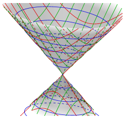
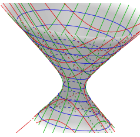

# Section1
因为大部分与高中内容重合, 所以仅记录一些高中不常用到的内容

### Definition1.1 坐标表示方法
#### 1.1.1 Position Vector
我们用从原点出发, 指向某点的向量表示该点的坐标

#### 1.1.2 parametric equation
对于一个 $\mathbb{R}^2$上的点集 $(x,y)$ , 我们可以有如下的表示方式:
$$
\begin{cases}
x=f(t)\\
y=g(t)
\end{cases}
$$
该点集也可以表示为:
$$
v(t) = (x,y)=(f(t),g(t))
$$

#### 1.1.3 Polar Coordinates
在 $\mathbb{R}^2$ 上, 我们可以用有序二元对 $(r,\theta)$ 来表示点 $P$ 的坐标.
其中 $r$ 等于 $\Vert OP\Vert$ 的大小,  $\theta$ 等于 $\vec{OP}$ 与$x$坐标轴的夹角.

#### Proposition 极坐标与笛卡尔坐标的转换
对于点 $P=(x,y)$, 我们有:
$$
\begin{cases}
x=r\cos\theta\\
y=r\sin\theta
\end{cases}
$$
也即
$$
\begin{cases}
r=\sqrt{x^2+y^2}\\
\tan\theta = \frac{y}{x}
\end{cases}
$$

#### 1.1.4 Cylindrical Coordinates 圆柱坐标系
在 $\mathbb{R}^3$ 上, 我们可以用有序三元对 $(r,\theta,z)$ 来表示点 $P$ 的坐标.
其中 $(r,\theta)$ 表示$P$在$xy$平面上的投影, $z$为$P$的$z$坐标

#### 1.1.5 Spherical Coordinates 球坐标
在 $\mathbb{R}^3$ 上, 我们可以用有序三元对 $(r,\psi,\theta)$ 来表示点 $P$ 的坐标.
其中 $(r,\theta)$ 定义同极坐标, $\psi$为$\vec{OP}$的与$z$轴的夹角.

#### Proposition 笛卡尔坐标系与球坐标系的转换
对于点 $P=(x,y,z)$, 我们有:
$$
\begin{cases}
x=r\sin\psi\cos\theta\\
y=r\sin\psi\sin\theta\\
z=r\cos\psi
\end{cases}
$$
$$
\begin{cases}
r=\sqrt{x^2+y^2+z^2}\\
\tan\psi = \frac{\sqrt{x^2+y^2}}{z}\\
\tan\theta = \frac{y}{x}
\end{cases}
$$

### Definition1.2 Cross Product
我们定义两个 $\mathbb{R}^3$ 上的向量 $u$ 与 $v$ 的向量积(叉乘)满足:
+ 是一个向量
+ $u\times v \perp u,v$
+ $\Vert u\times v\Vert = \Vert u \Vert\Vert v\Vert \sin\theta$, 其中 $\theta$ 是 $u$ 与 $v$ 的夹角

### Proposition1.1 Right-Hand Rule
向量积的方向满足"右手法则":

<!---->

### Proposition1.2 三维向量的叉乘公式:  
设 $u=(u_1,u_2,u_3),v=(v_1,v_2,v_3)$, 我们有:
$$
u\times v
=(u_2v_3−u_3v_2,u_3v_1−u_1v_3,u_1v_2−u_2v_1)\\
\begin{vmatrix}
i&j&k\\
v_1&v_2&v_3\\
u_1&u_2&u_3
\end{vmatrix}
$$
其中 &(i,j,k)$ 是空间向量的一组基底

### Proposition1.3 三维向量叉乘的性质
1. (associativity) $(u+v)×w=u×w+v×w$
2. (distributivity) $u×(v+w)=u×v+u×w$
3. (anticommutativity) $u×v=−v×u$
4. $(cu)×v=u×(cv)=c(u×v)$
### Proposition1.4
三角形OAB的面积及可以表示为:
$$
S_{\triangle OAB}=\frac{1}{2}\Vert u\times v\Vert
$$

### Proposition1.5 scalar triple product
在空间中, 三个不共面的位置向量: $u=(u_1,u_2,u_3),v=(v_1,v_2,v_3),w=(w_1,w_2,w_3)$ ,其合成的平行六面体(parallelepiped)的体积可以表示为:
$$
V = |(u\times v)\cdot w|
$$
而 $(u\times v)\cdot w$ 也被称为 $u,v,w$ 的标量三重积.

### Definition1.3 Equations of Planes
我们称一个 $\mathbb{R}^3$ 上的平面可以被表示为:
$$
\vec{u}+s\vec{v}+t\vec{w}
$$
其中 $s,t$ 为实参数

### Definition1.4 normal vector
一个 $\mathbb{R}^3$ 上平面的 **法向量(normal)** 垂直于这个平面上的所有向量

### Proposition1.6 
我们设在 $\mathbb{R}^3$ 上, 点$P$的位置向量为$(a,b,c)$ ,那么经过点$P$法向量为 $n=(A,B,C)$ 的平面的方程可以表示为:
$$
A(x−a)+B(y−b)+C(z−c)=0
$$

# Section2

### Definition2.1 injective, surjective and bijective
对于函数$f:X\rightarrow Y$, 我们称
#### (1) injective
$f$ 是 **单射的(injective)**/**one-to-one** 当 $\forall a\neq b\in X, f(a)\neq f(b)$ 时.
#### (2) surjective
$f$ 是 **满射的(surjective)**/**onto** 当 $\forall y\in Y, \exist x\in X, s.t. f(x)=y$ 时.
#### (3) bijective
$f$ 是 **双射的(bijective)**/**one-to-one correspondence** 当 $f$ 既是单射又是满射时.

### Proposition2.1 
所有的双射函数都具有反函数.

### Definition2.2 inverse function
对于函数 $f:X\rightarrow Y$, 我们称 $g:Y\rightarrow X$ 为其反函数, 当且仅当:
$$
f\circ g=g\circ f=identity\ function
$$
我们通常将 $f$ 的反函数记作 $f^{-1}$

### Definition2.3 vector-valued function
我们考虑一个 **向量值函数(vector-valued, 值为向量)** $f:X\rightarrow \mathbb{R}^m$, 其中 $X\subseteq \mathbb{R}^n$.
我们可以写出:
$$
f(\vec{v}) = (f_1(\vec{v}),f_2(\vec{v}),...,f_m(\vec{v}))
$$
其中 $f_i: X\rightarrow \mathbb{R}$
我们称 $f_1, f_2, . . . , f_m$ 为 $f$ 的**分量函数(component functions)**. 这样我们就只关注那些 **标量值函数(scalar-valued)** 了.

### Definition2.4 graph
我们称函数 $f:X\rightarrow \mathbb{R}$, 其中 $X\subseteq \mathbb{R}^2$ 的 **图(graph)** 为点集:
$$
\{(x,y,f(x,y))\in \mathbb{R}^3|(x,y)\in X\}
$$
称其在高度 $c$ 的 **轮廓曲线(contour curve)** 为点集:
$$
\{(x,y,f(x,y))\in \mathbb{R}^3|(x,y)\in X, f(x,y) = c\}
$$
称其在高度 $c$ 的 **等高线(level curve)** 为点集:
$$
\{(x,y)\in \mathbb{R}^2|(x,y)\in X, f(x,y) = c\}
$$

### Definition2.5 quadric surface
在 $\mathbb{R}^3$, 我们称一个 **二次曲面(quadric surface)** 通过如下公式定义(字典序):
$$
Ax^2 + Bxy + Cxz + Dy^2 + Eyz + Fz^2 + Gx + Hy + Iz + J = 0
$$

#### 以下是常见的二次曲面
##### 椭圆面(ellipsoid):
$$
\frac{x^2}{a^2}+\frac{y^2}{b^2}+\frac{z^2}{c^2}=1
$$

<!---->
当 $a=b=c$ 时, 为一 **球面(sphere)**

##### 椭圆抛物面(elliptic paraboloid):
$$
\frac{z}{c} = \frac{x^2}{a^2}+\frac{y^2}{b^2}
$$

<!---->

##### 双曲抛物面(hyperbolic paraboloid)
$$
\frac{z}{c} = \frac{x^2}{a^2}-\frac{y^2}{b^2}
$$

<!---->

##### 椭圆锥面(elliptic cone)
$$
\frac{z^2}{c^2} = \frac{x^2}{a^2}+\frac{y^2}{b^2}
$$

<!---->

##### 单叶双曲面(hyperboloid of one sheet)
$$
\frac{x^2}{a^2}+\frac{y^2}{b^2}-\frac{z^2}{c^2}=1
$$

<!---->

##### 双叶双曲面(hyperboloid of two sheet)
$$
\frac{x^2}{a^2}+\frac{y^2}{b^2}-\frac{z^2}{c^2}=-1
$$

<!---->

### Definition2.6 
对于任意的 $a\in \mathbb{R}^n$ 与 $r>0$, 我们称;
$\mathbb{R}^n$上以 $a$ 为中心, $r$ 为半径的 **开球(open ball)** 为集合:
$$
B(a,r)=\{x\in \mathbb{R}^n|\Vert x-a\Vert<r\}
$$

$\mathbb{R}^n$上以 $a$ 为中心, $r$ 为半径的 **闭球(close ball)** 为集合:
$$
\bar{B}(a,r)=\{x\in \mathbb{R}^n|\Vert x-a\Vert\leq r\}
$$

### Definition2.7 
对于 $X\subseteq \mathbb{R}^n$, 我们称:
$X$ 的**内点(interior point)** 满足:
存在以 $a$ 为中心的开球, 开球上所有点都属于 $X$ 
我们记 $X$ 的内点组成的集合为 **内部(interior)**

$X$ 的 **边界点(boundary point)** $a\in \mathbb{R}^n$ 满足:
对所有以 $a$ 为中心的开球, 都同时存在属于 $X$ 的点与不属于 $X$ 的点.
我们记 $X$ 的临界点组成的集合为 **分界线(boundary)**, 记作 $\partial X $

**注意**: $X$ 的内点一定属于 $X$,  临界点不一定属于 $X$

### Definition2.8
我们称集合 $X\subseteq \mathbb{R}^n$ 是 $\mathbb{R}^n$的 **开集(open set)** 若 $X$ 中的所有点都是 $X$ 的 **内点(interior point)**
我们称集合 $X\subseteq \mathbb{R}^n$ 是 $\mathbb{R}^n$的 **闭集(close set)** 若 $\mathbb{R}^n \setminus X$ 是一个 $\mathbb{R}$ 上的开集

### Proposition2.2 
对于 $X\subseteq \mathbb{R}^n$, $X$ 是闭集当且仅当 $\partial X\subseteq X$

### Definition2.9 
对于 $X\subseteq \mathbb{R}^n$, 我们称:

$a\in \mathbb{R}^n$ 是 $X$ 的 **极限点(limit point or accumulation point)**, 若 $a$ 满足:
$$
\forall \delta>0,\exist x\neq a(x\in X\cap B(a, \delta))
$$

$a\in X$ 是 $X$ 的 **孤立点(isolated point)** , 若 $a$ 不是极限点.

### Proposition2.3 
$X$ 的极限点中不在 $X$ 中的一定是 $X$ 的临界点.

### Definition2.10 Lim
对于 $f:X\rightarrow \mathbb{R}^m, X\subset \mathbb{R}^n$, $a$ 是 $X$ 的一个极限点. 我们称 $f$ 在 $a$ 处的**极限(limit)** 为 $L\in\mathbb{R}^m$, 满足:
$$
\forall \epsilon>0,\exist\delta>0, s.t. (x\in X\land 0<\Vert x-a\Vert<\delta\rightarrow\Vert f(x)-L\Vert<\epsilon)
$$
我们记做:
$$
\lim_{x\rightarrow a}f(x)=L
$$

### Proposition2.4 
若极限存在, 则在该点处的极限是被 **唯一确定(uniquely determined)** 的

### Proposition2.5 极限的性质
对于
$$
f,g: X\rightarrow \mathbb{R}^m, x\subset \mathbb{R}^n\\
\lim_{x\rightarrow a}f(x)=L, \lim_{x\rightarrow a}g(x)=M
$$
我们有:
(1) 
$$
\lim_{x\rightarrow a}(f\pm g)(x)=L\pm M
$$
(2) 
$$
\forall c\in\mathbb{R}, \lim_{x\rightarrow a}(cf)(x) = cL
$$
(3)若 $m=1$,
$$
\lim_{x\rightarrow a}(fg)(x) = LM
$$
(4)若 $m=1,M\neq 0$,
$$
\lim_{x\rightarrow a}(\frac{f}{g})(x)=\frac{L}{M}
$$

### Theorem2.1 夹逼定理/三明治定理 略
### Proposition2.6 
对于 $f:X\rightarrow \mathbb{R}^m, X\subset \mathbb{R}^n$, 且有 $f=(f_1, f_2,...,f_m)$, $a$ 是 $X$ 的极限点, 那么我们有:
$$
\lim_{x\rightarrow a}f(x)=(l_1, l_2,...,l_m)
$$
其中,
$$
\lim_{x\rightarrow a}f_i(x)=l_i\ for\ i=1,2,...,m
$$

### Definition2.11
对于 $f:X\rightarrow \mathbb{R}^m, X\subset \mathbb{R}^n$, 我们称 $f$ 在 $a$ 是 **连续的**, 若满足如下条件中任意一个:
$$
\begin{align}
&a 是 X 中的一个孤立点\\
&\lim_{x\rightarrow a}f(X)=f(a)
\end{align}
$$
否则, 则称 $f$ 在 $a$ 处不连续.

我们称 $f$ 是 **连续函数** , 当它在 $X$ 的每个点处都连续, 反之则称为 **不连续函数** .

### Proposition2.7 
若 $f$ 与 $g$ 在 $a$ 处连续, 我们有:
(1) $f+g$ 在 $a$ 处连续
(2) $\forall c\in\mathbb{R}, cf$  在 $a$ 处连续
(3) 若 $m=1$, $fg$ 在 $a$ 处连续
(4) 若 $m=1且g(a)\neq0$, $\frac{f}{g}$ 在 $a$ 处连续

### Proposition2.8 
对于 $f:X\rightarrow \mathbb{R}^m, X\subset \mathbb{R}^n$, 且有 $f=(f_1, f_2,...,f_m)$.
$f$ 在 $a$ 处连续当且仅当 $f_i$ 在 $a$ 处连续

### Proposition2.9
对于 $f:X\rightarrow \mathbb{R}^m, X\subset \mathbb{R}^n;g:Y\rightarrow \mathbb{R}^k, f(X)\subset T\subset\mathbb{R}^m$, $a$ 是 $X$ 的一个极限点. 若 $\lim_{x\rightarrow a}f(x)=L\in Y$ 且g在L处连续, 那么有:
$$
\lim_{x\rightarrow a}(g\circ f)(x)=g(L)
$$
作为推论, 若 $f$ 与 $g$ 是连续的, 那么 $f\circ g$ 也是连续的.

### Definition2.12 partial derivative
对于 $\mathbb{R}^n$ 上的变量 $X$, 与 $f:X\rightarrow \mathbb{R}$, 我们称 $f$ 在 $\vec{a}$ 点处 $x_j$ 分量的偏导数(部分微分)为:
$$
\frac{\partial f}{\partial x_j}(a) = \lim_{h\rightarrow 0}\frac{f(\vec{a}+h\vec{e_j})-f(\vec{a})}{h}
$$
也被记作 $f_{x_j}(a)$ or $D_{x_j}f(a)$

### Definition2.13 Tangent Plane
对于 $f:X\rightarrow \mathbb{R}, X\subset \mathbb{R}^2$, $(a,b)$ s是 $X$ 的內点. 我们称 $f$ 的graph $S$ 在 $x=(a,b,f(a,b))$ 的 **切面** 是包含了 $x$ 处 $S$ 的所有切线的平面.

懒得打字了, 转战平板
