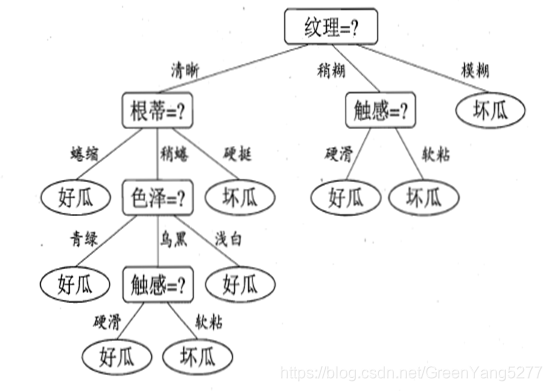

# MIT6.006 Lec4 Hash(包括一部分决策树)

我们先前使用了基于排序的预处理, 将无序数组变为有序, 这样通过二分查找(binary search)就可以实现 $O(\log n)$ 的查找. $O(\log n)$已经在效率上超越线性时间$O(n)$了. 但是**基于比较顺序**的查找是无法找到**更快**的查找的.
> 我的理解是, 基于比较的顺序, 对与比较每次最多给出三个结果: $=, >, <$. 每次进行比较要么对两个数给出顺序, 要么基于一个基数将数组分为三类(有序数组适用二分查找的原因), 故最快只能进行$O(\log n)$ 的查找  
> 
严格的证明可以参考这篇知乎回答(笔者还没学信息论, 就不献丑了)
[很多高效排序算法的代价是 nlogn，难道这是排序算法的极限了吗？ - 沧海一只鸮的回答](https://www.zhihu.com/question/24516934/answer/115013452935)

## 4.1 比较模型 Comparison Model 
计算的**比较模型**作用于一组可比较对象(如整数, 字符串或者某些实现了比较方法的自定义对象). 这些对象可以看作是黑盒(black boxes), 我们不需要知道这些对象的具体信息, 只需要他们支持的一组二进制布尔操作, 被称为**比较(Comparison)**(如`A`是否 $\gt, \geq, \lt, \le, =, \neq$ `B`)
每个**比较**接受两个输入对象`A`与对象`B`, 并返回一个Boolean值`True` or `False`.

我们先假设每个对象都有一个唯一确定的key, 那么:
作用与有n个元素的set的**搜索算法**就是: 接收一个key的输入, 返回set中与该key相同值的元素储存的值, 或该set中不存在这个key.

### 4.1.1 决策树 decisio tree
我们先补充一个Machine Learning方面的概念: 决策树(因为笔者同样没学ML, 所以主要还是侧重于单纯理解决策树而非构建决策树需要的监督学习之类的方向)
(笔者很喜欢在学一部分知识时发散到某个仅仅有些相关的知识点, 并深入的了解一下, 以下关于决策树的内容基本与MIT6.006不相关, 可直接略过)
> 本部分参考CSDN与知乎博文:
> [决策树原理详解（无基础的同样可以看懂）- GreenYang5277](https://blog.csdn.net/GreenYang5277/article/details/104500739)
> [【非常详细】通俗易懂的讲解决策树（Decision Tree） - 王改改的文章](https://zhuanlan.zhihu.com/p/197476119)
>
决策树(Decision Tree)是一种以树形数据结构来展示决策规则和分类结果的模型, 是归纳学习算法(induced learning algorithm)的一种. 其重点是将看似无序, 杂乱的**已知数据**通过某种技术手段将它们转化成**可以预测未知数据的树状模型**, 每一条从根结点(对最终分类结果贡献最大的属性)到叶子结点(最终分类结果)的路径都代表一条决策的规则. 如下图中的例子:

<!--  -->
#### 4.1.1.1 生成决策树的步骤: 
我们假设**类别C是我们最终预测的结果**(不一定是二元的), 有许多属性用于构建决策树的判断
1. 我们首先将所有节点划分到根节点
2. (循环开始) 我们开始进行判断
3. 边界条件: 
   1. 如果数据集为空:
      1. 如果当前节点为根节点, 则返回null(无法基于当前提供的数据构建决策树)
      2. 如果当前节点为中间节点, 则通常将此节点标记为父节点中出现次数最多的类别作为预测结果
   2. 如果所有数据都属于同一个类别 $C$(这些样本在 **目标变量(标签)** 上具有相同的预测结果):
      1. 跳出循环，节点标记为该类别
4. 此时我们选择当前条件下的**最优属性划分**(一会详细分析), 并生成该属性下的分支节点
5.  返回步骤2, 对所有分支节点重新进行递归的生成

#### 4.1.1.2 最优属性划分

目前主流的决策树构建是"最优"的测算算法是ID3 (迭代二分器第3版, Iterative Dichotomiser 3), C4.5(无广泛应用的全程, 为ID3的改进版本) 与 CART(分类与回归树, Classification and Regression Trees)
> Dichotomiser（二分器）：这里的“二分”更多是指一种广义上的分割或划分，而不是严格意义上的二元划分。在ID3中，属性可以有多个取值，因此可以根据这些不同的取值将数据集划分为多于两个子集
 
前两者的"最优"概念基本采用了**香农熵(Shannon Entropy)** 的概念, 我们先继续拓展一个 **信息熵(comentropy)** 的概念:
> 本部分参考
> [信息熵_百度百科](https://baike.baidu.com/item/%E4%BF%A1%E6%81%AF%E7%86%B5/7302318#3-4)
> 与前一部分的两篇博文
> [决策树原理详解（无基础的同样可以看懂）- GreenYang5277](https://blog.csdn.net/GreenYang5277/article/details/104500739)
> [【非常详细】通俗易懂的讲解决策树（Decision Tree） - 王改改的文章](https://zhuanlan.zhihu.com/p/197476119)

信息论之父 C. E. Shannon 在 1948 年发表的论文“通信的数学理论（ A Mathematical Theory of Communication ）”中指出，任何信息都存在冗余，冗余大小与信息中每个符号（数字、字母或单词）的出现概率或者说不确定性有关。
Shannon 借鉴了热力学的概念，把信息中排除了冗余后的平均信息量称为“信息熵”，并给出了计算信息熵的数学表达式。

信息熵的定义基于两个关键属性: 
+ 减函数：对于一个给定的概率分布，概率越大的事件，其发生的不确定性越小；反之亦然。
+ 可加性：如果两个事件相互独立，则这两个事件同时发生的不确定性等于各自不确定性的和。
  + f(x)为积性函数, 即 $f(P_1P_2) = f(P_1)+f(P_2)$

结合两条性质, 若该**积性**函数**定义域为正实数**，且**单调减**, 那么它只能是 **对数函数**.
即$$
f(x)=k\log_ax
$$
为简化运算, 在计算机领域中, 我们定义: **不确定性函数**:
$$
f(P) = \log_2\frac{1}{p}=-\log_2 p
$$
而在信息中, 我们往往考虑的不是某单一符号发生的不确定性, 而是这个信源所有可能发生情况的**平均不确定性**:
若信源符号 $U$ 有 $n$ 种不同的取值 $U_1,U_2,...U_n$ , 其对应的发生概率为 $P_1,P_2,...P_n$($\sum P_i=1$), 且所有符号的发生之间两两独立. 信源的 **平均不确定性** 应当为单个符号不确定性 $-\log_2 P_i$ 的统计平均值($E$), 可称为**信息熵**:
$$
H(U)=E[-\log_2 p_i] = -\sum^n_{i=1}p_i\log_2 p_i
$$

由定义可知, $H(U)$越大, 信息的不确定性越大, 信息变越混乱. **所以回到上述"最优属性划分"**, 我们要找的"最优属性划分", 便是最能**减少数据集信息不确定性**(or **熵**)的那个属性划分.

#### (A). ID3(迭代二分器)算法
在ID3算法构建决策树中, 我们这样定义属性划分后的熵:
$$
H(S) = -\sum^n_{i=1}p_i\log_2 p_i
$$
其中, $p_i$ 是类别(预测结果, 之后不在强调) $i$ 在集合 $S$ 中出现的概率.
对于某个属性 $A$ 的每个取值 $v$, 我们将集合 $S$ 划分为不同的子集 $S_v$, 那么属性 $A$ 的条件熵就可以表示为:
$$
H(S|A) = -\sum_{v\in Values(A)}\frac{|S_v|}{|S|}H(S_v)
$$
其中 $Values(A)$ 表示属性 $A$ 的所有可能取值, $S_v$ 表示当 $A=v$ 时的数据子集, 子集的信息熵 $H(S_v)$ 由前一公式计算.

最终, **信息增益** 可以通过原始熵减去条件熵得到:
$$
Gain(S, A)=H(S) - H (S|A)
$$

#### (B). C4.5 (ID3的改进版本)
在C4.5中, 对于"最优"的判断采取了改进的"增益率". 增益率是对信息增益的一个改进，因为它考虑了属性的固有信息量（即分裂信息）来惩罚那些具有大量不同值的属性:
$$
Gain\_Ratio(S, A)=\frac{Gain(S, A)}{SplitInfo_A(S)}
$$

其中, 分裂信息量 (Split Information) 为:
$$
SplitInfo_A(S)= -\sum_{v\in Values(A)}\frac{|S_v|}{|S|}\log_2(\frac{|S_v|}{|S|})
$$
也即把各个子集的元素数量看作不确定性计算的概率

#### (C). CART(分类与回归树)
CART算法评估的是"基尼系数(Gini Index)", 即从数据集中随机抽取两个样本, 其类别不一致的概率:
$$
Gini(S) = \sum^n_{k=1}\sum_{k'\neq k}p_kp_{k'} = 1-\sum^n_{i=1}p_i^2
$$
对于某个属性 $A$ 的划分，**基尼指数**可以这样计算:
$$
Gini\_Index(S, A)=\sum_{v\in Values(A)}\frac{|S_v|}{|S|}Gini(S_v)
$$
> 通常来讲, CART的性能表现要优于前两种

下面我们以基于ID3的决策树构建为例, 演示决策树的大致构建过程:
> 这一部分来自通义千问ai生成
> 
**数据集**:
假设我们有一个关于天气的数据集, 用来预测是否适合打网球(Play Tennis). 这个数据集包含以下属性:
+ `Outlook`: (天气状况晴天 Sunny、阴天 Overcast、雨天 Rainy)
+ `Temperature`: (温度热 Hot、温和 Mild、冷 Cool)
+ `Humidity`: (湿度高 High、正常 Normal)
+ `Wind`: 风速强 (Strong、弱 Weak)
+ `Play Tennis`: 是否适合打网球 (是 Yes、否 No)
  
| Outlook  | Temperature | Humidity | Wind   | Play Tennis |
| -------- | ----------- | -------- | ------ | ----------- |
| Sunny    | Hot         | High     | Weak   | No          |
| Sunny    | Hot         | High     | Strong | No          |
| Overcast | Hot         | High     | Weak   | Yes         |
| Rainy    | Mild        | High     | Weak   | Yes         |
| Rainy    | Cool        | Normal   | Weak   | Yes         |
| Rainy    | Cool        | Normal   | Strong | No          |
| Overcast | Cool        | Normal   | Strong | Yes         |
| Sunny    | Mild        | High     | Weak   | No          |
| Sunny    | Cool        | Normal   | Weak   | Yes         |
| Rainy    | Mild        | Normal   | Weak   | Yes         |
| Sunny    | Mild        | Normal   | Strong | Yes         |
| Overcast | Mild        | High     | Strong | Yes         |
| Overcast | Hot         | Normal   | Weak   | Yes         |
| Rainy    | Mild        | High     | Strong | No          |
1. 计算初始熵
   共有9个"Yes"与5个"No"
   $$
   H(S)=-(\frac{9}{14}\log_2\frac{9}{14}+\frac{5}{14}\log_2\frac{5}{14})\approx 0.940
   $$
2. 选择最佳划分属性
   以属性`Outlook`为例
   当数据按`Outlook`划分时:
    + Sunny: 2个Yes, 3个No
    + Overcast: 4个Yes, 0个No
    + Rainy: 3个Yes, 2个No
    计算条件熵:
    $$
    H(Outlook)=\frac{5}{14}H(Sunny)+\frac{4}{14}H(Overcast)+\frac{5}{14}H(Rainy)\\
    $$
    其中, 经计算:
    $$
    H(Sunny)\approx0.971,H(Overcast)=0, H(Rainy)\approx0.971
    $$
    故带入原公式, 有:
    $$
    H(Outlook)\approx0.694\\
    Gain(Outlook)=H(S)−H(Outlook)\approx0.940−0.694=0.246
    $$
    类似地, 计算出其他属性的信息增益, 有:
    $$
    \begin{aligned}
    &Gain(Temperature)\approx0.029\\
    &Gain(Humidity)\approx0.151\\
    &Gain(Wind)\approx0.048\\
    \end{aligned}
    $$
    综合比较, `Outlook`的信息增益最大, 故选择Outlook作为根节点
3. 对于每个`Outlook`的取值 (Sunny、Overcast、Rainy), 我们递归地重复上述过程
...
1. 最终获得了如下的决策树:
```
Outlook
├── Sunny
│   └── Humidity
│       ├── High: No
│       └── Normal: Yes
├── Overcast: Yes
└── Rainy
    └── Wind
        ├── Weak: Yes
        └── Strong: No
```

我们回到先前的话题, 对于排序后的数组, 我们通过选取中间大小的元素作为比较的基准, 以不大于它和大于它为属性的二划分, 得到一颗二叉决策树, 每次查找依此从根节点向下攀爬, 最长的路径就是这颗二叉树的最大深度(或者深度+1, 因为查找的key不存在), 这样就实现了 $O(logn)$ 的查找.

"比较"是**受限的**, 因为每次运算最多给出**常数个划分**, 其决策树的深度始终是对数级别的. 但如果我们并不局限于"比较操作", 那么我们是有可能获得比对数级别更快的查找. 更特别的, 如果我们能找到一种操作, 具有比常数 $\omega(1)$ 更大的分支因子, 那么我们的决策树就会更大, 从而实现更快的搜索

## 4.2 直接访问数组 Direct Access Array   

计算机的大部分操作都只允许常数的逻辑分支(constant logical branching), 但是**随机访问(randomly access)内存**操作, 即访问任意给定的地址储存的bit, 是 $\Theta(1)$ 时间级别的, 也即能提供**非常数分支因子**(non-constant branching factor).

为最大化利用这一特点, 我们定义数据结构 **"直接访问数组direct access array"**:
一个将语义(semantic meaning, **也即key**)与数组索引相关联的普通静态数组(normal static array)

我们注意到只有当key是整数时, 才方便与数组索引(index)相关联. 在现代计算机中, 内存中的任何东西都是与整数相关的, 故我们只考虑整数key.

现在我们想储存 $n$ 项元素, 每个元素都有一个唯一确定的整数键 $k_i$ 相关联, 且有$k_i\in [0, u-1]$, u为某大数.
那么我们就可以把这 $n$个元素储存在一个长度为u的直接访问数组里. 对于任意项 $i$, 都有最坏常数时间 $O(1)$的查找, 但是对于顺序操作(ordder operation), 如查找第一项\最后一项\下一项, 都可能会需要 $O(u)$ 的复杂度.

并且, 如果 $u$ 的值过大, 那么将占据极大的空间, 甚至无法实现, 这是我们通过哈希(Hash)算法, 来解决占地空间的问题.

## 4.3 哈希 Hash

我们希望找到一种用比 $u$ 规模更小的array去储存元素, 找到一个规模为 $m=O(n)$ 的动态直接访问数组. 为了能合理的分配key2index, 我们需要一个函数 $h(x)$ , 实现从key到index的映射, 即:
$$
h(x):\{0,...,u-1\}\rightarrow \{0,...,m-1\}
$$

我们把这个函数称作**哈希函数(Hash Function)** 或 **哈希映射(Hash Map)**, 这个更小的直接访问数组被称作**哈希表(Hash Table)**, 并称 $h(k)$是整数键 $k$ 的**哈希值(Hash or Hash Value)**.

> Hash, 一般直接音译为“哈希”，也有意译翻译做“散列”的(又叫做预映射, pre-image)

如果哈希函数对于某元素集是单射的(injective), 即对于每个key值 $k$ 都有一个唯一的index与之对应, 那么hash table作为一个规模为 $m=O(n)$ 的小直接访问数组, 应当实现最坏 $O(1)$ 的常数时间搜索.

不幸的是, 我们经常会遇到多个key对应同一个index的情况.
i.e. 
$$
\exist k_1\neq k_2(h(k_1)=h(k_2))
$$
> 最极端的情况, 由于 $m<u$, 当key数量 $n==u$ 时, 根据抽屉原理, 必定至少存在两个键对应同一个值, 更不用说为了解决空间, $m$通常比 $u$小许多个量级.

我们称这种情况为" $k_1$ 与 $k_2$ 发生了**哈希碰撞(Hash Collide)**
> 原文是 the hashes of $k_1$ and $k_2$ collide

对于哈希碰撞, 一般有两种处理方法:
1. **开放地址法 (Open addressing)**:
   将冲突的元素储存在**该直接访问数组**的其他地方
2. **链地址法 (Chaining)**:
   在哈希表的每个格子储存一个新的数据结构, 用于存放冲突的多个元素
   e.g. 可能用链表等数据结构储存每个index对应的所有元素
   在**最坏**的情况下(所有的元素都储存在同一个index下), 查找的时间复杂度会退化成 $O(n)$

目前的大部分哈希表都采用第一种策略(开放地址法 Open addressing)来构建哈希表, 但因其过于复杂且难以分析器性能与特性, 本课程(MIT6.006)将采用第二种策略(链地址法 Chaining).(在跟随本课程结束Chaining的分析后, 会补充我自己搜寻到的关于直接寻址法的一些内容)

### 4.3.1 链地址法 Chaining

**链地址法**是一种 **将冲突的键与原始哈希表分开储存** 的冲突解决策略. 哈希表的每个索引都储存着一个指向一个**链(chain)** 的指针.
+ **链**: 一种支持动态集合接口(dynamic set interface)得到数据结构. 通常使用**链表**或**动态数组**来实现链, 只要所有的操作都不会花费超过线性时间.

这样每次将元素(x, x.key)插入哈希表时, 只是简单的将该元素插入索引 $h(x.key)$ 所对应的chain内. 而如 `find()`,`delete()`等操作也是简单的操作对应的chain.

鉴于chain的性能, 我们希望每个chain都很小, 这就需要一个"好的"哈希函数, 使得存在尽可能少的哈希碰撞.
> If you know all of the keys you will want to store in advance, it is possible to design a hashing scheme that will always avoid collisions between those keys. This idea, called **perfect hashing**, follows from the Birthday Paradox. 

## 4.4 哈希函数 Hash Function

### 4.4.1 除法哈希法(bad) Division Method 
最简单而符合直觉的 $h(x):\{0,...,u-1\}\rightarrow \{0,...,m-1\}$ 的实现, 是使 $x$ 对 $m$ 取余, 即:
$$
h(k)=(k\mod m)
$$
或者在编程语言中, 称作 `k%m` .

如果keys是一致的分布在数域中, 那么"除法散列法"会大致的将对应后的index均匀的分布在哈希表中, 因此我们期望使用这种算法时, 应具有较小的key集. 

但是当数据集很大, 并且分布不均匀(如存在许多对 $m$ 同余的key)时, 这种算法很可能不尽如人意. 而我们理想情况下, 数据结构的性能与我们选择存储的键无关. 故我们还有第二种选择哈希函数的策略:

### 4.4.2 全域哈希法 (good) Universal Hashing:
对于一个充分大的key数域 $u$, 有 $n$ 个输入值, 几乎所有的哈希函数表现都不佳
> 特别的, 若 $u>mn$, 则根据抽屉原理, 必定有至少n+1个输入值是对应着同一个哈希值

但如果我们从一个大的**哈希函数族**(family of hash functions)中**随机的**的选取哈希函数, 将可以达到良好的期望界限. 这里的“**期望**”是针对我们所选择的哈希函数而言的, **而不是基于输入数据的分布**. 也就是说, 这种期望性能不依赖于输入. 
一个表现良好的哈希函数族是:
$$
\Eta(m, p)=\{h_{ab}(k)=(((ak+b)\mod p)\mod m)\ \ a,b\in\{0,...,p-1\}\And a\neq 0\}
$$
其中, $p$ 是一个比key范围 $u$ 更大的质数.
这个哈希函数族中的每个哈希函数, 都只取决于 $a$ 和 $b$ 的选取.
这个哈希函数族是"全域的(universal)", 即对任意两个key, 他们发生哈希碰撞的概率不大于 $\frac{1}{m}$.
i.e.
$$
\Pr_{h\in \Eta}\{h(k_i)=h(k_j)\}\leq\frac{1}{m}, \forall k_i\neq k_j\in\{0,..., u-1\}
$$
这个的证明被课程MIT6.006留到了后续课程MIT6.046, 不过笔者在这里补充了:

---
证明: 对于任意两个不等的键 $x\neq y$ , 哈希函数族中**随机选取的一个哈希函数** , 发生哈希碰撞的概率小于$\frac{1}{m}$：
$$
\Pr_{h\in \Eta}[h(x)=h(y)]\leq\frac{1}{m}
$$
1. Carter-Wegman 哈希函数族定义
   $$
   \Eta(m, p)=\{h_{ab}(k)=(((ak+b)\mod p)\mod m)|a\in\{1,...,p-1\}, b\in\{0,...,p-1\}\}
   $$
   也就是说:
   + 参数 $a$ 取自$\mathbb{Z}^*_p$(模 $p$ 下的乘法群)
   + 参数 $b$ 取自$\mathbb{Z}_p$(模 $p$ 下的乘法群)
2. 我们也即要证明:
   $\forall x\neq y\in U$, 有:
   $$
   \Pr_{a\in \mathbb{Z}^*_p,b\in \mathbb{Z}_p}[h_{a, b}(x)=h_{a, b}(y)]\leq\frac{1}{m}
   $$
3. 证明过程:
我们要求解的是:
$$
   \Pr_{a\in \mathbb{Z}^*_p,b\in \mathbb{Z}_p}[h_{a, b}(x)=h_{a, b}(y)]=
   \Pr_{a\in \mathbb{Z}^*_p,b\in \mathbb{Z}_p}[(((ax+b)\mod p)\equiv (ay+b)\mod p)\pmod m]
$$
因为两次取模运算较复杂, 我们先去除外层的$\pmod m$, 分析何时内层的值相等
所以考虑:
$$
   \begin{aligned}
   &(ax+b)\equiv (ay+b)&\pmod p\\
   &\Rightarrow ax\equiv ay&\pmod p\\
   &\Rightarrow a(x-y)\equiv 0&\pmod p
   \end{aligned}
$$
我们知道 $x\neq y$且 $p$ 是一个极大的质数($p>u\gg a,b$), 故$a, x-y\not\equiv 0\pmod p$
故不存在内层的哈希碰撞(即内层不可能同余)

故若**发生哈希碰撞**, 一定是在外层对 $m$ 取余后发生的, 被"折叠"到相同的哈希桶中
我们继续分析外层的同余式:
$$
(ax+b\pmod p)\equiv (ay+b\pmod p)\pmod m
$$
由于内层不会同模, 并且由于$a,b$在$\mathbb{Z}^*_p\times \mathbb{Z}_p$上随机选取, 我们可以认为 $ax+b$ 在 $\mathbb{Z}_p$ 上是近似均匀分布的, 故对m取模, 在 $\mathbb{Z}_m$上可以看作**近似**均匀分布的
> 因为 $p$ 不是 $m$ 的倍数, 所以对于 $p$ 均匀分布的随机变量, 对 $m$ 会出现一些偏差, 即某些余数可能会比其他余数多出现一些
> 不过因为 $p\gg m$ , 这种偏差可以近似忽略.

故我们可以近似的认为, 对任意key, 在 $\mathbb{Z}_m$ 中近似是等概率分布的.

故, 任意两个key, 其发生哈希碰撞的概率均小于 $\frac{1}{m}$
Q.E.D.

---

如果我们知道一族哈希函数是"全域的", 那么我们就可以通过我们对哈希函数选择的期望, 为任意的链估计其期望上界.
我们令 $X_{ij}$ 为表示键 $k_i$ 与 $k_j$ 是否哈希碰撞的指示随机变量(indicator random variable), 即当发生哈希碰撞时 $X_{ij}$ 为 $1$, 反之为 $0$. 
所以对于任意index $h(k_i)$ , 表示其元素数量的随机变量表示为: $X_i=\sum_jX_{ij}$, 其中$k_j$ 对所有的键(包括 $k_i$ )进行遍历.
故对于 $X_i$ 的期望, 有如下的变形:
$$
\begin{aligned}
   \mathop{\mathbb{E}}\limits_{h\in\Eta}[X_i]
   =\mathop{\mathbb{E}}\limits_{h\in\Eta}[\sum_jX_{ij}]
   &=\sum_j\mathop{\mathbb{E}}\limits_{h\in\Eta}[X_{ij}]\\
   &=1+\sum_{j\neq i}\mathop{\mathbb{E}}\limits_{h\in\Eta}[X_{ij}]\\
   &=1+\sum_{j\neq i}(1)\mathop{Pr}\limits_{h\in\Eta}[h(k_i)=h(k_j)] + \sum_{j\neq i}(0)\mathop{Pr}\limits_{h\in\Eta}[h(k_i)\neq h(k_j)]\\
   &\leq1+\sum_{j\neq i}\frac{1}{m}\\
   &=1+\frac{n-1}{m}
\end{aligned}
$$

这样, 我们发现,当哈希表的大小 $m$ 至少是储存元素数 $n$ 的线性上界时(i.e. $m=\Omega(n)$), 任意链条的长度的期望将会是:
$$
\mathbb{E}[X_i]=1+\frac{n-1}{\Omega(n)}=O(1)
$$
即常数级别. 换而言之, 只要我们能确保 $m$ 的规模, 那么就能确保哈希表的效率. 
通过用chaining解决哈希碰撞, 通过在全域哈希函数族中随机选取哈希函数从而达到近似平均选取减小链期望长度至常数级别, 我们便可以实现常数级别时间查找的哈希表.
+ 为保证哈希表的规模, 还需要许多特殊的设计, 以及许多动态数组的操作

代码例(课件附):
```python
class Hash_Table_Set:
    def __init__(self, r=200):  # O(1)
        self.chain_set = Set_from_Seq(Linked_List_Seq)
        self.A = []
        self.size = 0
        self.r = r  # 100/self.r = fill ratio
        self.p = 2**31 - 1
        self.a = randint(1, self.p - 1)
        self._compute_bounds()
        self._resize(0)

    def __len__(self):
        return self.size  # O(1)

    def __iter__(self):  # O(n)
        for X in self.A:
            yield from X

    def build(self, X):  # O(n)e
        for x in X:
            self.insert(x)

    def _hash(self, k, m):  # O(1)
        return ((self.a * k) % self.p) % m

    def _compute_bounds(self):  # O(1)
        self.upper = len(self.A)
        self.lower = len(self.A) * 100*100 // (self.r*self.r)

    def _resize(self, n):  # O(n)
        if (self.lower >= n) or (n >= self.upper):
            f = self.r // 100
            if self.r % 100:
                f += 1
            # f = ceil(r / 100)
            m = max(n, 1) * f
            A = [self.chain_set() for _ in range(m)]
            for x in self:
                h = self._hash(x.key, m)
                A[h].insert(x)
            self.A = A
            self._compute_bounds()

    def find(self, k):  # O(1)e
        h = self._hash(k, len(self.A))
        return self.A[h].find(k)

    def insert(self, x):  # O(1)ae
        self._resize(self.size + 1)
        h = self._hash(x.key, len(self.A))
        added = self.A[h].insert(x)
        if added:
            self.size += 1
        return added

    def delete(self, k):  # O(1)ae
        assert len(self) > 0
        h = self._hash(k, len(self.A))
        x = self.A[h].delete(k)
        self.size -= 1
        self._resize(self.size)
        return x

    def find_min(self):  # O(n)
        out = None
        for x in self:
            if (out is None) or (x.key < out.key):
                out = x
        return out

    def find_max(self):  # O(n)
        out = None
        for x in self:
            if (out is None) or (x.key > out.key):
                out = x
        return out

    def find_next(self, k):  # O(n)
        out = None
        for x in self:
            if x.key > k:
                if (out is None) or (x.key < out.key):
                    out = x
        return out

    def find_prev(self, k):  # O(n)
        out = None
        for x in self:
            if x.key < k:
                if (out is None) or (x.key > out.key):
                    out = x
        return out

    def iter_order(self):  # O(n^2)
        x = self.find_min()
        while x:
            yield x
            x = self.find_next(x.key)
```

<!--  -->

### 4.3.2 开放寻址法 open addressing

如果我们在插值时发生了冲突, 那么我们就在原哈希表内寻找下一个空的**"散列地址(hash address)"**, 并将该元素插入, 其基本公式为:
$$
H_i(key)=(H(key)+f(i))\pmod m, i\in\{0, 1, ...\}
$$
其中, $H_i(key)$ 为经历 $i$次冲突后的所得的地址, $H(key)$ 为哈希函数; $f(i)$为增量序列 $(f(0)=0)$ , 表示第 $i$ 次冲突后下次寻址的增量.
查找时同样经过相同的步骤, 如果最终寻找到空格子, 则说明当前key不存在.

不同的开放寻址法间的**区别**, **实际上是增量序列 $f(i)$ 选取的不同**. 以下是几种常见的增量序列:
1. **线性探测法 Linear Probing**
   增量序列是 $i$ 的一次多项式:
   $$
   f(i)=ai+b
   $$
   通常取 $f(i)=i$.
   在哈希过程中, 某些元素形成一些区块, 这种现象称作**一次聚集(primary clustering)**. 当某key的值经hash映射到这个区块中时, 将需要一直向后线性移动, 直到离开区块才可以解决哈希碰撞.
   但好处是: 可以将探查到整个哈希表(平方探测法则相反)
   我们以此为例演示一下开放寻址法的过程
   假设哈希表有6个格子
   | 0    | 1    | 2    | 3    | 4    | 5    |
   | ---- | ---- | ---- | ---- | ---- | ---- |
   | null | null | null | null | null | null |

   第一个插入哈希值为2的元素a, 得到:
   | 0    | 1    | 2   | 3    | 4    | 5    | 6    |
   | ---- | ---- | --- | ---- | ---- | ---- | ---- |
   | null | null | a   | null | null | null | null |

   然后插入一个哈希值为4的元素b, 得到:
   | 0    | 1    | 2   | 3    | 4   | 5    | 6    |
   | ---- | ---- | --- | ---- | --- | ---- | ---- |
   | null | null | a   | null | b   | null | null |

   然后插入一个哈希值为2的元素c
      发现格子2已经被占据, 故探寻下一个格子3, 放入得到:
   | 0    | 1    | 2   | 3   | 4   | 5    | 6    |
   | ---- | ---- | --- | --- | --- | ---- | ---- |
   | null | null | a   | c   | b   | null | null |

   然后插入一个哈希值为2的元素d, 重复如上寻址动作, 得到:
   | 0    | 1    | 2   | 3   | 4   | 5   | 6    |
   | ---- | ---- | --- | --- | --- | --- | ---- |
   | null | null | a   | c   | b   | d   | null |

   如果我们要**查找**元素b:
   + 计算哈希值为2, 发现2中key并非我们所寻找的
   + 根据增量序列, 向后一位查找格子3
   + 最终在格子4中找到
   如果我们要查找不存在的元素e:
   + 若哈希值对应为null, 则e不存在
   + 若不为空, 譬如为2
     + 我们发现2中key并非我们所寻找的
     + 根据增量序列, 向后一位查找格子3
     + 最终在格子6中找到null, 证明e不存在
2.  平方探测法 Quadratic Probing
   $$
   f(i)=i^2
   $$

对于平方探测法, 我们有两个定理:
(1) 若表长度 `m` 为 **素数** , 那么对任意的key, 前 $\lfloor\frac{m}{2}\rfloor-1$ 个探测序列是互不相同的.
proof:
也即对于 $\{0=1,2,\dots (\lfloor\frac{m}{2}\rfloor-1)\}$ 中的数, 其平方对 $m$ 取余的结果互不相同. 我们采取反证法:
若 $a^2\equiv b^2(\mod m)$, 则有:
$$
m|a^2-b^2\\
m|(a+b)(a-b)\\
$$
由于 $m$ 是素数, 所以只能有 $m|a+b$ 或 $m|a-b$. 但这两个数均小于m, 故矛盾!
(2) 若 $m$ 为素数, 则存在 $m$ 个不同的探测序列.

> 在实际操作中，平方探测法不能探查到全部剩余的桶。不过在实际应用中，散列表如果大小是素数，并且至少有一半是空的，那么，总能够插入一个新的关键字。若探查到一半桶仍未找一个空闲的，表明此散列表太满，应该重哈希。平方探测法是解决线性探测中一次聚集问题的解决方法，但是，她引入了被称为二次聚集的问题——散列到同一个桶的那些元素将探测到相同的备选桶。下面的技术(笔者注: 有些人会把"重哈希"这种方法与"开放寻址法"并列, 合为四种解决哈希碰撞的方法, 不过笔者更认同"重哈希法"属于开放寻址法的一种)将会排除这个遗憾，不过要付出计算一个附加的哈希函数的代价。
> [解决哈希冲突的常用方法之开放寻址法 - 楼兰胡杨](https://www.cnblogs.com/east7/p/12594894.html)


1. 双哈希法  
$$
H_i(key)=H(key)+f(i)\\
f(i)=i\times H'(key)
$$
其中, H,H‘为两个不同的哈希函数.
对于 $H'(key)$, 典型的取法是:
$$
H'(key) = Prime - (key\ \%\ Prime)
$$

### 4.3.3 再哈希法 (Rehashing Method)

我们在发生哈希碰撞时, 使用一个新的哈希函数来计算新的地址, 直到找到空的位置. 可以有效减少聚集现象, 提高哈希表性能.
$$
Address_i(key) = 
\begin{cases}
    H_0(key), &i=0\\
    H_i(Address_{i-1}(key)), &i>0
\end{cases} 
$$
