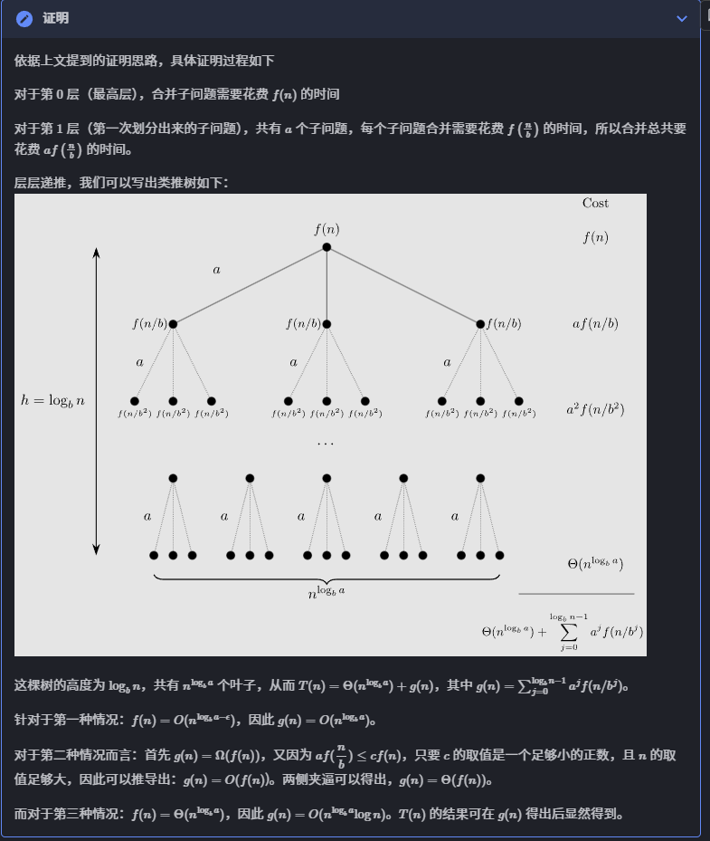
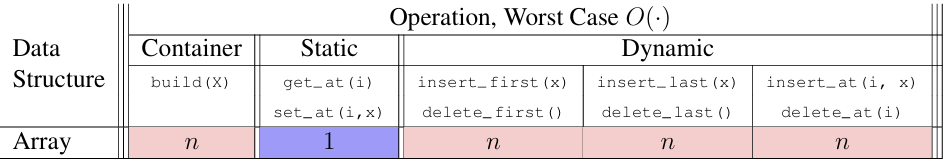
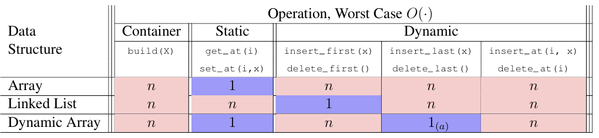

我个人认为这两节课的定位类似, 都是**为后续算法讲解提供理论基础**, 故合为一篇.因为写的时候还想全英记笔记, 所以这一篇是英文, 后续大概率会回到中文, 原因见随笔. 同时这一篇笔记几乎等于对MIT6.006公开Notes的简单整理+简单扩充, 因为MIT的Notes**太优质了**, 个人能做的修改聊胜于无. 讨论课(Recitation)的内容与Lec分开发(其中也会包含我认为Problem set, Assessment等题目中我认为有讨论价值的内容的整理) 

# Lecture 1
## 1.1 Problem
**Definition**: A binary relation from **problem inputs** to **correct outputs**.
We can't specify **every** correct output for all inputs(tooooo many), so we can provide a verifiable predicate (a property) that correct outputs must satisfy.

## 1.2 Algorithm 
**Definition**: Procedure mapping each input to a single output (deterministic)
In other words, it solves a problem if it returns a correct output for every problem input

## 1.3 Correctness
How to prove correct of algorithm?
+ For small inputs, we can use **case analysis**(verify every inputs and output)
+ For arbitrarily large inputs, algorithm must be **recursive** or **loop** in some way, must use **induction**.

(1.4 and 1.5 is from **OI-wiki**)
## 1.4 Efficiency(or time complexity) 
How to mesure efficiency of algorithm?
Measure **run time**? But time is depends on both **input scale** and **machine perform**.
So we suggest the size of input is $n$, and represent the efficiency by a function about n: $O(n)$, $\Omega (n)$, $\Theta (n)$, means the number of the computations.
Upper bounds ($O$), lower bounds ($Ω$), tight bounds ($Θ$)

More rigorous, we difine those:
For function $f(n)$, $g(n)$.
+ $f(n)=\Theta(g(n))$ IFF $$\exist c_1,c_2,n_0\geq 0\ s.t.\\
\forall n\geq n_0,0\leq c_1\cdot g(n)\leq f(n)\leq c_2\cdot g(n).$$
+ $f(n)=O(g(n))$ IFF $$\exist c,n_0\geq 0\ s.t.\\
\forall n\geq n_0,0\leq f(n)\leq c\cdot g(n).$$
+ $f(n)=o(g(n))$ IFF $$\exist c,n_0\geq 0\ s.t.\\
\forall n\geq n_0,0\leq f(n)< c\cdot g(n).$$
+ $f(n)=\Omega(g(n))$ IFF $$\exist c,n_0\geq 0\ s.t.\\
\forall n\geq n_0,0\leq c\cdot g(n)\leq f(n)$$
+ $f(n)=\omega(g(n))$ IFF $$\exist c,n_0\geq 0\ s.t.\\
\forall n\geq n_0,0\leq c\cdot g(n)< f(n)$$
In computer science, we always consider about big O, two main reason:
+ O is easy to type "O" on computers wwwwwwwww
+ Some times we only can prove the upper bounds(In some complicated algorithm)
### Common properties
+ $f_1(n)+f_2(n)=O(max\{f_1(n), f_2(n)\})$
+ $f_1(n)\times f_2(n)=O(f_1(n)\times f_2(n))$\\$
+ $\forall a\neq 1,log_an=O(log_2n)$  (Because of **Change of Base Formula**)

## 1.5 主定理 (Master Theorem)
For recursive algorithm, we can use **Master Theorem** to quickly compute its time complexity.
Let $T(n)$ be the time complexity. If we can split the problem of scale $n$ into $a$ sub-problems of scale $(\frac{n}{b})$, each time of sub-problem combination incurs cost $f(n)$ time, that:
$$
T(n)=aT(\frac{n}{b})+f(n), \forall n>b
$$
then, we have:
$$
T(n)=\begin{cases}
\Theta(n^{log_ba}), &f(n)=O(n^{log_ba-\epsilon}), \epsilon>0\\
\Theta(f(n)), &f(n)=\Omega(n^{log_ba+\epsilon}), \epsilon\geq 0\\
\Theta(n^{log_ba}log^{k+1}n), &f(n)=\Theta(n^{log_ba}log^kn), k\geq0\\
\end{cases}
$$


## 1.6 Model of Computation
In this class, we use ***Word-RAM*** model. It specificate for what operations on the machine can be performed in O(1) time 
+ Machine word: block of $w$ bits ($w$ is word size of a w-bit Word-RAM) 
+ Memory: Addressable sequence of machine words 
+ Processor supports many constant time operations on a O(1) number of words (integers): 
  + integer arithmetic: (+, -, *, //, %) 
  + logical operators: (&&, ||, !, ==, <, >, <=, =>) 
  + (bitwise arithmetic: (&, |, <<, >>, ...))
  + Given word `a`, can **read** word at address `a`, **write** word to address `a` 
+ Memory address must be able to access every place in memory 
  + Requirement: $w$ must can represent largest memory.
    + If memory is $n$ bits, then $w\geq log_2n$
+ Python is a more complicated model of computation, implemented on a Word-RAM

## 1.7 Data Structure(A little, more in Lec 2) 
Definition: A data structure is a way to store non-constant data, that supports a set of operations 
+ A collection of operations is called an **interface**
+ Different **type** of data structure:
  + Sequence: Extrinsic order to items (first, last, $n$-th)
  + Set: Intrinsic order to items (queries based on item keys) 
+ Data structures may implement the **same** interface with **different** performance
+ Stored word can hold the address of a larger object 

---
# Lecture 2: Data Structures 
+ A **data structure** is a way to store data, with algorithms that support operations on the data 
+  Collection of supported operations is called an **interface** (also **API(Application Programming Interface)** or **ADT(Abstract Data Type)**) 
   + **Interface** is a **specification(规范)**: what operations are supported (the problem!) 
   + **Data structure** is a **representation**: how operations are supported (the solution!) 
   + The definition is similar to the "`interface`" in **JAVA** www
### In this class, there are two main *interfaces*: Sequence and Set
## 2.1 Sequence Interface
+ Maintain a sequence of items (order is extrinsic) 
+ Expression: $(x_0,x_1,x_2,...,x_{n−1})$ (zero indexing) 
+ (use $n$ to denote the number of items stored in the data structure) 
+ Supports sequence operations: 


| Type | Operation | Description
|---|---|---
|Container | `build(X)` | given an iterable `X`, build sequence from items in `X`  
| | `len()` | return the number of stored items
| Static | `iter_seq()` | return the stored items one-by-one in sequence order 
| | `get_at(i)` | return the $i-th$ item 
| | `set_at(i, x)` | replace the $i-th$ item with `x`
| Dynamic | `insert_at(i, x)` | add `x` as the $i-th$ item 
| | `delete_at(i)` | remove and return the $i-th$ item
| | `insert_first(x)` | add `x` as the first item 
| | `delete_first()` | remove and return the first item 
| | `insert_last(x)` | add `x` as the last item
| | `delete_last()` | remove and return the last item 
+ Special case interfaces: 
  + stack insert last(x) and delete last() 
  + queue insert last(x) and delete first() 

## 2.2 Set Interface
+ Order in **intrinsic** order
  + Each item has an unique keys(`x`--`x.key`)
  + Now we just restricct that the key is unique(not multi-set)
  + Often we just let `x.key=x`(Like `set` in Python), but may need different(Like `dict` in Python)
+ Supports set operations: 
  
Special case interfaces:  `dictionary`: set without the Order operations   

There are many types to inplement **Sequence interface**:
### 2.1.1. Array Sequence
+ A sequence of items. 
+ Advantage:
  + `get_at(i)` and `set_at(i)` in $\Theta(1)$ time (because access a address is $\Theta(1)$ time)
+ Disadvantage:
  + Bad at dynamic operations
  + For consistency, we maintain the invariant that array is full. So when insert and remove items, it requires:
    + Reallocating array
    + Shifting all items after modified item

+ Array always implement by address+offset, like in C++, an int array `num[i]` is means: address (`num` + `i*sizeOf(int)`).
  + In C++, variable array actually is a pointer, point to the address of the first item in array.
  + [i] is the offset
  + that's why array can  arandom access in $O(1)$ time


### 2.1.2. Linked List Sequence
+ **Pointer** data structure
  + Each item stored in a `Node`
  + Each `Node` stores item's value and pointers.
    + For **Single Linked List**, each `Node` just need to store the next `Node`'s address
      + 
    + For **Double Linked List**, need pointer `next` and `prev`
      + 
+ Advantage:
  + Great at dynamic operation
    + Manipulate nodes simply by relinking pointers
  + Insert and delete from the front in Θ(1) time
+ Disadvantage:
  +  `get_at(i)` and `set_at(i, x)` each take $O(n)$ time
+ 
We just implement Single Linked List here.
```python
class SingleLinkList():

  class Node():
    def __init__(self, item):
      self.item = item
      self.next = None

  def __init__(self):
    """build()"""
    self._head = None
    self._len = 0
  
  def len(self):
    return self._len
  
  def __iter__(self):
    self.cur = _head
    return self

  def __next__(self):
    if cur is None:
       raise StopIteration
    result, cur = cur, cur.next
    return result.item
  
  def get_at(self, index):
    if index > self.len()
      raise IndexError(f:"index: {index} is out of length: {self._len}")
    cur = _head
    while index > 0:
      cur = cur.next
      index--
    return cur.item
  
  def set_at(self, index, item):
    if index > self.len()
      raise IndexError(f:"index: {index} is out of length: {self._len}")
    cur = _head
    while index > 0:
      cur = cur.next
      index--
    cur.item = item
  
  def insert_at(self, index, item):
    if index > self.len()
      raise IndexError(f:"index: {index} is out of length: {self._len}")
    cur = _head
    while index > 1:
      cur = cur.next
      index--
    temp = cur.next
    cur.next = Node(item)
    cur.next.next = temp
  
  def delete_at(self, index, item):
    if index > self.len()
      raise IndexError(f:"index: {index} is out of length: {self._len}")
    cur = _head
    while index > 1:
      cur = cur.next
      index--
    cur.next=cur.next.next
  
  def add_first(self, item):
    temp = _head.next
    _head = Node(item)
    _head.next = temp
  
  def delete_first(self):
    if _head is None:
      raise IndexError(f"List is empty")
    _head = _head.next
  
  def add_last(self, item):
    cur = _head
    while cur.next is not None:
      cur = cur.next
    cur.next = Node(item)
  
  def delete_last(self):
    if _head is None:
      raise IndexError(f"List is empty")
    if _head.next is None:
      _head = None
      return
    cur = _head
    while cur.next.next is not None:
      cur = cur.next
    cur.next = None
```

Can we have both advantage of them two(kand of)? Yes we have:
### 2.1.3. Dynamic Array Sequence:
+ Advantage:
  + Efficient for last dynamic operations
  + Each operation takes $Θ(1)$ **amortized time**(more details in next part)
+ Disadvantage:
  + when reallocation, each single operation need take $O(n)$ time
+ python's `list` is a dynamic array
+ Idea:
  +  Allocate extra space so reallocation does **not** occur with every dynamic operation 
+ **Fill ratio**: $0 ≤ r ≤ 1$ the ratio of items to space
  + In python, $0.25 \leq r \leq 1$
  + Whenever array is **full** ($r = 1$), allocate $Θ(n)$ extra space at end to fill ratio $r_i$
    + In python, will double space every time when occur it
    + i.e. $r_i$ change to $0.5$
  + Whenever array is veay empty(in python is `r<0.25`), reallocate a new smaller(In python is half) space, and free the old space.
+ 

### 3. Amortized Analysis
+ Operation has amortized cost $T(n)$ if $k$ operations cost at most $≤ kT(n)$ 
+ “$T(n)$ amortized” roughly means T(n) “on average” over many operations
+ e.g. When a dynamic array is **full**with $n$ items, and we want to add $n$ items(python)
  + for the first item's addition, we need reallocate the space and copy all items in array, need $O(n)$ time.
  + then add the last $n-1$ items each need $O(1)$ time
  + total we need: $O(n)+(n-1)\times O(1)=O(n)$
  + average $O(1)$ for each operation