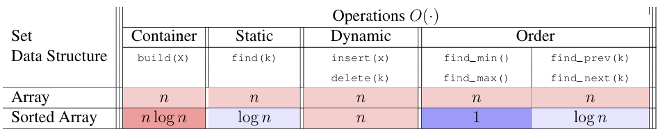

# MIT6.006 Lec3 sort
我们先详细的定义一下四种时间复杂度:
### 3.1.1 平均(期望)时间复杂度
即每个输入规模下所有可能输入对应用时的平均值的复杂度（**随机输入**下期望用时的复杂度）

### 3.1.2 最好时间复杂度
即每个输入规模下用时最短的输入对应的时间复杂度

### 3.1.3 最坏时间复杂度
即每个输入规模下用时最长的输入对应的时间复杂度

### 3.1.4 均摊复杂度 Amortized Analysis(来自[OI.wiki](https://oi.wiki/basic/amortized-analysis/))
均摊分析（Amortized Analysis）是一种用于分析算法和动态数据结构性能的技术。它不仅仅关注单次操作的成本，还通过评估一系列操作的**平均成本**，为整体性能提供更加准确的评估。均摊分析不涉及概率，且只能确保最坏情况性能的每次操作耗费的平均时间，并不能确认系统的平均性能。在最坏情况下，均摊分析通过将高成本操作的开销**分摊**到低成本操作上，确保整体操作的平均成本保持在合理范围内。

均摊分析通常采用三种主要分析方法：**聚合分析**、**记账分析**和**势能分析**。这些方法各有侧重，分别适用于不同的场景，但它们的共同目标是通过均衡操作成本，优化数据结构在最坏情况下的整体性能表现。
我们接下来以初始容量为$m=1$动态数组(dynamic array)的尾部插入操作为例, 分析三种分析方法下的均摊成本:
#### 3.1.4.1 聚合分析 (Aggregate Analysis)
聚合分析（Aggregate Analysis）通过计算一系列操作的总成本，并将其平均到每次操作上，从而得出每次操作的均摊时间复杂度。
对于动态数组的尾部插入, 有两种情况:
+ 若数组未满, 插入的成本为$O(1)$.
+ 若数组已满, 则插入操作需要先扩容, 需要$O(m)$的成本($m$为当前数组的大小), 然后进行$O(1)$的插入.
所以，为了计算$n$次插入操作的总成本，可以将其分开为两部分计算:
+ 插入成本: 每次插入都是$O(1)$, 故$n$次成本为$O(n)$
+ 扩容成本:
  + 每次扩容都发生在容量为$2$的整数次幂时(因为扩容操作为倍增数组大小), 故总时间成本为$1+2+2^2+...+2^k$, 其中$2^k$为不大于n的最大$2$的整数次幂.
  + 故总操作成本为: $1+2+2^2+...+2^k = \frac{2^{k+1}-1}{2-1} = O(n)$
+ 总均摊成本为: $\frac{O(n)+O(n)}{2}=O(1)$
+ 即使在最坏情况下，平均每次插入操作的成本依然是常数时间。

### 3.1.4.2 记账分析(Accounting Analysis)
记账法（Accounting Method）通过为每次操作预先分配一个固定的均摊成本来确保所有操作的总成本不超过这些预分配的成本总和。记账法类似于一种 费用前置支付 的机制，其中较低成本的操作会存储部分费用，以支付未来高成本的操作。
以动态数组的尾部插入为例:
1. 费用分配:
   1. 我们假设每次插入的成本为$1$, 那么我们记每次插入的均摊成本为$3$
      1. 其中, $1$为每次插入的成本为$1$
      2. 剩余得$2$是每次插入为未来的扩容操作"预存"的成本
      3. 即 $均摊成本=实际成本+预存成本$
2. 费用使用:
   1. 当数组已满时，需要进行扩容操作，实际成本为$O(m)$，其中$m$是当前数组的大小。
   2. 假设扩容前数组的元素数量为$n$，由于原数组的后半部分$\frac{n}{2}$个元素在插入时共预存了$n$单位的均摊成本，恰好足够支付扩容操作的成本。
   
### 3.1.4.3 势能分析(Potential Analysis)
势能分析（Potential Method）通过定义一个势能函数（通常表示为 $\Phi$），度量数据结构的**潜在能量**，即系统状态中的预留资源，这些资源可以用来支付未来的高成本操作。势能的变化用于平衡操作序列的总成本，从而确保整个算法的均摊成本在合理范围内。

1. 我们定义状态 $S$ 为某一时刻数据结构的**状态**，该状态可能包含元素数量、容量、指针等信息，其中定义初始状态为 $S_0$，即未进行任何操作时的状态。
2. 我们定义势能函数 $\Phi(S)$ 用于度量数据结构状态 $S$ 的势能，其满足以下两个性质:
   1. **初始势能**：在数据结构的初始状态$S_0$下，势能$\Phi(S_0) = 0$
   2. **非负性**：在任意状态$S$下，势能$\Phi(S) \geq 0$
3. 对于每个操作，其均摊成本 $\hat{c}$ 定义为:
$$ 
\hat{c} = c + \Phi(S') - \Phi(S)
$$
其中$c$为操作的实际成本，$S$ 和 $S'$ 分别表示操作前后的数据结构状态。
4. 该公式表明，均摊成本等于实际成本加上势能的变化。
   1. 如果操作增加了势能（即 $\Phi(S') > \Phi(S)$），则均摊成本上升；
   2. 如果操作消耗了势能（即 $\Phi(S') < \Phi(S)$），则均摊成本下降。

5. 我们可以通过势能函数来分析一系列操作的总成本。设 $S_1, S_2, \dots, S_m$ 为从初始状态 $S_0$ 开始，经过 $m$ 次操作后产生的状态序列，$c_i$ 为第 $i$ 次操作的实际开销，那么第 $i$ 次操作的均摊成本 $p_i$ 为：
$$
p_i = c_i + \Phi(S_i) - \Phi(S_{i-1})
$$
因此，$m$ 次操作的总时间花销为：
$$
\sum_{i=1}^m c_i = \sum_{i=1}^m p_i + \Phi(S_0) - \Phi(S_m)
$$
由于 $\Phi(S) \geq \Phi(S_0)$，总时间花销的上界为：
$$
\sum_{i=1}^m p_i \geq \sum_{i=1}^m c_i
$$
因此，若有 
$$
\forall i\in [1, m], p_i = O(T(n))
$$
则 $O(T(n))$ 是均摊复杂度的一个**上界**。

以动态数组的尾部插入为例:
定义如下的势能函数 $\Phi(h)$：
$$
\Phi(h) = 2n - m
$$
其中，$n$ 是数组中的元素数量，$m$ 是数组的当前容量。这个势能函数反映了数组中剩余可用空间的数量，即**当前容量和实际使用空间之间的差异**
每次插入有如下两种情况:
1. 空间未满, 无需扩容
   1. 操作成本：$O(1)$，因为只需插入一个元素
   2. 势能变化：插入后，元素数量增加 $1$，势能增加 $2$
      1. $\Phi(h') - \Phi(h) = (2(n + 1) - m) - (2n - m) = 2$
   3. 均摊成本: $n + 1 + (2 - n) = 3$
2. 空间已满($n=m$), 需要扩容
   1. 操作成本:
      1. 我们假定当前元素数$n=m$, 需要扩容至 $2n$
      2. 需要将当前所有元素复制至新数组并插入, 故实际操作成本为 $n+1$
   2. 势能变化: 
      1. 插入后, $m\rightarrow 2m,\ n\rightarrow n+1$
      2. 
      $$
      \begin{aligned}\Phi(h')-\Phi(h)
      &=(2(n+1)-2m)-(2n-m)\\
      &=2-m\\
      &=2-n\\
      \end{aligned}
      $$
   3. 均摊成本: $n+1 + (2-n) = 3
故所有均摊成本均为 $O(1)$

对于一个set interface, 我们想要按内在逻辑(intrinsic)寻找需要的key, 通常需要遍历一遍, 消耗 $O(n)$的时间, 那么如何加快这个操作? 最简单的方式就是在一个**有序数组**中查找key, 以下介绍几种为数组排序的方法:

## 3.2排序算法(sort algorithm)
+ 将array的元素排序成按key递增的形式
  + 更快的找到最大/最小值(第一个/最后一个元素)
  + 通过二分搜索(binary search)实现更快的查找, $\Theta(n)$时间
+ Input: (static) array A of n numbers 
+ Output: (static) array B(是A的一个有序排列sorted permutation)
  + permutation: 有相同元素不同顺序的array
  + sorted: $\forall i\in (0, n-2),\ b[i]<b[i+1]$
+ 
以下是部分排序算法:
(在代码中, 未在行末用"#"标注时间复杂度的都是$O(1)$)

### 3.2.1 排列排序 Permutation Sort 
+ 若不考虑A中有相同元素, A有$n!$种排列, 我们枚举出每一种排列并验证其是否是有序的
  + (有点类似于让一只猴子敲打字机, 总有一种可能是能打出<<莎士比亚>>)
+ 完全不稳定的排序, 毕竟你运气好可以第一个排列就是正确的, O(n)解决问题
代码实现:
```python
def permutationSort(A):                     #T(n)
    for B in permutations(A):               #O(n!)
        if is_sorted(B):                    #O(n)
            return B                        

def permutations(A):                        #S(n)
    if len(A)<=1:
        yield A
    for i in range(len(A)):                 #O(n)
        rest = A[:i] + A[i+1:]
        for p in permutations(rest):        #S(n-1)
            yield [A[i]] + p
```
+ 时间复杂度:
  + 平均时间复杂度:
    + `is_sorted`: 每次验证的时间是$\Theta(n)$的, 因为需要遍历所有元素
    + `permutations`: 递归的生成A的所有排列, $S(n)=n*S(n-1)$, 且$S(1)=\Theta(1)$, 故$S(n)=\Theta(n!)$ 
    + 对于每次生成的排列, 都要进行一起验证, 故平均时间复杂度是$\Theta(n)\times\Theta(n!)=\Theta(n\cdot n!)$ 
  + 最好时间复杂度:
    + 当第一个便利的排列是有序时, 时间为验证所需时间$\Theta(n)$
  + 最坏时间复杂度:$\Theta(n\cdot n!)$ 

3.2.2插入排序和3.2.3选择排序是对少量项进行排序的常用排序算法，因为它们易于理解和实现。这两种算法都是逐步的(incremental)，因为它们维护并增长元素的的有序子集，直到所有项目都有序.
我们再补充两个评估(排序)算法的概念:

**就地**(in-place)与**稳定性**(stability)
+ "就地(in-place)":
  + 指排序算法在排序过程中只需要**常数级别**的额外空间(即 $O(1)$ 额外空间复杂度)
  + 通常这类算法在实现的过程中基本上是在输入的数据结构内部进行所有必要的交换和调整，而不需要大量的额外数组或其他数据结构来辅助排序
+ "稳定(stable)":
  + 一个排序算法是稳定的，如果它保持了相等元素的相对顺序
    + e.g. 如果排序前有`A[i]==A[j]`($i<j$), 那么排序后同样有`A[i]`的新索引小于`A[j]`的新索引
  + 这个特性对于某些需要保证相同值元素原有顺序的应用场景非常重要

### 3.2.2 选择排序 Selection Sort 
+ 每次遍历剩余序列找出其最大/最小值, 取出放在新序列尾/头. 然后继续递归遍历去除该最值的剩余序列.
  + 在MIT6.006中, 实现逻辑为每次遍历`A`的子序列`A[:i]`找到最大值, 并将最大值(前缀最大值prefix_max)与`A[i]`交换
+ 如果序列是基于**数组(array)/动态数组**实现的, 那么因为其在任意位置的插入/删除是$O(n)$级别, 所以使用swap导致其是不稳定的(比如本课中的代码实现)
+ 如果序列是基于**链表**实现的, 那么就是稳定的

+ 是"就地"的
```python
def selection_sort(A, i = None):                    #T(i)
  ’’’Sort A[:i + 1]’’’  
  if i is None: i = len(A)- 1                       
  if i > 0: 
    j = prefix_max(A, i)                            #S(i)
    A[i], A[j] = A[j], A[i] 
    selection_sort(A, i - 1)                        #T(i-1)

def prefix_max(A, i):                               #S(i)
  ’’’Return index of maximum in A[:i + 1]’’’ 
  if i > 0: 
    j = prefix_max(A, i - 1)                        #S(i-1)
    if A[i] < A[j]: 
     return j 
  return i
```
+ 时间复杂度:
  + 平均时间复杂度:
    + 对于`prefix_max`:
      + base case: $i=0$时, 最大值的索引即为0
      + 递推: 前缀最大值是`A[i]`与前$i-1$个元素最大值的最大值
      + $S(1)=\Theta(1),\ S(n)=S(n-1)+\Theta(1)=\Theta(n)$
    + 对于`selection_sort`:
      + base case: 只有一个元素时是有序的
      + 递推: 假设前面的递推是正确的, 那么i后元素均在正确的位置, 递推继续
      + $T(1)=\Theta(1),\ T(n)=T(n-1) + S(n) = \Theta(n^2)$
  + 最好/最坏时间复杂度:
    + 同样需要上述所有过程, 故是$\Theta(n^2)$

### 3.2.3 插入排序 Insertion Sort 
我们假定前i-1个元素已排列好, 即子序列`A[:i]` 是有序的, 那么我们只需要依此将`A[i]`从`A[i-1]`开始向前移动, 直至其到达合适的位置, 即`A[j]<=A[i]`.

+ 是稳定的
+ 是"就地"的
```python
def insertion_sort(A, i = None):                #T(i)
  ’’’Sort A[:i + 1]’’’ 
  if i is None: i = len(A)- 1 
  if i > 0: 
    insertion_sort(A, i - 1)                    #T(i-1)
    insert_last(A, i)                           #S(i)

def insert_last(A, i): 
  ’’’Sort A[:i + 1] assuming sorted A[:i]’’’ 
  if i > 0 and A[i] < A[i- 1]: 
    A[i], A[i - 1] = A[i - 1], A[i] 
    insert_last(A, i - 1)                       #S(i-1)
```
时间复杂度:
  + 平均时间复杂度:
    + 对于`insert_last`:
      + base case: i=0, 只有一个元素的序列是有序的
      + 递推: 假设`A[:i]`是有序的, 那么只需要将`A[i]`向前移动直到遇见比自己小的数为止, 此时`A[:i+1]`也是有序的, 递推成立
      + $S(1)=\Theta(1),\ S(n)=S(n-1)+\theta(1)=\Theta(n)$
    + 对于`insert_sort`:
      + base case: i=0, 只有一个元素的序列是有序的
      + 递推: 若`A[:i]`是有序的, 那么我们只需要继续操作下去即可
      + $T(1)=\Theta(1),\ T(n)=T(n-1) + S(n) = \Theta(n^2)$
  + 最好/最坏时间复杂度:
    + 同样需要上述所有过程, 故是$\Theta(n^2)$
  
2025.10.15 补充
本质上, 插入排序的每一步都是在修复一个 **“逆序对”**. 我们还可以将插入排序的时间复杂度改写为 $\Theta(n+K)$, 其中 $K$ 为这个数组中逆序对的数量. 在对于 **基本有序** 或者 **数量小** 的数组, 插入排序往往能表现出不错的性能.

一方面, 对于基本有序的数组, 其逆序对的数量可以被视作 $\Theta(cn)$ 级别, 那么插入排序就能表现出近似常数时间复杂度的性能.

另一方面, 对于较小的数组, 使用其他排序常常需要许多预处理步骤, 以及在栈上的额外开支, 而in place的插入排序可以做到直接开始. 所以Java的 `Array.sort()` ($<15$ 个)和c++的 `std::sort` 对于小数组均使用插入排序.
  


### 3.2.4 归并排序 Merge Sort 
我们每次将序列分为长度大致相等的前后两半, 分别对其排序(递归的进行归并排序), 最后合并两个有序序列.
归并排序的平均时间复杂度是 $O(n\log n)$, 已经很接近线性时间复杂度了(比二次式接近了很多)

```python
def merge_sort(A, a = 0, b = None):                         #T(n)
  if b is None: 
    b = len(A) 
  if 1 < b- a: 
    c = (a + b + 1) // 2 
    merge_sort(A, a, c)                                     #T(n/2)
    merge_sort(A, c, b)                                     #T(n/2)
    L, R = A[a:c], A[c:b] 
    i, j = 0, 0 
    while a < b:                                            #O(n)用于merge
      if (j >= len(R)) or (i < len(L) and L[i] < R[j]): 
        A[a] = L[i] 
        i = i + 1 
      else: 
        A[a] = R[j] 
        j = j + 1 
        a = a + 1
```
+ 时间复杂度:
  + 平均时间复杂度:
    $$
    \begin{aligned}
    T(n)&=2T(\frac{n}{2}) + \Theta(n)\\
    &=\Theta(n\log^{0+1}n)\\
    &=\Theta(n\log n)
    \end{aligned}
    $$
+ 可以在实现时只使用 $O(1)$的额外空间, 但会极大的增加代码复杂程度, 故本实现还是非"就地"的
+ 是稳定的

通过3.2.4归并排序, 我们已经可以实现 $O(n\log n)$的排序,现在我们已经可以完成我们之前的表格了:

这种在构建容器时提前处理数据的方法, 我们称为预处理(preprocessing)

接下来是几种其他的常见排序方法, 仅作为拓展

### 3.2.5 希尔排序 Shell Sort
是一种对插入排序的优化, 也称为缩小增量排序(Diminishing Increment Sort)。它通过将待排序的列表分成若干子列表，对每个子列表进行插入排序，逐步缩小子列表的间隔，最终完成对整个数组的排序
我们知道插入排序一般来说是低效的, 但是**对于几乎有序的数组是高效的**(接近$O(n)$)
希尔排序的**基本思想**是：先将整个待排序的记录序列分割成为若干子序列分别进行直接插入排序，待整个序列中的记录"基本有序"时，再对全体记录进行依次直接插入排序。
**算法步骤:**
1. 选择增量序列：
   1. 选择一个增量序列（gap sequence），用于将列表分成若干子列表。常见的增量序列有**希尔增量**（$\frac{n}{2}, \frac{n}{4}, ..., 1$）等
2. 分组插入排序：
   1. 按照增量序列将列表分成若干子列表(如`[A[0], A[0+gap], A[0+2gap]...]` )，对每个子列表进行插入排序
3. 缩小增量：
   1. 逐步缩小增量，重复上述分组和排序过程，直到增量为 1
4. 最终排序：
   1. 当增量为 1 时，对整个列表进行一次插入排序，完成排序

> 初始状态：
列表：[8, 3, 1, 2, 7, 5, 6, 4]
初始增量：4（列表长度 8 的一半）
> 
> 第一轮（增量为 4）：
将列表分成 4 个子列表：
子列表 1：[8, 7]
子列表 2：[3, 5]
子列表 3：[1, 6]
子列表 4：[2, 4]
对每个子列表进行插入排序：
子列表 1：[7, 8]
子列表 2：[3, 5]
子列表 3：[1, 6]
子列表 4：[2, 4]
排序后的列表：[7, 3, 1, 2, 8, 5, 6, 4]
> 
> 第二轮（增量为 2）:
将列表分成 2 个子列表：
子列表 1：[7, 1, 8, 6]
子列表 2：[3, 2, 5, 4]
对每个子列表进行插入排序：
子列表 1：[1, 6, 7, 8]
子列表 2：[2, 3, 4, 5]
排序后的列表：[1, 2, 6, 3, 7, 4, 8, 5]
> 
> 第三轮（增量为 1）：
将整个列表视为一个子列表，进行插入排序
排序后的列表：[1, 2, 3, 4, 5, 6, 7, 8]   

```python
def shell_sort(A, gap=None):
  if(gap == None): gap = len(A)//2
  if(gap == 0): return
  for i in range(gap, len(A)):
    # 对每个子列表进行插入排序
    temp = A[i]  # 当前待插入元素
    j = i
    # 在子列表中找到合适的位置插入
    while j >= gap and A[j - gap] > temp:
      A[j] = A[j - gap]
      j -= gap
    A[j] = temp
  shell_sort(A, gap//2)
```
+ 时间复杂度:
  + 最优时间复杂度为 $O(n)$
  + 平均时间复杂度和最坏时间复杂度与间距序列的选取有关.总体来说在$O(n \log n)$ 到 $O(n²)$(最坏) 之间
    + 常见的增量序列:
      + 希尔增量：$\frac{n}{2}, \frac{n}{4}, ..., 1$，时间复杂度为 $O(n²)$。
      + Hibbard 增量：$1, 3, 7, 15, ..., 2^{k - 1}$，时间复杂度为 $O(n^\frac{3}{2})$
      + Sedgewick 增量：$1, 5, 19, 41, 109, ...$，时间复杂度为 $O(n^\frac{4}{3})$
    + 详见[OI.wiki-希尔排序](https://oi.wiki/basic/shell-sort/#%E6%97%B6%E9%97%B4%E5%A4%8D%E6%9D%82%E5%BA%A6)
+ 是就地的
+ 不稳定排序

### 3.2.6 冒泡排序 Bubble Sort
每次从头开始依此检查相邻元素, 将较大的元素如冒泡般逐渐移至数组尾部, 最终直至数组有序

递归实现:
```python
def bubble_sort(A, n=len(A)):        #T(n)
  if n == 1: return
  flag = True                        #若数组有序, 则一遍遍历便结束
  for i in range(n-1):
    if A[i] > A[i+1]:
      A[i], A[i+1] = A[i+1], A[i]
      flag = False
  if flag: return
  bubble_sort(A, n-1)               #T(n-1)
```
+ 时间复杂度:
  + 平均时间复杂度:
    + $T(n) = T(n-1) + \Theta(1) = \Theta(n^2)$
  + 最好时间复杂度:
    + 当数组本身有序时, 时间复杂度为遍历一遍数组的时间$\Theta(n)$
  + 最坏时间复杂度:
    + 最坏情况下, 需要进行$\frac{n(n-1)}{2}$次交换, 需要 $\Theta(n^2)$
+ 是稳定的(如果相同就不会交换)
+ 该实现下是"就地"的

经过Lec4的讨论, 我们知道, 基于比较模型的排序算法的效率被局限在 $O(\log n)$ 之下, 因为每次比较所获得的“决策树因子”是常数级别的, 故最终排序所花费的时间复杂度是 $(n\log n)$
但通过计算机中的一些特性, 我们便可以获得线性级别的决策树因子, 从而实现可能更高效的排序算法.
(原本下述的笔记都是我自己手打整理的, 但是沟槽的mac VSCode的一些和win的不同的特性, 导致我丢失了写了两三个小时的笔记, 我就只能直接copy [OI.wiki](https://oi.wiki)的内容了)

### 3.2.7 计数排序 (Counting Sort)
使用一个额外的数组`B`, 其第 $i$ 项为待排序数组`A`中等于 $i$ 的元素的个数, 之后利用`B`排序`A`. 因为`B`的索引本身就是有序的, 而现代内存机制可以做到$O(1)$的随机访问, 所以相当于用很大的空间实现了排序
> 譬如`A=[1, 1, 4, 5, 1, 4]`, `B`的大小为6.
> 那么当`B`处理完后, `B=[0, 3, 0, 0, 2, 1]`
> 即意味着A中有3个1 ...
> 那么我们可以轻易写出A得到有序形式: 111445
> 
实现其逻辑很简单, 但不能保证其稳定性(即如何保证相同元素的顺序), 故我们加入前缀和的处理, 确保排序前后的稳定性

```python
W = 114514 #最大元素
w = 0	#最小元素

def counting_sort(A):
	B = [0] * W
    result = [0] * len(A)
	for i in range(len(A)): B[A[i]] += 1
    for i in range(W-2, w-1, -1): B[i] += B[i+1]  #计算前缀和
    for i in range(len(A)):
    	result[B[A[i]]-1] = A[i]
        B[A[i]] -= 1
    return result
```
+ 时间复杂度:
	+ 平均, 最好, 最坏时间复杂度均为 $\Theta(n+W)$, 因为至少要遍历一遍A与B
	+ 采取了"空间换时间"的策略, 比如有10万个1-10000间的整数的排序, 这种算法可以近似达到$O(n)$的级别
+ 是稳定的(通过前缀和保证顺序)
+ 需要极大的额外空间(usually), 并非就地
+ 是一种非比较型的排序算法

### 3.2.8 基数排序
直接去看[OI.wiki-基数排序](https://oi.wiki/basic/radix-sort/#msd-基数排序)即可

--2025.8.8

### 3.2.9 优先队列排序 Priority Queue Sort
(MIT6.006 Lec8)

我们假设我们拥有一个已经良好实现的优先队列数据结构`PQ`, 那么我们就可以很轻易的利用PQ的功能实现高效的 **基于比较的**排序.

```python
def heap_sort(PQ, A):
  pq = PQ()
  for x in A:
    pq.add(x)
  return [pq.delete_max() for _ in A][::-1]
```

优先队列排序的 **本质** 是把排序抽象为两个步骤: **插入** 与 **提取极值**. 不同的PQ的实现对应着不同的经典排序算法.

基于我们对优先队列实现的不同, 我们所获得的优先队列排序其性能也有不同的表现. 对于其时间我们采用如下方式估计:
$$
T_{fastest} = T_{build}+n\cdot T_{delete_max} \le n\cdot T_{add}+n\cdot T_{delete_max}\Rightarrow T_{estimated}
$$

对于如下几种优先队列的实现, 我们有时间估计:
|Priority Queue | Operations ||| Priority Queue Sort||||
|---|---|---|---|---|---|---|---|
|Datastructure|`build(A)`|`add()`|`delete_max`|Time(fastest)|Time(estimated)|is in place?|Used Algorithm|
|Dynamic Array|$$O(n)$$|$$O(1)_{(a)}$$|$$O(n)$$|$$O(n^2)$$|$$O(n^2)$$|Y|Selection Sort|
|Sorted Dynamic Array|$$O(n\cdot\log n)$$|$$O(n)$$|$$O(1)_{(a)}$$|$$O(n\cdot\log n)$$|$$O(n^2)$$|Y|Insertion Sort|
|Set AVL Tree|$$O(n\cdot\log n)$$|$$O(\log n)$$|$$O(\log n)$$|$$O(n\cdot\log n)$$|$$O(n\cdot\log n)$$|N|AVL Sort|
|Binary Heap|$$O(n)$$|$$O(\log n)$$|$$O(\log n)$$|$$O(n\cdot\log n)$$|$$O(n\cdot\log n)$$|Y|Heap Sort|

(下注(a)意味均摊时间复杂度)


-- 2025.8.20

### 3.2.10 快速排序 Quick Sort
快速排序的核心思想是 **“分区 Partitioning”**, 也即采用了 **“分治 Divide and Conquer”** 的思想. 具体步骤如下:

step1. 选择一个元素 `x` 为 **“基准 pivot”**
step2. 获得两个子数组 `A` `B` , 子数组 `A` 的所有元素均不大于 `x` , 子数组 `B` 的所有元素均不小于 `x`.
step3. 递归的对两个子数组重复步骤1-2 
step4. 合并`A` `x` `B`.

#### Runtime Analyse
Best Case:
若我们选取的pivot始终为数组的中位数, 那么总时间就为 $\Theta(n\log n)$

Worst Case: 
若我们每次选取的pivot均为极值, 那么需要的总时间为 $\Theta(n^2)$

#### Perfoemance in practice
快速排序的平均时间为 $\Theta(n\log n)$ , 最坏情况为 $\Theta(n^2)$. 看似会慢于所有情况均为 $\Theta(n\log n)$ 的合并排序, 但是我们考虑如下几个因素:
1. 显示的数据分布出现极端案例的情况较小
   1. 我们假设每次选取的pivot均为数据的90%百分位数, 那么快速排序的时间为:
    $$
    \Theta(n\cdot \log_{\frac{10}{9}}n)=\Theta(n\log n)
    $$
    i.e. 对于绝大多数案例, 快排始终是 **基于比较** 的排序中最快的数量级
   2. 选取pivot的策略
   如果我们 **随机选取** , 同样可以保证 $\Theta(n\log n)$ 的时间复杂度.
2. 快速排序的过程, 实际上就是BST生成的过程. 如果你将快速排序的 pivot 选择序列看作 BST 的插入顺序, 那么比较的模式是相同的
换而言之, 快排的性能就约等于BST的性能.
3. 平均情况下, 性能为 $2n\ln n$ , 常数因子优于合并排序的 $n\log_2n$

#### 如何避免最坏情况:
1. 随机化选择pivot
2. 排序前预处理, 随机化处理序列从而避免遇到最坏情况
   1. $O(n)$ 预处理, 与排序所需时间消耗想比不值一提
3. 利用BFPRT's Algorithm

##### BFPRT
BFPRT是由5为CS科学家 Blum, Floyd, Pratt, Rivest和Tarjan于1973年提出的算法(在原论文中被称为 **PICK**). 被用于以线性时间 $O(n)$ 快速找到一个未排序序列中的 **“第k小的数”** .

##### Main Process: Find the medium of medium
这也是BFPRM区别于其他快速选择算法的步骤. 我们递归的进行如下步骤:
step1. 将序列进行5个一组的分组, 分成 $\lceil \frac{n}{5}\rceil$ 组
step2. 找到每组的中位数, 所有中位数形成一个新的序列
step3. 对新的序列递归的进行原步骤, 最终得到我们的pivot(也即the medium of medium)

时间上, 我们很轻易可以写出递推式:
$$
T(n) = T(\lceil \frac{n}{5}\rceil) + O(n) = O(n)
$$
其中后续的 $O(n)$ 主要是对每组进行寻找中位数的过程

而我们再关注我们找出的 **“中位数的中位数”**, 由于这个最终的pivot `M` 大于一半的倒数第二批中位数序列, 每个中位数序列中的元素均在原5元素组中大于两个元素, 我们就可以写出式子:
$$
3\times \lceil\frac{\lceil \frac{n}{5}\rceil}{2}\rceil\approx\frac{3}{10}n
$$
也即 `M` 至少大于 $\frac{3}{10}n$ 的元素
同理可证得 `M` 至少小于 $\frac{3}{10}n$ 的元素.

换而言之, 如果我们以 `M` 作为pivot, 对该序列进行划分, 那么的到的左右两个子序列均是 $\frac{3}{10}n 到 \frac{7}{10}n$ 级别的数组, 也即我们确保了以 `M` 为pivot划分后 **子问题的规模范围** !

到这里, 我们已经不难看出如何通过BFPRM对快速排序的pivot选择策略进行优化. 而BFPRM的 “找到第 $k$ 小元素“ 的过程, 也是在递归中进行不断的缩小规模. 

最终我们通过BFPRT, 将我们的总问题拆分为如下的递推式:
$$
T(n)\le T(\frac{1}{5}n) + T(\frac{7}{10}n) + O(n)
$$

PS. 为什么选择5个元素分组.
首先偶数个元素分组, 中位数将是除法的形式, 显然不够简便. 我们设选择 $2k+1$ 个元素, 按上述过程进行寻找, 最终 `M` 的rank为:
$$
(k+1)\times \lceil\frac{\lceil \frac{n}{2k+1}\rceil}{2}\rceil\approx\frac{k+1}{4k+2}n
$$
随k递减, 并且当k=1时, 随Quick Sort的时间复杂度递推式变为
$$
T(n)\le T(\frac{1}{3}n) + T(\frac{2}{3}n) + O(n)
$$
注意到 $\frac{1}{3}n + \frac{2}{3}n = n$, 显然会退化为 $O(n\log n)$. 故我们选择最小的可用 $k$ :5

> 我们一般不使用BFPRT的思想选择pivot, 该算法看似将所有情况的时间复杂度均优化到了 $\Theta(n\log n)$, 但是其过大的常数因子, 导致了实际上的效果不如随机选择pivot.

附: 以BFPRT选择**median of medians**, 然后选取第k大的数的代码例:
```python
from merge_sort import merge_sort
data = [1,3,2,4,9,8,7,6,5]

def find_approximate_median(arr):
        if len(arr) <= 5:# The number usually is more than 30
            return sort(arr)[len(arr)//2]
        medians = []
        i = 0
        while i < len(arr):
            if i + 4 > len(arr):
                medians += [find_approximate_median(arr[i:])]
            else:
                medians += [find_approximate_median(arr[i:i+5])]
            i += 5
        return find_approximate_median(medians)

def find_kth(arr, k):
    # k from 0 to len(arr)-1
    pivot = find_approximate_median(arr)
    print("pivot = ", pivot)
    L, M, R = [], 0, []
    for i in range(len(arr)):
        if arr[i] < pivot:
            L += [arr[i]]
        elif arr[i] == pivot:
            M += 1
        else:
            R += [arr[i]]
    if k < len(L):
        return find_kth(L, k)
    if k < len(L) + M:
        return pivot
    return find_kth(R, k-len(L)-M)
```

#### 分区方式: Tony Hoare's Partitioning
我们考虑有两个指针在数组左右端点, 并且我们用某种策略选取了一个pivot.

左指针“hate”所有大于等于pivot的元素,  右端点“hate”所有小于等于pivot的元素. 他们向着另一个端点的方向遍历, 当遇到他们“hate”的元素时, 这个指针会停下直到另一个指针也遇到它hate的元素, **交换彼此元素** 并继续遍历, 直到两指针相遇.

此时, 相遇点左侧元素均小于等于pivot, 右侧同理.

TH Partitioning因为 **交换次数少**, 对**缓存友好** (因为是顺序访问元素, 符合CPU cache的设计), **逻辑简单**, 在恰当的pivot策略下, 通常效率是Merge Sort的2-3倍!


--2025.10.24