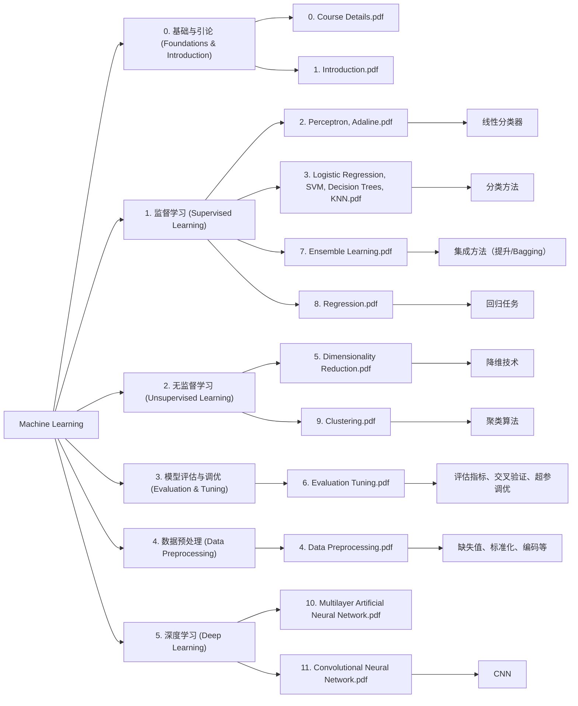

```text
Machine Learning
├──  0. 基础与引论 (Foundations & Introduction)
│   └── 0. Course Details.pdf
│   └── 1. Introduction.pdf
│
├──  1. 监督学习 (Supervised Learning)
│   ├── 2. Perceptron, Adaline.pdf                     → 线性分类器
│   ├── 3. Logistic Regression, SVM, Decision Trees, KNN.pdf → 分类方法
│   ├── 7. Ensemble Learning.pdf                       → 集成方法（提升/Bagging）
│   └── 8. Regression.pdf                              → 回归任务
│
├──  2. 无监督学习 (Unsupervised Learning)
│   ├── 5. Dimensionality Reduction.pdf               → 降维技术
│   └── 9. Clustering.pdf                             → 聚类算法
│
├──  3. 模型评估与调优 (Evaluation & Tuning)
│   └── 6. Evaluation Tuning.pdf                      → 评估指标、交叉验证、超参调优
│
├──  4. 数据预处理 (Data Preprocessing)
│   └── 4. Data Preprocessing.pdf                     → 缺失值、标准化、编码等
│
└──  5. 深度学习 (Deep Learning)
    ├── 10. Multilayer Artificial Neural Network.pdf
    └── 11. Convolutional Neural Network.pdf             → CNN
```

```mermaid
graph LR
    root((Machine Learning))
    root --> 基础理论
    root --> 监督学习
    root --> 无监督学习
    root --> 半监督与自监督学习
    root --> 强化学习
    root --> 深度学习
    root --> 模型评估与调优
    root --> 数据工程
    root --> 部署与应用

    基础理论 --> 数学基础
    基础理论 --> 核心概念
    
    数学基础 --> 线性代数
    数学基础 --> 概率与统计
    数学基础 --> 微积分
    数学基础 --> 优化理论
    
    核心概念 --> 假设空间
    核心概念 --> 偏差-方差权衡
    核心概念 --> 过拟合/欠拟合
    核心概念 --> No_Free_Lunch_定理

    监督学习 --> 分类
    监督学习 --> 回归
    
    分类 --> 线性模型
    分类 --> 支持向量机
    分类 --> 决策树与集成方法
    分类 --> K近邻
    分类 --> 贝叶斯分类器
    
    线性模型 --> Perceptron
    线性模型 --> Logistic_Regression

    决策树与集成方法 --> RF
    决策树与集成方法 --> GBDT
    决策树与集成方法 --> XGBoost

    回归 --> 线性回归
    回归 --> 岭回归_Lasso
    回归 --> 多项式回归

    无监督学习 --> 聚类
    无监督学习 --> 降维
    无监督学习 --> 关联规则

    聚类 --> K-Means
    聚类 --> 层次聚类
    聚类 --> DBSCAN
    聚类 --> 高斯混合模型_GMM

    降维 --> PCA
    降维 --> t-SNE
    降维 --> LDA
    降维 --> 自编码器_Autoencoder

    关联规则 --> Apriori
    关联规则 --> FP-Growth

    半监督与自监督学习 --> 半监督学习
    半监督与自监督学习 --> 自监督学习

    半监督学习 --> 一致性正则化
    半监督学习 --> 图半监督

    自监督学习 --> 对比学习_SimCLR_MoCo
    自监督学习 --> 掩码建模_MAE

    强化学习 --> 马尔可夫决策过程_MDP
    强化学习 --> Q-Learning
    强化学习 --> Policy_Gradient
    强化学习 --> Actor-Critic
    强化学习 --> DQN_PPO_SAC

    深度学习 --> 前馈网络_MLP
    深度学习 --> 卷积神经网络_CNN
    深度学习 --> 循环神经网络_RNN_LSTM_GRU
    深度学习 --> Transformer
    深度学习 --> 图神经网络_GNN
    深度学习 --> 生成模型

    生成模型 --> VAE
    生成模型 --> GAN
    生成模型 --> Diffusion_Models

    模型评估与调优 --> 评估指标
    模型评估与调优 --> 验证方法
    模型评估与调优 --> 超参优化

    评估指标 --> 分类指标
    评估指标 --> 回归指标
    评估指标 --> 聚类指标

    分类指标 --> Accuracy
    分类指标 --> Precision
    分类指标 --> Recall
    分类指标 --> F1
    分类指标 --> AUC

    回归指标 --> MAE
    回归指标 --> MSE
    回归指标 --> R2

    聚类指标 --> Silhouette_Score
    聚类指标 --> Calinski-Harabasz

    验证方法 --> 留出法
    验证方法 --> K折交叉验证
    验证方法 --> 时间序列分割

    超参优化 --> 网格搜索
    超参优化 --> 随机搜索
    超参优化 --> 贝叶斯优化
    超参优化 --> Optuna_Hyperopt

    数据工程 --> 数据预处理
    数据工程 --> 特征工程
    数据工程 --> 数据增强

    数据预处理 --> 缺失值处理
    数据预处理 --> 标准化_归一化
    数据预处理 --> 类别编码_One-Hot_Label_Embedding

    特征工程 --> 特征选择
    特征工程 --> 特征构造
    特征工程 --> 特征缩放

    数据增强 --> 图像_旋转_裁剪
    数据增强 --> 文本_同义词替换

    部署与应用 --> 模型压缩
    部署与应用 --> 推理加速
    部署与应用 --> MLOps

    模型压缩 --> 剪枝
    模型压缩 --> 量化
    模型压缩 --> 蒸馏

    推理加速 --> ONNX
    推理加速 --> TensorRT

    MLOps --> 模型版本管理
    MLOps --> 监控与漂移检测
    MLOps --> CI_CD_for_ML

```


    
