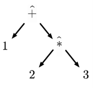

1. **language** of programming languages: 描述一种编程语言的不同组成部分的形式化系统
2. **primitive(基本元素)**: 
   1. objects that represent **atomic units** of meaning
   2. e.g. 
      1. In most programming languages are characters, booleans, functions, and so on.
      2. In natural language are n., adj. and v.
3. **composition**:
   1. Composition means any kind of **operation** or structure that uses or relates objects.
   2. In natural language, we make meaning with sentence structures
      1.  e.g. subject-verb-object composition
4. **gramma**: a meta-linguistic(元语言的) concept, a tool for describing language structure.
5. **context-free grammar 上下文无关文法**
   1. 形式定义: 
   2. 一个上下文无关文法由四个部分组成，记作四元组：
        \[
        G = (V, \Sigma, R, S)
        \]
    其中：
        | 符号 | 含义 |
        |------|------|
        | \( V \) | **非终结符（Non-terminals）**：表示语法结构的抽象类别，如 `Expression`、`Statement`。它们可以被进一步展开。 |
        | \( \Sigma \) | **终结符（Terminals）**：语言中的基本符号，如数字 `1`、运算符 `+`、括号 `(` 等。不能再被替换。 |
        | \( R \) | **产生式规则（Production Rules）**：形如 \( A \to \alpha \)，其中 \( A \in V \)，\( \alpha \in (V \cup \Sigma)^* \)。表示如何将一个非终结符替换成一串终结符和/或非终结符。 |
        | \( S \in V \) | **起始符号（Start Symbol）**：生成整个语言的起点，通常是 `Program` 或 `Expression`。 |
6. **Syntax tree**: 
   1. CFG中表达式的实际含义. 
   2. e.g. linear expression "$1 \hat{+} 2 \hat{*} 3$" can be represented as:
   <!---->
   3. 以语法树的视角, 我们可以定义:
7. **syntax**: establish the basic structure of a language.
8. 
   
---
