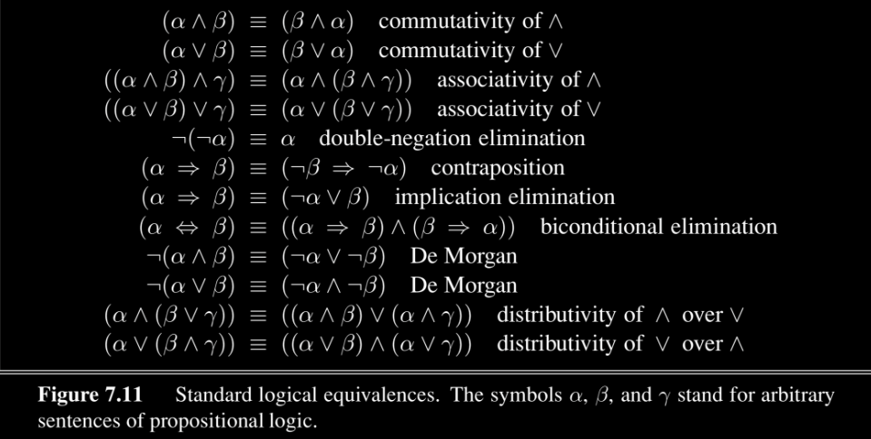

# 1. Basics of logic
## 1.1 Basic language of logic:
+ **Not**: $\neg p = true$ **if and only if** $p = false$
+ **And**: $A\wedge B = true$ **IFF** $A=B=true$
+ **Or**: $A\vee B = true$ **IFF** at least one of $\{A,B\}$ is $true$.
+ **Implication**: $(A\Rightarrow B) = true$ **IFF** 
    1. $B=true$
    2. $A=false$.  
   i.e. $(A\Rightarrow B) = (\neg A)\vee B$
+ **biconditional**: $A\Leftrightarrow B = true$ **IFF** $A=B$

## 1.2 Property of basic operation of logic:

<!---->

# 2 Propositional logic
**PRopositional logic** composed of **proposition symbols** and **logic connectives**.
+ **Proposition symbols**:
  + We use a uppercase letter to represent an **atomic proposition**, which is an indivisible fundamental statement about the world.
  + e.g. $A=\{\text{I fuck the HKU}\}$
+ **Model**: A complete assignment method for all propositional symbols(True of False).

There are three types of a sentence(the combination of propositions):
+ Valid/Tautology:
  + Is **true** for all models
+ Satisfiable
  + There is at least one model make it true
+ Unsatisfiable/Comtradiction
  + Is **false** for all models

## 2.1 CNF Conjunctive Normal Form
CNF is a standard form of proposition, composed of many **subsentence**, each subsentence is composed of many **literals**, combinated by $\wedge$.   
i.e.
$$
(A_1\vee A_2\vee\dots)\wedge(B_1\vee B_2\vee\dots)\wedge\dots
$$

