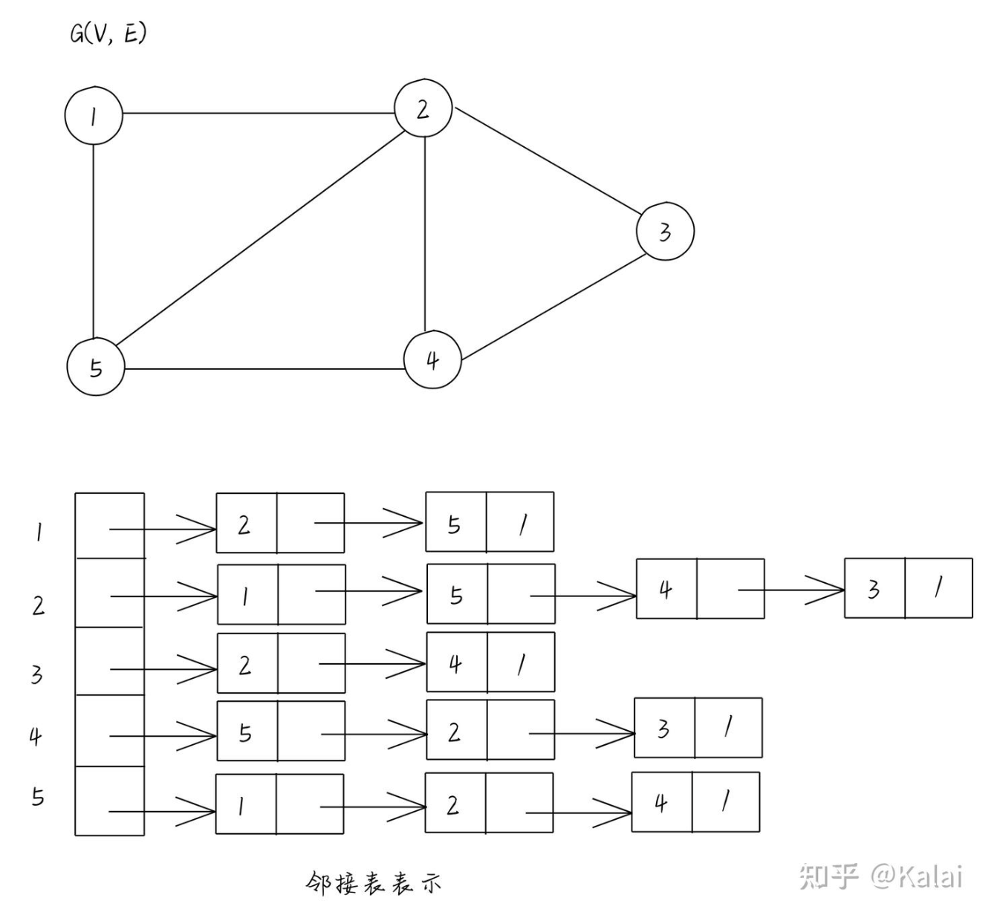

# Graph Traversal

**Graph** 是一种在数学与计算机科学中被广泛用到的数学对象. 一个graph由两个集合组成, 也即:$G=(V, E)$, 其中 $V$ 是包含着所有 **顶点** 的 **顶点集**,  $E$ 是包含所有 **边** 的 **边集**.

## 相关术语约定:
1. 我们称两顶点 **相邻(incident/adjacent)** 当 $E$ 中包含这两个顶点连成的边
2. 对于 $V$ 中两顶点 $u,v$, 
   1. 若一个图是 **有向图**, 则 $E$ 中的边为 **有序点对**, 也即 $(u, v)$
      1. 我们称u为边 的
   2. 若一个图是 **无向图**, 则 $E$ 中的边为 **无序点对**, 也即 $\{u, v\}$
   (或者替代成同时含有两条有向边 $(u,v), (v,u)$ )
3. 我们用 **度 degree** 来表示每个顶点相连
4. 对于有向边 $e=(u, v)$
   1. 我们称 $u$ 是 $e$ 的 **尾 tail**, $v$ 是 $e$ 的 **头 head**.
   2. $e$ 是 $u$ 的 **出边 outgoing edge**, 是 $v$ 的 **入边 incoming edge**. 相对应的, 我们有 **出度 out-degree** 与 **入度 in-degree**
   3. 对于 $u$, 其 **出边点集(outgoing neighbor set)** 被记作 $Adj^+(u)=\{v\in V|(u,v)\in E\}$, **出度** 被记作 $deg^+(u)=|Adj^+(u)|$
   4. 对于 $v$, 其 **入边点集(incoming neighbor set)** 被记作 $Adj^-(v)=\{u\in V|(u,v)\in E\}$, **入度** 被记作 $deg^-(v)=|Adj^-(v)|$
   5. 在 **无向图** 中, 对任意顶点都有: $Adj+(u)=Adj^-(u)$
5. 一条 **路径 path** 是一组有序点集 $(v_1, v_2,...v_k)$. 其中对任意的点对 $(v_i,v_{i+1})$, 都有边 $(v_i,v_{i+1})$ 存在于边集 $E$ 中.
   1. path的 **长度 length** $l(p)$ 被定义为这条路经的边数(或者顶点数减1)
   2. 顶点间的 **距离(Distance)** $d(u,v)$ 被定义为两点间的最短路径
      1. 若两点间不存在路径, 我们通常定义 $d(u,v)=\infty$
6. 一个图被称作 **强连通 Strongly Connected** 当且仅当对任意两个顶点间都存在一条路经.
7. 通常在图论算法中, $\Theta(V+E)$ 被称作 **线性时间**

图一般分为 **简单图 sample graph** 与 **复杂图 complex graph**.
我们定义:
1. 重边: 当边集 $E$ 中存在多个头尾相同的重复边时, 我们说该图含有 **重边**
2. 自环: 当一条边头尾为同一个顶点时, 我们称这条边为 **自环 self-loop**

##### 一个简单图, 是不含有重边, 自环的图.

我们大部分时候都会着重讨论有向简单图

## 图的表示/储存
(我们这里假设是 **简单有向图** , 无向图可以理解为存在两条 **仅有方向相反的边**)
#### (我们用 $N,M$ 表示顶点数与边数)
### 1. 直接存边:
我们直接把所有相连的边以元组列表的形式储存. 这个方法很符合我们数学上对graph的定义, 但它的性能大部分时候十分糟糕, 比如我们想知道所有与顶点`v`相连的结点, 需要遍历整个边集, 所以需要特定的结构去优化.

通常来说
+ 如果我们希望快速的访问顶点, 通常使用 **Hash Table** 或 **Direct Access Array** 储存邻接表
+ 如果我们希望快速迭代顶点的所有边, 通常使用 **Linked List** 或 **Array**

### 2. 邻接矩阵 Adjacent Matrix
我们用二维数组`A[][]`表示两个顶点的相连情况. 其中`A[u][v]`的值表示顶点u到v的状态.
+ 对于无权图, 我们可以用`bool`数组, `True`与`Flase`来表示是否相连.
+ 对于有权图, 我们用数值来表示边的权值, 用一个极大的数来表示不相连
  + 通常在实现最短路算法时, 我们使用`int`的最大值`inf`表示不相连(也即 $\approx\infty$)
    + `cpp`: `INT_MAX`
    + `java`: `Integar.MAX_VALUE`
    + `python`: python的整数没有传统意义上的最大值, 我们通常使用`sys.axsize`(平台相关的最大正向索引值)来表示“无限大”的概念, 但这可能不是整数的上限
因为邻接矩阵需要固定的 $\Theta(N^2)$ 的存储空间, 所以常用语稠密图, 也即边数接近 $O(N^2)$ 的图. 
对于稀疏图的存储, 我们很自然的想到可以只存储已经存在的边, 这就引出了下述几种方法(其实也就是方法1直接存边的优化)

### 3. 邻接表(也叫邻接链表) Adjacent List
我们用 $|V|$ 个链表来存储每个顶点的相邻的顶点. 如:

<!---->
对于一条有向边 $(u, v)$ , 他只会出现在邻接链表`Adj[u]`中, 所以邻接表使用的空间是 $O(V+E)$

对于有权图, 我们只需要稍加修改, 就可以储存:

<!---->

对于邻接表, 我们在输入时需要不断的动态拓展每个顶点邻接链表的大小, 在计算机底层的角度, 这会造成许多性能浪费. 所以我们考虑如何以静态的方式, 提前分配好空间, 避免性能浪费.

### 4. 链式前向星 Forward Star With Next Array
> Also names "静态邻接表 Static Adjacency List"

我们用两个数组来表示这个图:
+ `edge[M]`: 用来存储全部 $M$ 条边. 下标`i`表示第`i`条边
  ```cpp
  struct Edge{
    int to, weight, next;
  }edge[M];
  ```
  其中, 一条边的起点不在`edge[M]`中存储, 而是在`head[N]`中记录该链表的头部.
  `to`表示这条边的终点;
  `weight`表示这条边的权重
  `next`表示下一个条与这个边起点相同的边
+ `head[N]`: 存储邻接关系. 下标`i`表示第一次出现以顶点`i`为起点的第一条边在`edge`中的下标.

当我们需要遍历一个顶点`u`的所有出边时, 只需要从`edge[head[u]]`出发, 不断通过`next`指针向后遍历所有以`u`为起点的边即可.

本质上链式前向星就是通过维护`head[N]`与`edge.next`指针, 从而事先为链表腾出紧凑的大块空间, 从而避免动态拓展空间带来的额外复杂度.

<!---->


# Shortest Path
在最短路问题中, 我们通常是在一个图中, 寻找从出发点 `s` 到目标点 `t` 的最短路径. 我们做一些符号约定:
## 1. 符号约定
$E, V$: 分别指该图的 **边集** 和 **顶点集**
$n, m$: 在复杂度分析中通常指图的 **顶点数** 和 **边数**
`s`: 最短路问题的出发点
`D(u)`: 从源点 `s` 到`u`的 **实际** 最短路径(也即我们全部过程完成后的实际结果)
`dis(u)`: 从源点 `s` 到`u`的 **过程** 最短路径(也即在算法过程中, 当前能得到的最短路径长度)
`w(u, v)`: 边(u, v)的权值

我们只考虑有向正权简单图.

## 最短路算法

一般来讲, 对图的搜索分为 **“盲目式搜索(Blind Search)”** 和 **“启发式搜索(Heuristic Search)”**. 

### 盲目与启发

## 1. 盲目式搜索
盲目式搜索, 也叫 **无信息搜索(Uninformed Search)**, 是指在搜索过程中不使用任何关于目标位置或路径代价的额外信息, 仅根据问题的初始状态、目标状态和操作规则进行系统性探索。

假设我们想在一个迷宫上找到出口, 如果我们采用盲目式搜索, 就只能盲目的以 **某种特定的遍历方式**, 以最坏可能走遍整个迷宫的所有路线的代价, 找到出口. 

本质上, 我们 **无信息搜索** 的过程, 就是在图中, 以起点为 **root**, 建立一颗 **搜索树**. 而不同的 **无信息搜索的过程**, 就是我们访问/创建子结点的策略的不同

1. 如果我们不断以出发点为圆心, 螺旋的由近及远不断遍历周围所有可能的路线, 这就是BFS(breadth first search)
从搜索树的视角来看, BFS是优先创建满当前层的所有结点, 再继续遍历下一层.

2. 如果我们不断的沿着一个方向直到走到头, 然后退回一步到前一个岔口尝试另一个方向, 这就是DFS(depth first search)
从搜索树的视角来看, DFS是优先沿着一条path尝试走到叶结点

3. 如果我们贪心的不断记录从出发点到迷宫中上每个路口的最短距离, 并以此为基准继续更新其他点, 直到我们最终找到了出口, 这就是Dijkstra‘s algorithm.
从搜索树的视角来看, Dijkstra‘s 是优先遍历当前结点的最近(weight)子结点, 以贪心的策略进行.
etc.

### 1.1. 广度优先搜索 BFS

我们注意到, BFS只关心“部署”(这里是从一个结点到另一个结点), 而不关心每一步的权重, 所以我们只使用BFS无法解决有权图的最短路, 所以本示例仅解决每一条边权重均相等的情况以做演示
> 这里的“无法解决”指只能通过遍历所有路径才能最终以指数级别的时间复杂度找到最短路
> 有权图情况详见 [3. Dijkstra‘s”](#3-dijkstras-algorithm)

我们假设:
+ 用连续的正整数表示结点编号
+ 二维`bool`数组`edges[u][v]`的值表示`u`, `v`两点间是否相连
+ `bool`数组`is_visited[]`表示结点是否已被访问过

(使用cpp, 因为笔者好久没写了, 复习一下)
```cpp
int BFS(int s, int t){
    queue<tuple<int, int>> vertics;
    vertics.push({s, 0});
    is_visited[s] = true;
    while(vertics.size() > 0){
        auto cur = vertics.front();
        vertics.pop();
        for(int i=0; i<N; i++){
            if(edges[get<0>(cur)][i] && (!is_visited[i])){
                if(i == t)return get<1>(cur) + 1;
                is_visited[i] = true;
                vertics.push({i, get<1>(cur) + 1});
            }
        }
    }
    return -1;
}
```
特性:
+ 完备性(Completeness):
  + 若图中存在 **环** , DFS可能陷入死循环(当然可以通过限制层数等方法解决)
+ 最优性(Optimality): 
  + 原始的DFS不能保证, 只能找到第一条通路.
+ 时间复杂度:
  + 不考虑死循环, 最坏情况会遍历整个图 $O(mn)$

### 1.2. 深度优先搜索 DFS
分析同上, 不过由于函数递归是天然的stack, 我们使用递归(更简洁)
```cpp
int DFS(int s, int t){
    is_visited[s] = true;
    if(s == t)return 0;
    int dis = INT_MAX;
    for(int i=0; i<N; i++){
        if(edge[s][i] && (!is_visited[i])){
            dis = min(dis, DFS(i, t))
        }
    }
    is_visited[s] = false;
    return (dis == INT_MAX ? INT_MAX : dis+1);
}
```
特性:
+ 完备性(Completeness):
  + 具备, 只要解存在, 就能在遍历到这个层数时找到
+ 最优性(Optimality):
  + 不能保证, 只能保证找到 **经过边数** 最短的路, 当且仅当每条边权重均相同时能保证.
+ 时间复杂度:
  + 同DFS

但是注意, 虽然BFS和DFS都是通过枚举所有路径寻找有向无权图最短路, 但通常DFS性能表现较差. 因为BFS第一次寻找到t时就已经是最短路了, 但DFS需要枚举出所有的路径(终点为t or 到头遇不到t)才能判断出最短的路径. 所以DFS不适合最短路算法, 这里仅作参考了解DFS思想

### 1.3. Dijkstra’s algorithm
> 也被称作 **一致代价搜索（Uniform Cost Search, UCS**

D一串字母算法是通过特殊的顺序, 对BFS算法在有权图中的优化. 其本质上是使用贪心的思路, 与BFS类似的(优先遍历步数最少的), 优先遍历与源点“实际距离”最小的点, 从而保证了在有权图中的优异表现.

#### 1.3.1 idea
其核心思路很简洁:
1. 初始化优先队列
   1. 我们先将`s`压入最小堆优先队列`PQ`, 其 `key` 为 $0$
   2. 将图中剩余的 $n-1$ 个顶点全部压入`PQ`, `key` 设置为$+\infty$
2. 我们取出 `PQ` 的最优先元素顶点 `p` , 对所有以p为起点的 **出边** 进行 **松弛(relax)** 操作

**松弛**: 
这个操作在多个最短路算法中都会用到, 本质上类似dp的状态转移.
我们对某条边(p, q)进行松弛操作, 当满足条件:
`dis(p) + w(p, q) < dis(q)`
此时我们更新从源点到q的估计最小距离.

那么我们很轻易的就可以写出这个算法的建议代码了:

#### 1.3.2 implement
我们用 `edgeTo[]`记录最短路径的 **前驱结点** , 也即在我们最后得到的最短路径中, 到达结点`u`的最短路径的前一个结点是`edgeTo[u]`

```python
def relax(e):
    u, v = e.start, e.end
    if not PQ.contions(v): return
    if dis[u] + e.weight < dis[v]:
        dis[v] = dis[u] + e.weight
        edgeTo[v] = u
        PQ.change_priority(v, dis[v])
    
def dijkstra(vertices, s, t):
    PQ = PriorityHeap()
    PQ.add(s, 0)
    infinity = float('inf')
    for u in vertices:
        if u != s: PQ.add(u, infinity)
    while PQ.size() > 0:
        cur = PQ.pop()
        #留待优化
        for e in edge(cur): relax(e)
    return dis[t]
```

#### 1.3.3 Short-circuiting优化
我们注意到, 当一个顶点 `u` 被弹出 `PQ` 时, 从源点到 `u` 的最短距离就已经被优化成 **实际最短距离** , 也即`D(u) = dis(u)`. 这也是我们在relax()时, 不去松弛终点不在PQ中的边的原因. 出于此, 如果我们只想知道源点s到t的距离, 只需要等到t被弹出后, 就可以结束算法, 而不需要继续进行后续的过程.

也即, 我们在上述代码的“留待优化”行添加
```python
if(cur == t)return dis[t]
```
即可

#### 1.3.4 正确性
(完备性(Completeness)与最优性(Optimality))

每次的弹出dis()最小顶点的操作, 本质上是一种贪心算法, 我们选取当前已知的从s出发到达最近的点, 进行松弛.

我们采用数学归纳法来证明: 每当我们对 `PQ` 进行弹出堆顶操作时, 源点 `s` 到堆顶顶点 `v` 有 `dis(v) = D(v)`

**base case**: 对于第一个元素, 是源点 `s` 自己, 距离显然为0

接下来我们采用 **反证法** : 我们假设 `p` 是第一个满足 `dis(p) != D(p)` 的堆顶顶点

那么说明存在一条path: `(s, ..., p)`, 其权长小于我们已找到的最短路径

首先我们能证明, 该路径上的所有点, 都不在我们的最小堆`PQ`里.
+ 否则由源点到该在堆中的路径中间点`v`的长度:`dis[v]` 已经大于原最短路径 `dis[p]`, 也即`D(p)>dis(p)`, 与最短矛盾

那么, 由于我们的假设, 该路径上的倒数第二个点`q`(到`p`的 **前驱结点** )满足`D(q) = dis(q)`, 那么很明显当我们遍历到q被弹出时, `dis[p]`必定会被`relax`为`dis[q]+w(q, p)`, 此时我们有 `dis(p) = D(p)`

综上, 我们证明了该算法的正确性.

> 在之前的分析中, 我们一直保持的一个前提就是, 该图为非负权图, 当有负权时, 我们的很多推断便是不一定正确的. 对于此的解决方法, 我们之后会介绍 **Johnson 全源最短路径算法**

#### 3.5 时间复杂度分析
在优先队列的实现版本中, 我们总共会进行 $O(m)$ 次修改 `PQ` 的键值, $O(n)$ 次`pop`操作. 理论上(采用斐波那契堆)最优的性能是 $O(m+n\log n)$

此外还有很多不同的实现方式, 会得到不同的时间复杂度

<!---->

### 1.4 Floyd algorithm
我们定义一个三维数组`f`, `f[n][x][y]` 表示在仅经过前 $k$ 个结点的情况下, 从结点`x`到`y`的最短距离.(`x`, `y`不一定在 $k$ 的范围内)

那么很自然的, 我们要求出 `f[n][s][t]` 的值. 那么我们只需要类似动态搜索的, 递归的求出值便可:
+ base caes: `f[0][x][y]`有三种取值:
  + 当x=y时, 取0
  + 当x与y直接相连时, 取该边的权值
  + 当x与y不直接相连时, 取一个极大值
+ recursion(或者状态转移方程):
  + `f[k][x][y] = min(f[k-1][x][y], f[k-1][x][k] + f[k-1][k][y])`
    最小值中的前者表示不使用k的最短距离, 后者表示途径k的最短距离

代码示例:
```python
def floyd(n, s, t):
    inf = sys.maxsize
    f = [[[inf for _ in range(n+1)] for _ in range(n+1)] for _ in range(n+1)]
    for j in range(1, n+1):
        for k in range(1, n+1):
            if(j == k):f[0][j][k] = 0
            elif(is_connected(j, k)): f[0][j][k] = weight(j, k)
    for i in range(1, n+1): 
        for j in range(1, n+1):
            for k in range(1, n+1):
                f[i][j][k] = min(f[i-1][j][k], f[i-1][j][i] + f[i-1][i][k])
    return f[n][s][t]
```
或者可以优化空间, 只使用二维数组:
```python
def floyd(n, s, t):
    inf = sys.maxsize
    f = [[inf for _ in range(n+1)] for _ in range(n+1)]
    for j in range(1, n+1):
        for k in range(1, n+1):
            if(j == k):f[j][k] = 0
            elif(is_connected(j, k)): f[j][k] = weight(j, k)
    for i in range(1, n+1): 
        for j in range(1, n+1):
            for k in range(1, n+1):
                f[i][j][k] = min(f[i-1][j][k], f[i-1][j][i] + f[i-1][i][k])
    return f[s][t]
```

### 1.5 DAG Shortest Pash Search
我们首先引入一个概念: Topolocal Sort. 
#### 1.5.1 Topological Sort
1. 现实背景
我们考虑要逐步看完HKU的所有课程, 其中很多课程存在前置关系, e.g. 如果像学COMP2113, 需要pass COMP1117 or ENGG1330. 那么我们如何确定一个符合前置关系上课的顺序呢?
2. 抽象模型
我们考虑将这些具有 **完成先后顺序** 的事件抽象到一个 **有向无环图(DAG Directed ? Graph)** 中. 那么我们希望找到一个有序无重复的顶点序列, 能遍历整个 $V$ , 并且对于每条有向边 $(u,v)$, $u$ 总是在 $v$ 的前边.

那么我们考虑如何获得这个序列.
#### 1.5.2 基于DFS的Topological Sort
+ step1. 任意选择一顶点
+ step2. 递归的沿DFS访问该顶点的所有子顶点, 当我们访问完该顶点的所有子顶点, 将其标记为“已访问”并加入 **序列**
+ step3. 重复的进行step1-step2, 直到所有顶点均已被标记为“已访问”
+ step4. 我们前边提到的序列的 **反序** 即为一个Topological Sort序列.

##### 伪代码
```pseudocode
function DFS(unVisited, result, vertice)
    for(nextVertice in vertice.nextVertice) do
        if(nextVertice not in unVisited) then
            continue
        end if
        DFS(unVisited, result, nextVertice)
    end for
    result.add(vertice)
    unVisited.delete(vertice)
end function

function dfsTopologicalSort(DAG)
    add all vertex of DAG to unVisited
    result = []
    while(unVisited is not empty) do
        vertice = unVisited.pop()
        DFS(unVisited, result, vertice)
    end while
    return result.reverse()
end function
```

##### 正确性的证明:

我们每次`DFS`某个顶点时, 其所有子顶点都会递归的先于该顶点加入result, 也即在result的反序中后于该顶点. 从而保证了正确性. 我们的到的Topological Sort 序列取决于我们在“剩余顶点集合”中选取新顶点的顺序.

##### Runtime Analyse
由于DFS的性质以及每个顶点我们只遍历一次, 总的时间复杂度时 $\Theta(V+E)$
#### 1.5.3 基于BFS的Topological Sort
step1. 记算所有点的入度
step2. 选择任意一个入度为0的顶点
step3. 将v加入Topological Sort序列, 将v删除, 将v所有子结点入度-1
重复step2直至所有顶点均被加入Topological Sort序列.

原理类似DFS-Tolological Sort, 时间复杂度也是$\Theta(V+E)$

#### 1.5.3 基于Topological Sort的DAG SPT
我们重新考虑Dijkstra‘s, 其最基本的思想是利用贪心的策略选择对顶点relax的顺序. 但也因为relax时只考虑了出边, 导致在负权图中, 已经被relax的顶点在后续发现该点有负权入边时, 算法的正确性出错. 但如果我们relax的顺序是 **按照Topological Sort的顺序** 进行, 对于每个顶点的relax, 我们确保了它的所有入边都被考虑过后, 才会进行relax, 所以DAG SPT实际上拓展了Dijkstra在负权图中的应用(虽然也添加了 **图必须是DAG** 的限制)

并且在时间复杂度上, 由于Dijkstra’s需要用到Priority Queue, 其时间复杂度包含了对 $V$ 个顶点的堆操作, 也即时间复杂度为 $O(E+V\log V)$, 实际上当顶点数量大是慢于DAG LPT.

### 1.6 Bellman–Ford Algorithm
在Dijkstra‘s中, 我们针对每个顶点的所有出边进行relax, 而我们也可以考虑直接对每条边 $(u,v)$ 进行relax. 

每次对边 $(u,v)$ relax本质上是是$S\rightarrow v = min\{S\rightarrow v, S\rightarrow u\rightarrow v \}$

我们考虑每轮对所有的 $E$ 条边进行relax, 若最短路存在, 则每轮都会至少为我们找到的最短路边数+1, 由于最短路最长的边数为 $n-1$, 那么我们可以估计出该算法的时间复杂度为 $O(VE)$


## 2. 启发式搜索
启发式搜索, 也叫有 **信息搜索(Informed Search)**，是指在搜索过程中利用启发函数 `h(n)` 来估计从当前节点 `n` 到目标的代价, 从而优先探索 **“更有希望”** 的路径。

很自然的, 还是上述例子, 当我们确定了(估计到)出口的大致方位(`h(n)`), 例如出口在东方, 我们是可以直接向着这个方位开始搜索(直接走向出口的方向). 但我们目测的大致方位有时并不一定是正确的, 我们需要不断调整我们的`h(n)`.

### 2.1 启发函数
而对启发函数 $h(n)$ 的选取, 通常有如下要求:
1. 可采纳性 Admissible
   也即, 启发函数的预估值不应大于实际最短距离.
   $$
   h(n)\le h(n)
   $$
   其中, $h^*(n)$是实际最短距离
   这样我们能确保我们找到的最短距离是**最短的**.
2. 一致性 consistency
   对任意边(m,n), 我们有:
   $$
   h(n)\le h(m)+w(m,n)
   $$
   (这也是Dijkstra, A*进行“松弛操作”的理论基础)
    这样可以保证A*不需要重复访问节点
#### Dominance
我们称启发函数 $h_a(n)$ 是 **支配 Dominant** $h_a(n)$ 的, 当且仅当:
$$
\forall n:\ h_a(n)\ge h_b(n)
$$
很自然的, 如果一个启发函数支配了另一个启发函数, 在 A* 算法中他就是更优的启发函数. 他的预估值更接近真实距离. 我们称如下的启发函数:
+ **平凡启发函数 Trivial Heuristic**: 
  + $h(n) = 0$, 此时A*退化成Dijkstra‘s(UCS)
  + 任何启发函数都支配平凡启发函数
+ **完美启发函数 Perfect Heuristics**: 
  + $h(n) = g(n)$, 也即预估距离完美贴合实际最短距离

### 2.2 贪婪搜索 Greedy Search
实际上赖斯Dijkstra‘s, 但是我们以H(n) = h(n)作为预估距离, 也即只关注启发函数.
缺点:
+ 不完备：可能陷入局部最优或无限循环（如被错误启发式误导）
+ 不最优：即使找到解，也可能不是代价最低的路径

### 2.3 A* algorithm
事实上A* Algorithm与Dijkstra‘s Algorithm的思路类似. 但是此时我们使用结点的综合优先级H(n)作为评估每个结点的“预计代价”
我们定义:
$$
H(n) = g(n) + h(n)
$$
其中: 
+ $H(n)$ 为综合优先级, 是我们评估某一节点的参考数据
+ $g(n)$ 为从源点 $s$ 到该结点的 **实际代价**
+ $h(n)$ 为从该结点到终点$t$的**估计**代价

#### 2.3.1 思路
那么我们的思路也很明确了, 与Dijkstra‘s Algorithm类似地:
1. 将所有结点放入优先队列`pq`中(小根堆), 除源点外的h(n)均设置为正无穷(充分大即可)
2. 弹出堆顶结点, 对其所有出边进行松弛操作
   1. 此处的松弛是针对实际代价$H(n)$的
3. 重复2直至我们弹出到终点

#### 2.3.2 启发函数$h(n)$
对启发函数的选取是决定A* algorithm性能的关键. 
+ 在二维平面图中(例如平面地图), 我们常常利用x, y坐标的运算估算距离.
  + 在网格地图中, 我们常使用**Manhattan Distance**: 我们定义 $h(n) = |x_1-x_2|+|y_1-y_2|$
  + 在存在斜向移动的地图中, 我们使用**Euclidean Distance**: $h(n) = \sqrt{(x_1-x_2)^2+(y_1-y_2)^2}$
  + 对角线距离: 
  $$
  h(n) = d_{min} + (d_{max}-d_{min})\cdot(\sqrt{2}-1)
  $$
  其中, $d_{min}=min(\Delta x, \Delta y)$, $d_{max}=max(\Delta x, \Delta y)$
+ 而在一般的图中, 我们没有潜在的几何信息, 所以一般直接设置$h(n)=0$, 此时A*直接退化为Dijkstra's algorithm.

实现类似Dijkstra, 不再赘述.

#### 2.3.4 实际技巧:
当我们有一系列admissible启发函数$\{h_1,h_2,...h_m\}$时, 我们考虑使用每个节点的启发函数的最大值, 也即:
$$
h(n) = \max\{h_1(n),h_2(n),\cdots,h_m(n)\}
$$
此时我们得到的新启发函数既是admissible的, 也是支配所有我们现有启发函数的!

---

(本文代码均为本人手打, 不代表参考链接作者代码水平)
参考链接:
1. [CS61B 2025sp](https://sp25.datastructur.es)
2. [OI.wiki 最短路](https://oi.wiki/graph/shortest-path)
3. [对于DFS，BFS，A*与IDA*等寻路算法的总结跟感悟-漏れた玩具](https://blog.csdn.net/ljt735029684/article/details/78945098)
4. 通义千问ai