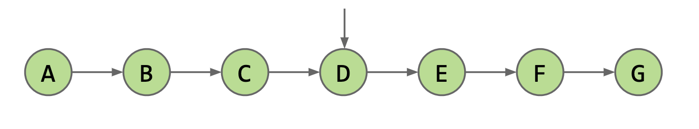
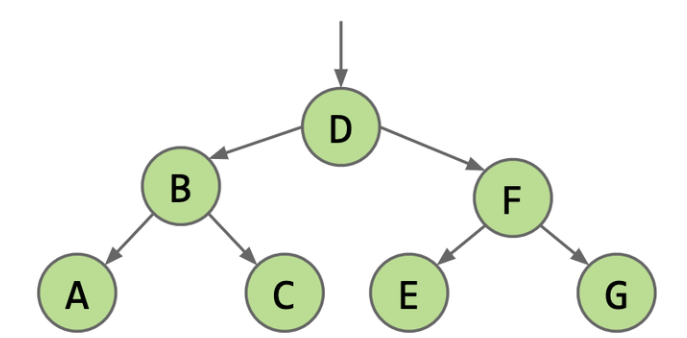
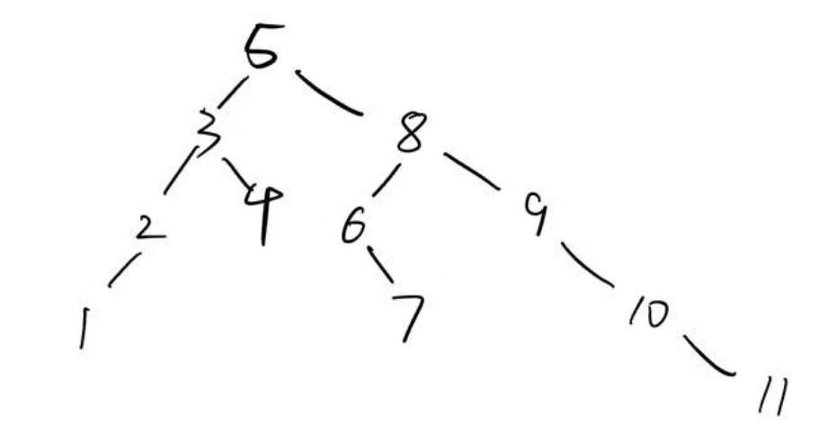
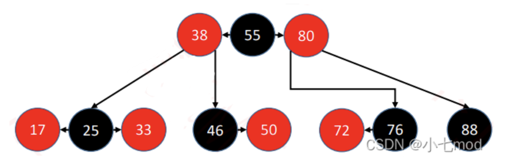
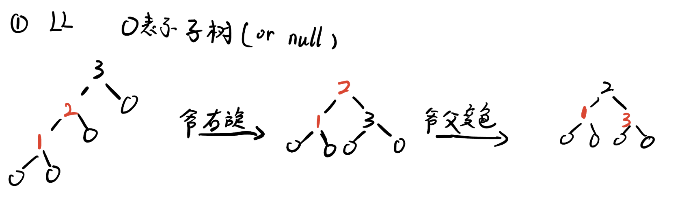

# Search Tree
大体内容整理自**UCB-CS61B** 教材的Lec16-18(因此采用java语言)
[CS61B-Textbook](https://cs61b-2.gitbook.io/cs61b-textbook)

大致顺序是-BST-B树-红黑树-AVL

给大家推荐一个可视化数据结构的网站
[Data Structure Visualizations](https://www.cs.usfca.edu/~galles/visualization/Algorithms.html)

## 1. 二叉搜索树 BST(Binary Search Tree)
对于链表数据结构, 我们如果通过遍历数组来查找一个key所需要的时间都是 $O(n)$, 很自然的我们会想到, 对有序数组使用二分查找的效率是 $O(\log n)$. 
为了实现高效的中间插入, 我们选择链表数据结构, 但是因为链表的索引访问`.get(i)`的效率是 $O(n)$, 若对一有序链表采用二分访问, 其效率应为 $O(n\cdot \log n)$, 甚至不如直接遍历搜索.
如何简化在链表中的高效二分查找呢? 我们考虑在有序的链表中储存其中间的值的索引, 即
```java
Node mid = this.get(Math.floor(size / 2))
```

<!--  -->
类似地, 我们通过与中间的值的比较, 又递归的获得了两个子链表, 我们继续储存其中间的值的索引

<!--  -->
如此递归的操作, 我们事实上已经获得了一个二叉树结构储存的索引, 所以我们可以通过如上的过程, 通过二叉树储存一系列可比较的值, 从而得到**二叉搜索树BST**.

<!--  -->
我们先给出几个严格的定义:
### 1.1 BST的相关定义
**树**是 $n$ 个结点的有限集. 当 $n=0$ 时, 称为空树. 在任意一棵树非空树中应满足:
1. 有且仅有一个特定的称为根 (root) 的结点；
2. 当 $n>1$ 时, 其余结点可分为 $m$ 个互不相交的有限集 $T_1,T_2,...T_m$, 其中每一个集合本身又是一颗树, 并且称为根的子树(SubTree)      

**二叉树**, 则是每个结点都只有两个子树的**树**, 被称为"左子树"和"右子树"(也即, 二叉树的左右子树是**有次序的**)特点包括：
1. 每个结点最多有两个子结点, 分别称为左子结点和右子结点
2. 左子树和右子树都是二叉树, 它们本身也可以是空树
3. 二叉树的结点结构包含一个数据元素和指向左右子树的指针

以下是一些常见的术语:
1. 结点: 包含一个数据元素及若干指向其子树的分支
2. 结点的度: 一个结点拥有的子树的数目
3. 叶子或终端结点: 度为 $0$ 的结点
4. 非终端结点或分支结点: 度不为 $0$ 的结点
5. 树的度: 树内各结点的度的最大值
6. 孩子结点或子结点: 结点的子树的根称为该结点的孩子结点或子结点
7. 双亲结点或父结点: 若一个结点含有子结点, 则这个结点称为其子结点的双亲结点或父结点
8. 兄弟结点: 同一个双亲的孩子之间互称兄弟
9. 祖先结点: 从根到该结点所经分支上的所有结点
10. 子孙结点: 以某结点为根的子树中任一结点都称为该结点的子孙
11. 结点的层次: 从根开始定义起, 根为第一层, 根的孩子为第二层. 若某结点在第 $L$ 层, 则其子树的根就在第 $L+1$ 层
12. 堂兄弟结点: 其双亲在同一层的结点互为堂兄弟
13. 树的深度或高度: 树中结点的最大层次
14. 森林: 由 $m(m\ge0)$ 棵互不相交的树的集合称为森林
15. 有序树和无序树: 树中结点的各子树从左到右是有次序的, 不能互换, 称该树为有序树, 否则称为无序树
16. 路径和路径长度: 路径是由树中的两个结点之间的结点序列构成的. 而路径长度是路径上所经过的边的个数

而**二叉搜索树**的定义如下:
对一颗二叉树, 如果其所有结点`node`满足:
1. 其左子树的所有结点, 其值均小于`node.value`
2. 其左子树的所有结点, 其值均大于`node.value`
   
那么这棵树被称作**二叉搜索树**

下面是一个简易的**BST**模块:
```java
private class BST<Key> {
    private Key key;
    private BST left;
    private BST right;

    public BST(Key key, BST left, BST Right) {
        this.key = key;
        this.left = left;
        this.right = right;
    }

    public BST(Key key) {
        this.key = key;
    }
}
```

**BST的深度(Depth)**:
+ root的深度为0, 向下递增
+ BST的平均深度是所有结点的深度之平均值

**BST的高度(Height)**: root到深度最大结点的距离, 也即树的最大深度.


<!---->

在BST的实际运行中, 其**结点的深度**决定了访问该结点所需的时间复杂度, **平均深度**决定了BST的平均性能, **高度**决定了BST的最坏运行时间. 在现实中, 我们可以证明:
对于一颗随机生成的BST, 记 $N$ 为其结点数, $h$, $d$ 为表示其高度, 深度的随机变量, 我们有:
$$
E[d]\approx 2\ln N\\
E[h]\approx 4.311\ln N
$$
<!--
以下是废案, 暂不知是我写错了还是是我理论知识不过关后续分析错了, 该递推数列的解是{1,2,3,...}
故先封存
我们尝试证明第一个:

我们用 $D_n$ 表示一个有 $n$ 个结点的BST的平均深度. 那么我们有如下的递推式:
$$
D_0=0\\
D_n=\frac{1}{n}\sum_{k=0}^{n-1}(D_k+D_{n-k-1})+1
=\frac{2}{n}\sum_{k=0}^{n-1}D_k+1
$$
也即 $D_n$ 的平均深度等于$左右子树平均深度+1$

我们考虑其对应的 **OGF(Ordinary Generating Function)** 形式:
$$
G(x)=\sum_{i=0}D_ix^i
$$

我们考虑:
$$
\begin{aligned}
&&G(x) &&= &&D_0 &&+D_1x &&+D_2x^2 &&+D_3x^3+...\\
&&xG(x) &&= && &&D_0x &&+D_1x^2 &&+D_2x^3+...\\
&&x^2G(x) &&=&& && &&D_0x^2 &&+D_1x^3+...
\end{aligned}
$$
notice:
$$
G(x)=\frac{2}{n}\sum_{i=1}x^iG(x)+1
$$
so that
$$
G(x)=\frac{1}{1-\frac{2}{n}\sum_{i=1}x^i}
$$
-->

看似性能平均是对数级别的, 但在实际应用中, 我们无法做到真正意义上的“随机生成”(我们很多时候并不能一次性获得所有的数据, 而是不断的构建/优化BST), 所以, 采取必要的措施去保证BST的“bushiness“很重要.

### 1.2 BST的遍历方式

而对于一颗BST, 如果我们把“遍历根结点”“遍历左子树”“遍历右子树”分别称作“D”“L”“R”, 那么我们按照遍历的先后, 递归的分别有6种遍历方式: DLR, DRL, LDR, RDL, LRD, RLD.

而考虑到在L与R在树结构上的对称性, 先遍历L还是R塞算法设计上的差别不大, 我们只考虑三种遍历方式:
1. 前序遍历(preorder traversal)-DLR
2. 中序遍历(inorder traversal)-LDR
3. 后序遍历(postorder traversal)-LRD

我们给出一个样例BST:

<!---->

#### 1.2.1 前序遍历
(我们仅解释一次, 后两种请自行类比)
对于每棵子树, 我们先遍历其根结点, 再依次遍历其左右子树.
对于样例BST, 我们的遍历顺序为:
5-3-2-1-4-8-6-7-9-10-11
example code:
```python
def preorder_traversal(tree, oper):
   if tree == None: return
   oper(tree.node)
   preorderTraversal(tree.left, oper)
   preorderTraversal(tree.right, oper)
```
通常来说, 前序遍历因为其会先遍历到根结点, 所以常用于当子结点依赖于父结点的情况.

#### 1.2.2 中序遍历
对于样例BST, 我们的遍历顺序为:
1-2-3-4-5-6-7-8-9-10-11
example code:
```python
def inorder_traversal(tree, oper):
   if tree == None: return
   inorder_traversal(tree.left, oper)
   oper(tree.node)
   inorder_traversal(tree.right, oper)
```
采取LDR或者RDL, 可以实现对BST的有序遍历, 获得有序的结果.


#### 1.2.3 后序遍历
对于样例BST, 我们的遍历顺序为:
1-2-4-3-7-6-11-10-9-8-5
example code
```python
def postorder_traversal(tree, oper):
   if tree == None: return
   inorder_traversal(tree.left, oper)
   inorder_traversal(tree.right, oper)
   oper(tree.node)
```


## 2. B-Tree

我们考虑有一颗已经构建好的BST, 如图所示:
<!---->

如果我们想向内插入新的元素`8`, 那么将会得到一颗高为4的新BST. 想象一个最糟糕的情况, 如果我们继续插入9,10,11..., 那么我们将会得到一个 $h\approx N$ 的超高的BST, 此时它的性能将接近Linked List. 所以我们考虑一种“过度填充(Overstuffing)”的思路:  
即将8与7放在同一个“格子”里(有点类似解决哈希碰撞的Chaining方法), 也就是得到如下右图的形式
<!---->

但是面临上述情况时, 同样会遭遇退化成链表的问题, 为了解决这个问题, 我们考虑让格子中的元素“上浮”. 也即当叶子结点上元素过多时, 我们考虑向父结点上浮其中的元素.

另一个问题是, 当一个结点有多个元素时, 其BST的性质将会发生改变, 我们很麻烦才能判断围绕着个结点的大小关系. 故我们考虑采用这个策略:

对于每个有 $n$ 个元素 $\{a_1,a_2,...a_n\}$ 的父结点, 其应有 $n+1$ 颗子B-Tree, 从左往右, 第 $k$ 颗 $(0<k\le n)$ 子树中的任意元素 $m$ 应满足 $a_{k-1}(if\ exist)<m<a_k(if\ exist)$
也即我们将该结点下所有元素划分成 个区间, 以父结点所有元素作为这些区间的端点.
以下是严格定义

Definition: 
m-n B-Tree是指每个节点至少有 $m$ 个关键字, 最多有 $n$ 个子结点(i.e. 最多 $n-1$ 个关键字)的B-Tree

而B-Tree中有两个重要的不变量:
1. 所有的叶子都离根的距离相同
2. 具有 $k$ 个项目的非叶子节点必须正好有 $k+1$ 个子节点

我们接下来以依次插入1-9 9个元素为例, 分别演示2-4 B-Tree与3-6 B-Tree的构造过程:
(AI生成)
**2-4 B-Tree:**
✅ 插入 1

树为空，创建一个根节点，插入 1。
```
[1]
```
✅ 插入 2

根节点未满（最多 3 个键），插入 2。
```
[1, 2]
```
✅ 插入 3

根节点仍不满，插入 3。
```
[1, 2, 3]
```
❗插入 4

根节点已满（已有 3 个键），需要分裂（split）。
分裂规则：
将当前节点的中间键（即 2）上移。
左边键（1）作为一个新节点。
右边键（3, 4）作为另一个新节点。
新的根节点包含中间键 2。
```
     [2]
   /     \
[1]   [3, 4]
```
✅ 插入 5

找到应该插入的位置：右子节点 [3, 4]。
该节点未满，插入 5。
```
     [2]
   /     \
[1]   [3, 4, 5]
```
❗插入 6

插入到右子节点 [3, 4, 5]，该节点已满，需要分裂。
中间键是 4，上移到父节点。
左子节点：[3]
右子节点：[5, 6]
父节点 [2] 接收新键 4，变成 [2, 4]

```
       [2, 4]
     /   |   \
  [1]  [3]  [5, 6]
```

✅ 插入 7

找到应该插入的节点：最右边的叶子节点 [5, 6]。
该节点未满（最多 3 个键），插入 7。
```
       [2, 4]
     /   |   \
  [1]  [3]  [5, 6, 7]
```
❗ 插入 8

插入到 [5, 6, 7]，该节点已满（3 个键），需要分裂。
中间键：6，上移到父节点。
左子节点：[5]
右子节点：[7, 8]
父节点 [2, 4] 接收新键 6，变成 [2, 4, 6]
```
         [2, 4, 6]
       /   |   |   \
    [1]  [3] [5] [7, 8]
```
❗ 插入 9

插入到 [7, 8]，插入 9 后变成 [7, 8, 9]，未满 → 插入完成 ✅
```
         [2, 4, 6]
       /   |   |   \
    [1]  [3] [5] [7, 8, 9]
```

**3-6 B-Tree**
✅ 插入 1

树为空，创建根节点，插入 1。
```
[1]
```
✅ 插入 2

根节点未满（最多 5 个键），插入 2。
```
[1, 2]
```
✅ 插入 3

插入到根节点中。
```
[1, 2, 3]
```
✅ 插入 4

插入到根节点中。
```
[1, 2, 3, 4]
```
✅ 插入 5

插入后变成 [1, 2, 3, 4, 5]，未满。
```
[1, 2, 3, 4, 5]
```
❗ 插入 6

根节点已满（已有 5 个关键字），需要 分裂（split）
找到中间键：3，作为新根
左子节点：[1, 2]
右子节点：[4, 5, 6]
新结构如下：

```
     [3]
   /     \
[1, 2]  [4, 5, 6]
```
✅ 插入 7

插入到右子节点 [4, 5, 6] 中 → 插入后变成 [4, 5, 6, 7]
```
     [3]
   /     \
[1, 2]  [4, 5, 6, 7]
```
✅ 插入 8

插入到右子节点中 → [4, 5, 6, 7, 8]
```
     [3]
   /     \
[1, 2]  [4, 5, 6, 7, 8]
```
❗ 插入 9

右子节点已满（5 个键），需要分裂
中间键：6
左子节点：[4, 5]
右子节点：[7, 8, 9]
父节点插入 6
父节点 [3] 接收新键，变为 [3, 6]
```

       [3, 6]
     /   |   \
[1,2] [4,5] [7,8,9]
```

最后, 我们简要的分析一下B-Tree的性能
对于一颗有 $N$ 个元素 p-q B-tree, 
1. 高度
   其高度应介于最好与最坏情况之间. 如果这颗B树是满的, 那么其高度应为 $\log_q \frac{N}{q-1}$, 也即 $\Omega(\log N)$ ; 对于其最坏情况, 即每个结点只有 $p$ 个元素, 那么其高度应为 $\log_{p+1}\frac{N}{p}=O(log N)$
   故B树的高度是 $\Theta (\log N)$ 级别的
2. 类似的分析, 其contain, add的的复杂度均为 $O(\log N)$

## 3. Red-Black Tree
PS. 本课(CS61B Lec18)中, 是基于对2-3 B-Tree的等价变形, 引出了LLRB(左倾红黑树), 并未介绍最原始的红黑树, 本笔记将基于本人对红黑树的学习, 将两种红黑树分别介绍

PS. 红黑树的发明晚于AVL, 其发明目的是基于简化AVL创建成本而诞生的, 但是由于其于B-Tree的等价关系, 故先收录红黑树.

> 本部分主要基于我对如下文章/网页/工具的学习:
[【数据结构】史上最好理解的红黑树讲解，让你彻底搞懂红黑树 - 小七mod](https://blog.csdn.net/cy973071263/article/details/122543826)

**红黑树**, 是一种自平衡的二叉查找树, 是一种高效的查找树. 由Rudolf Bayer于1972年发明的, 当时被称作**“平衡二叉 B 树(symmetric binary B-trees)“**, 后来在1978年被 Leo J. Guibas 和 Robert Sedgewick 修改为如今的红黑树.

我们前面已经说明了(并未证明), 如果一颗BST是随机生成的, 那么其高度在 $O(\log n)$ 范围内, 但在实际应用中, 数据的输入是不断进行的, 且通常是部分有序的(这也是python采用Tim排序的原因), 最极端情况下, 如果数据的输入是完全有序的, 那么BST将退化成一个链表, 达到 $O(n)$ 性能, 失去了其性能的优势 (我们也可以说BST的实际性能在 $O(\log n)$ 与 $O(n)$ 之间).

为了避免这一情况, 我们考虑通过特殊的约定(红黑节点)+旋转操作, 达成在构建时高效的保持搜索树平衡. 

我们约定:
### 3.1 红黑树的约束:
1. 每个节点不仅保存值, 还保存其颜色(Red or Black)
2. 叶子结点 **(这里指null节点)** 与 **root** 是黑色的
3. 红色节点的 **父结点** 与 **子结点** 都是黑色的
   1. 也即不存在相连的的红色节点
4. 从任一节点到所有(能到达)叶子结点的简单路径(也即只能向下)上都有相同数目的黑色节点.
   1. 我们将黑色节点的数目称为 **“黑高(Black-Height)“bh(x)**

而结合这几条约定, 我们能得出关于红黑树的许多有益性质:
### 3.2 红黑树的性质
#### (1) 任何一条从根到叶结点的简单路径上, 最长路径不大于最短路径的2倍
proof:
考虑约定4, 每条如上所示的路径上均有相同数目的黑色节点
考虑约定3, 无相邻的红色节点
故我们考虑最极端情况, 两条黑色节点数目相同的路径, 一条无红色节点, 一条塞满红色节点, 则后者是前者的二倍, 因为只能做到红黑相间.

#### (2) 红黑树的高度满足: $n\le 2^{\frac{H}{2}}+ \frac{H}{2} -1$
我们考虑最坏情况, 也即这颗红黑树只有一条路径是红黑相间的, 剩下的路径均为全黑, 也即有:
$$
n=(2^{\frac{H}{2}}-1)(前\frac{H}{2}层)+\frac{H}{2}(最长路径中比\frac{H}{2}更深的部分)\\
=2^{\frac{H}{2}}+ \frac{H}{2} -1
$$
考虑最好情况, 这棵树的所有由跟到叶子结点的路径均相同
$$
n = 2^{\frac{H}{2}}-1
$$
故, 对于所有的红黑树, 我们有:
$$
2^{\frac{H}{2}}-1 \le n \le 2^{\frac{H}{2}}+ \frac{H}{2} -1
$$
化简有:
$$
H \le 2\log_2 (n+1)\Leftrightarrow H=O(\log(n+1))
$$
而在 $H$ 充分大时, 与 $2^{\frac{H}{2}}$ 相比, $\frac{H}{2}$ 可以近似忽略, 我们就可以得出:
$$
H=\Theta(\log(n+1))
$$

从理论上分析, 每个结点的黑高均相等, 每个结点都有0-4个子树, 这都完美符合的2-4B树的定义.
换句话说, 红黑树和2-4 B树是存在一一对应关系的, 其中对应的每个B树, 其节点都是黑色结点在中间, 红色结点在左右的结构.


### 3.3 等价变换
虽然B树和红黑树的基于不同的目的分别独立的发明出来的
> 红黑树为简化AVL的维护
> B树为优化硬盘储存空间检索

但是我们发现红黑树和B树是存在某种等价关系的. 对于一颗红黑树, 当我们将其所有的红色节点移动至其父结点“Overstuffing”时, 我们发现事实上我们新得到的结构就是一颗 **2-4 B树**, 如下图所示

<!---->


<!---->

### 3.4 构建/维护红黑树
我们先详细讲解释一下几个基本操作:
#### 3.4.1 旋转操作
我们的旋转是针对某个结点进行的, 对每个节点, 只要其左子树非空即可左旋(也即以其右子结点代替其本身位置), 右旋同理.
而旋转 **不应破坏BST本身的性质** , 故我们在更换结点后,还有移植子树的操作.

# picture

具体的过程是:

# picture

#### ! 这里的旋转操作不止局限于红黑树, 后面讲到的AVL同样基于旋转操作来维护BST的性质

#### 3.4.2 查找操作
同普通BST的查找, 因为红黑树与AVL本身就是 **有更多优化约束的BST**

#### 3.4.3 插入操作(重点)

我们知道红黑树与2-4B树是具有一一对应的关系的. 如果我们以2-4B树的视角来看, 我们会很轻易的通过我们对B树的了解, 先转换成B树, 再进行插入删除操作, 最后再转回红黑树, 但这本身就与我们 **简化AVL插入删除繁琐过程** 的初衷相悖. 所以我们仅以红黑树本身变形的视角进行解释, 中间以2-4B树的视角进行等价的辅助说明.

##### step1. 我们规定, 每个新插入的结点都是红色结点

这一条看起来似乎与红黑树的几条性质相左, 我们在后续的步骤中, 会涉及染色操作, 从而保持红黑树的性质不变

##### step2. 将新插入的结点放置在相应的叶子结点位置上

##### step3. 调整直至新BST满足红黑树性质

我们先统一一下BST的辈份www


<!---->

(左右顺序可换, 但称谓不分左右, 看以哪个子结点为主视角)

此后, 我们会遇到很多种情况需要分别讨论.
1. 插入结点时为root, 则变为黑色, 结束.
   1. **2-4B树视角:** 根结点一定是结点中最中间的结点
2. 若父结点是黑色, 则不违背红黑树性质, 结束.
   1. **2-4B树视角:** 也即此叶子结点只有一个值, 我们只需overstuff插入进该结点即可
3. 若叔叔节点(父结点的同父兄弟结点)为黑色:
   1. LL类型, 即新结点为父结点的左子结点, 父结点为祖父结点的左子结点(之后将不再解释)
       1. 首先对祖父进行右旋
       2. 原来的父, 爷结点变色
       3. 得到红黑树
      
      <!---->
       4. **2-4B树视角:** 
    2. LR类型
       1. 先对父结点进行左旋
       2. 然后得到同3.1的LL类型, 相似处理方式
      
      <!---->
    3. RR类型
       1. 首先对祖父进行左旋
       2. 原来的父, 爷结点变色
       3. 得到红黑树
      
      <!---->
    4. RL类型
       1. 先对父结点进行右旋
       2. 然后得到同3.3的RR类型, 相似处理方式
      
      <!---->
4. 若叔叔节点为红色
   这种情况只需要变色即可
   1. 将父结点, 叔叔节点, 租父结点变色
   2. 若租父结点为root, 则染上黑色.
   下图例为假设租父结点不是root的情况
   
   <!---->
#### 3.4.4 删除操作
红黑树的删除情况较为复杂, 不过类似插入, 我们先类似BST的删除找到结点, 然后删除结点, 并通过染色+旋转操作从而恢复红黑树的性质
参考链接:

[彻底理解红黑树（三）之 删除](https://www.jianshu.com/p/84416644c080 )

以及附上一张, 大部分情况(对于实现完BST的插入/删除后不符合红黑树约定的情况), 变形直至恢复红黑树性质的图片


<!---->

### 3.5 红黑树效率
1. 每次旋转只需要常数时间 $O(1)$
2. 每次查找需要 $O(\log n)$时间
   由性质3.2.(2)可知, 树的高度是 $\Theta(\log(n+1))$, 由此可知, 查找的最坏情况也是 $\Theta(\log(n+1))$ 级别的时间.
3. 每次插入/删除最多耗费 $O(\log n)+O(1)=O(\log n)$ 时间. 
   因为只需要查找到相应叶子位置+常数级别的旋转/染色时间(因为没有循环, 递归之类的操作)

### 3.6 左倾红黑树 LLRB Tree (Left Leaning Red-Black tree)
PS. 这也是CS61B主讲的红黑树, 本人猜测是因为其原理与标准红黑树类似, 但是实现更简单, 更具有教学意义而非工程实践意义.

左倾红黑树与 **2-3 B树** 有一一对应的关系, 每个多元素结点(最多两个元素), 左元素被划分为红结点连至左子树, 右元素被划分为黑结点保留. 从而得到了相应的BST.

与传统“standard RBTree”相比, LLRB Tree实现起来更加的简便(重点在插入/删除上), 它简化了一部分的约束
> “它满足了许多原始设计目标，并且导致插入/删除的代码简单的多，仅需要常用实现代码的四分之一“
> 具体来说，在由一个N个键构成的左倾红黑2-3树种，一个搜索操作需要检查lgN - 0.5个节点，树的平均高度约为 $2\ln n$
在LLRB中由许多吸引人的特性：
   1：实验研究未能将这些算法与最优算法区分开
   2：它可以通过向标准BST算法添加几行代码来实现。
   3：与哈希表不同，他们支持有序操作，如：SELECT，RANK，RANGE搜索
因此LLRB树对于各种符号表应用程序都很有用，并且是未来软件库中作为符号表基础的主要候选对象
--(LLRB 发明者 Robert Sedgwick)

左倾红黑树有如下几条简化的不变量约束:
1. root与叶子结点(Null)是黑色的
2. 不存在两个相邻的红色结点
3. 每条路径上的黑色结点的数量是相同的

其操作的思想也与标准红黑树类似, 我们这里就不再展开赘述了.

## 4. AVL 

AVL是 **平衡二叉树** 全称叫做 **平衡二叉搜索(排序)树**, 简称 **AVL树(Balanced Binary Tree)**
AVL 是大学教授 G.M. Adelson-Velsky 和 E.M. Landis 名称的缩写, 他们提出的平衡二叉树的概念, 为了纪念他们, 将 平衡二叉树称为 AVL树

### 4.1 definition
我们定义: 
一个结点的 **“倾斜(skew)”** , 为其左子树的高度减其右子树的高度.
我们继续定义:
我们称一个结点是 **高度平衡的(height-balanced)** , 当且仅当其 $skew \in \{-1, 0, 1\}$

#### 一颗AVL树, 其左右子树都是AVL树

### 4.2 AVL的性质
基于先前所述的性质, 我们可以推出一个重要的结论: AVL树是平衡的.
i.e. AVL树的平均高度为 $O(\log n)$ 级别
proof:
该树的高度 $h=O(\log n)$等价于对于结点数 $n$ 有 $n=2^{\Omega(h)}$;
我们假设 $F(h)$ 表示, 一颗高度为 $h$ 的AVL的最少结点数字.
那么有:
$$
\begin{aligned}
&F(0) &&=0\\
&F(1) &&=1\\
&F(h) &&=1+F(h-1)+F(h-2)(由于AVL的性质)\\
&\ &&\ge 2F(h-2)
\end{aligned}
$$
故我们有:
$$
\begin{aligned}
F(h)\ge2^(\frac{h}{2})\\
也即: F(h)=2^{\Omega(h)}
\end{aligned}
$$

这样我们证明了, 这个重要性质. 而我们接下来关注, 如何构建一颗AVL树, 以及如何在insert/delete中保持其性质

### 4.3 维护AVL

在每次的插入过程中, 其只有可能影响其直系长辈结点的height-balance. 所以我们只需要关注其长辈结点.
并且, 对于一颗skew为 $\pm2$ 的不平衡AVL, 当我们通过旋转的方式消除不“高度平衡”性时, 其本身的高度也就减少了1(if L=D+2, then L'->L-1 = D+1; D'->D+1=L', height:D+2->D+1).所以我们只需找到这个叶子结点最近的不平衡祖先结点, 通过旋转将其平衡, 则不会对其祖先的祖先的平衡性造成影响.

确定了这一点, 我们发现, 只要能找到该祖先结点, 就能以 $O(1)$ 的时间成本解决, 也即插入时的时间成本主要花费在寻找该祖先结点上.

更具体的, 不妨设找到高度为 $h$ 的结点的skew成本为 $T(h)$, 那么我们有:
$$
time = O(\sum^h_{i=0}T(i)+1)=O(\sum^h_{i=0}T(i))
$$

我们找到每个结点左右子树的时间复杂度是 $\Omega(\log n)$.
example code:
```python
def height(tree):
   if tree == None: return 0
   return height(tree.left) + height(tree.right) + 1
```

则有:
$$
time = O(\log n!)\approx O(n\log n)
$$
花销很大, 那么我们考虑令每个结点都储存自身的高度, 达到需要时 $O(1)$ 的访问, 并在插入/删除是自动维护数值, 从而减小开销

以下是具体的实现(provide by mit6.006)
#### Binary Node Implementation with AVL Balancing
```python
def height(A):
    if A:
        return A.height
    else:
        return -1


class Binary_Node:
    def __init__(A, x):  # O(1)
        A.item = x
        A.left = None
        A.right = None
        A.parent = None
        A.subtree_update()

    def subtree_update(A):  # O(1)
        A.height = 1 + max(height(A.left), height(A.right))

    def skew(A):  # O(1)
        return height(A.right) - height(A.left)

    def subtree_iter(A):  # O(n)
        if A.left:
            yield from A.left.subtree_iter()
        yield A
        if A.right:
            yield from A.right.subtree_iter()

    def subtree_first(A):  # O(log n)
        if A.left:
            return A.left.subtree_first()
        else:
            return A

    def subtree_last(A):  # O(log n)
        if A.right:
            return A.right.subtree_last()
        else:
            return A

    def successor(A):  # O(log n)
        if A.right:
            return A.right.subtree_first()
        while A.parent and (A is A.parent.right):
            A = A.parent
        return A.parent

    def predecessor(A):  # O(log n)
        if A.left:
            return A.left.subtree_last()
        while A.parent and (A is A.parent.left):
            A = A.parent
        return A.parent

    def subtree_insert_before(A, B):  # O(log n)
        if A.left:
            A = A.left.subtree_last()
            A.right, B.parent = B, A
        else:
            A.left, B.parent = B, A
        A.maintain()

    def subtree_insert_after(A, B):  # O(log n)
        if A.right:
            A = A.right.subtree_first()
            A.left, B.parent = B, A
        else:
            A.right, B.parent = B, A
        A.maintain()

    def subtree_delete(A):  # O(log n)
        if A.left or A.right:
            if A.left:
                B = A.predecessor()
            else:
                B = A.successor()
            A.item, B.item = B.item, A.item
            return B.subtree_delete()
        if A.parent:
            if A.parent.left is A:
                A.parent.left = None
            else:
                A.parent.right = None
            A.parent.maintain()
        return A

    def subtree_rotate_right(D):  # O(1)
        assert D.left
        B, E = D.left, D.right
        A, C = B.left, B.right
        D, B = B, D
        D.item, B.item = B.item, D.item
        B.left, B.right = A, D
        D.left, D.right = C, E
        if A:
            A.parent = B
        if E:
            E.parent = D
        B.subtree_update()
        D.subtree_update()

    def subtree_rotate_left(B):  # O(1)
        assert B.right
        A, D = B.left, B.right
        C, E = D.left, D.right
        B, D = D, B
        B.item, D.item = D.item, B.item
        D.left, D.right = B, E
        B.left, B.right = A, C
        if A:
            A.parent = B
        if E:
            E.parent = D
        B.subtree_update()
        D.subtree_update()

    def rebalance(A):  # O(1)
        if A.skew() == 2:
            if A.right.skew() < 0:
                A.right.subtree_rotate_right()
            A.subtree_rotate_left()
        elif A.skew() == -2:
            if A.left.skew() > 0:
                A.left.subtree_rotate_left()
            A.subtree_rotate_right()

    def maintain(A):  # O(log n)
        A.rebalance()
        A.subtree_update()
        if A.parent:
            A.parent.maintain()
```