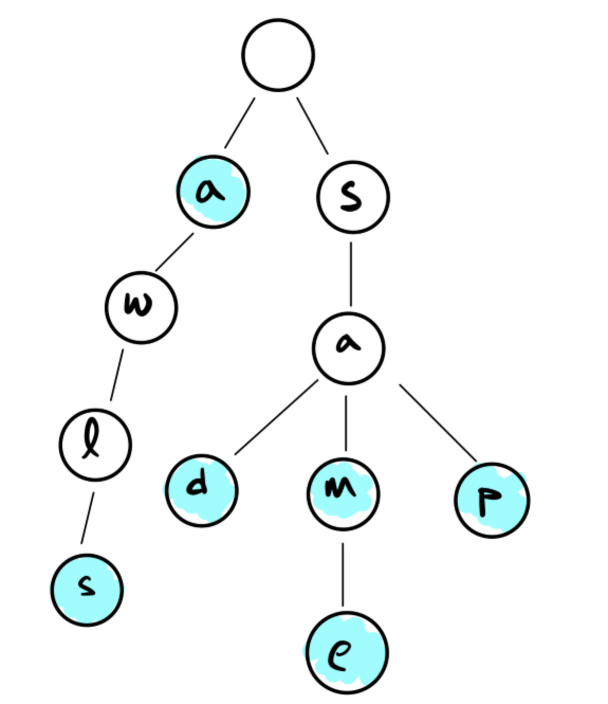

## 1. Definition
考虑一种key是字符串的字典. 我们考虑下述数据结构 `Trie`:
我们考虑一棵 **字典树** , 树的每一个结点都是一个字符(根结点表示字符串的开始), 一个字符串被储存入树时, 从根结点可以沿该字符串的每个字符依次选择子结点走下直到走到最后一个字符.
如我们储存单词"sam", "sad", "sap", "same", "a", "awls"的话, 我们会得到如下的结果:

<!---->

其中被染色表示单词的结束.

## 2. Implementation
我们不难写出如下代码:
```java
public class Trie<V>{
    private class Node{
        private char ch;
        private V value;
        private boolean isKey;
        private Children next;

        public Node(char c, V value, boolean isKey){
            this.ch = c;
            this.value = value;
            this.isKey = isKey;
            this.next = new Children();
        }
    }
}
```
有一个 **关键的问题** 是: 我们如何储存子结点?

### 1. 使用fixed length array
也即, `children` 是一个固定长度的array, 其长度为可能出现的字符的数量(比如ASCLl字符共有128个).
这样做保证了每次查找子结点都有 $O(1)$ 的速度, 但是这对空间的消耗是巨大的. 当我们插入的字符长度增加, 对与空间的消耗是不容小觑的.

而本质上, 我们将字符映射成array index的过程是一种hash, 换而言之, 这种方法也被称为 **“Hash based Tires”**

#### complex analyse
1. runtime
对于一个长度为 $L$ 的字符串, 查找所需时间为 $\Theta(L)$
2. space
若我们储存字符有 $n$ 个子结点, 总共有 $m$ 种字符, 那么所需的空间为 $\Theta(n\times m)$

也可以使用动态扩容的hash table, 但是由于hash table为确保性能, 其load factor会导致仍然有大量的空间被浪费.

### 2. 使用BST
我们此时不再需要使用大量的空间, 但是在每次查找子结点时, 相应的时间复杂度也会增加(每次查找从 $O(1)$ 变成子结点数量的对数)

## 3. String Operation
上述文字并没有说明字典树的优势, 无论是查找速度还是储存空间, 都比其他的数据结构要逊色一些, 但是对于某些常见的operation, 字典树就展现出其强大的优势:
### 1. 返回具有某前缀的所有key(也即auto complete)
自动补全是很多与文字相关软件具有的功能(搜索引擎, IDE的代码补全等). 其具体原理为, 根据前缀找到相应的结点, 然后对其所有的子结点进行操作.

### 2. 找到某一组字符的最长前缀
不难想到, 我们直接进行DFS, key的最小深度-1即是我们所求.