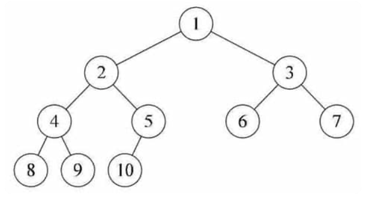

# CS61B 优先队列与堆 priovity queue

# 1. 优先队列 Priority Queue

## 1.1 定义

优先队列(Priority Queue, 简称PQ), 是一种队列, 他支持快速插入/删除最值操作.

或者我们换个说法, 优先队列支持快速处理高优先级元素, 如果是键值小的元素优先级高, 我们称作升序优先队列, 反之称作降序优先队列.两种队列在操作上的逻辑是相似的, 我们这里只讨论生序优先队列.

## 1.2 interface

我们认为PQ起码支持如下method:
```java
/** (Min) Priority Queue: Allowing tracking and removal of 
  * the max item in a priority queue. */
public interface MaxPQ<Item> {
    /** Adds the item to the priority queue. */
    public void add(Item x);
    /** Returns the max item in the priority queue. */
    public Item getMax();
    /** Removes the max item from the priority queue. */
    public Item removeMax();
    /** Returns the size of the priority queue. */
    public int size();
}
```

## 1.3 implement

### 1.3.1 链表
我们(我)最自然想到的, 就是使用链表, 维护一个有序的数列, 实现快速操作最大最小值. 我们分析一下其时间复杂度:
`add`: 最坏时间, 平均时间均为 $O(n)$ , 当插入元素位置位于链表尾端时最大
`gedMax`: 需要时间 $O(1)$
`removeMax`: 需要时间 $O(1)$
`size`: 若提前储存并在add/remove时维护, 只需要时间 $O(1)$

我们发现, 基于链表实现的PQ性能主要局限在`add`上, 如果PQ需要大量的增添操作, 其性能将接近线性

### 1.3.2 BST
> 具体BST的实现我们并不关心, 但我们可以假设BST是平衡的, 具体实现方式参考本人笔记
> [CS61B Search Tree](https://www.cnblogs.com/dddsx259/p/19013490)

基于我们对BST的认识, 我们能直接分析出基于BST的PQ的性能:
`add`: 最坏时间, 平均时间均为 $O(\log n)$
`gedMax`: 需要时间 $O(\log n)$
`removeMax`: 需要时间 $O(\log n)$
`size`: 若提前储存并在add/remove时维护, 只需要时间 $O(1)$

我们发现, 基于我们对BST的深入理解以及很多比较高效的BST优化(红黑树, AVL树, 以及不是BST的B树), 我们可以实现几乎全对数性能的PQ操作.

特别的, 我们可以继续优化基于平衡BST的PQ, 如果我们能维护一个指向最左结点(或其父结点)的指针/引用, 那么`getMax`操作的时间成本 **可以达到常数时间成本** , 也即此时PQ的性能除`add` `removeMax`是 $O(\log n)$ 以外, 均是常数时间性能.

### 1.3.3 二叉堆 binary heap
我们后面会详细介绍数据结构 **堆(heap)**

但现在, 我们先给出其性能:

`add`: 最坏时间 $O(\log n)$, 摊还时间复杂度 $O(1)$
`gedSmallest`: 需要时间 $O(1)$
`removeSmllest`: 需要时间 $O(\log n)$
`size`: 若提前储存并在add/remove时维护, 只需要时间 $O(1)$

综上分析, 我们发现通过二叉堆/平衡BST, 我们可以实现仅有add/remove是对数性能, 其余均常数性能的PQ.

## 1.4 优先队列的应用

数据压缩：赫夫曼编码算法；
+ 最短路径算法：Dijkstra算法；
+ 最小生成树算法：Prim算法；
+ 事件驱动仿真：顾客排队算法；
+ 选择问题：查找第k个最小元素；
etc.

> PS: 个人碎碎念, 61B通过PQ引出堆二叉堆的介绍我认为还是很巧妙的. 堆的重要性质就是其父结点的优先级大于/小于全部的子孙结点, 我们也就得出一个更确定的结论, 其根结点定是整个堆的最优先元素, 恰巧与PQ需要不断的操作最优先元素相呼应.

# 2. 堆

## 2.1 定义

堆是一个树状数据结构, 对于所有的堆(包括子堆), 其父结点的元素优先级都大于其所有子结点的优先级. 通常情况下, 是父结点的键值均大于/均小于子结点的键值

对于父结点键值均大于子结点的堆, 我们称作 **大根堆**, 反之称作 **小根堆**. 我们这里先仅讨论大根堆.

> 通常来讲, 在不特殊说明时, 提到“堆”都是指二叉堆


<!---->

### 2.2.1 二叉堆 binary heap

二叉堆是一颗完全二叉树, 其满足堆的性质.

我们先给出“完全二叉树”的性质:

**完全二叉树**: 

是指对于一颗深度为 $h$ 二叉树, 其每个结点的编号都与一颗高度为 $h$ 的 **满二叉树**相同, 事实上满二叉树就是完全二叉树的一种 **特殊形式**

对二叉树的 **编号** 我们遵循BFS原则, 一层一层的自左至右编号(不编号空结点)直至遍历完整颗二叉树. 以如下的一颗完全二叉树为例, 我们如图所示编号:


<!---->

一种对完全二叉树的直观理解是, 其相当于一颗满二叉树, 在最底层自右至左的连续删除部分结点, 所得到的.

而对于一颗完全二叉树, 因为其除最底层外每一层的元素数量, 以及元素顺序均是固定的, 所以可以用数组进行储存. 每个元素保存在数组中的index便是其 $编号-1$.

也即: 第 $k$ 层的 $2^{k-1}$ 个元素保存在数组的 $[2^k-1, 2^{k+1}-2]$ 索引里

索引为 $n$ 的父结点, 其左右子结点的index分别为: $2n+1, 2n+2$

```java
private int getLeftSon(int index){
    return 2*index+1;
}

private int getRightSon(int index){
    return 2*index+2;
}

private int getFather(int index){
    /*
        java的整数除法“/”是向0取整, 故对于右子结点, 
        其进行“(index - 1) / 2”得到的int结果
        与“(index - 1) / 2”是相同的
    */
    return (index - 1) / 2;
}
```

### 我们回到二叉堆.

鉴于我们对完全二叉树结构的理解, 我们很轻易的就能在脑海中构建出二叉堆的结构. 并用array实现快速访问任意结点(只要我们知道其结构)

#### 2.2.1.2 implement

##### (1) 插入的实现
很自然的, 我们想到, 类似AVL等自平衡BST, 我们可以先找到合适的leaf位置插入新元素, 然后进行一系列操作维护二叉堆的性质. 同时为了尽量保持其完全二叉树的性质, 我们挑最低层的靠右叶子结点插入新元素. 当最底层叶子满时, 我们增加新的层.

那么我们为维护二叉堆的性质, 引入“上浮操作”

```java
public boolean add(Item o){
    if(set.contains(o))return false;
    set.add(o);
    //用一个set维护堆中元素的唯一性
    checkForResize();
    //当需要扩容时扩容
    Items[size] = o;
    floating(size);
    size ++;
    return true;
}
```

> 二叉堆默认是不保证数据唯一性的, 但我们未简化上浮下沉, 所以再使用一个set维护其唯一性


##### (2) 上浮操作
类似冒泡排序, 我们只需要每次比较子结点与其父结点的大小, 当子结点大于父结点时, 遍交换两结点. 我们很容易发现, 只需要这个过程直到无法交换/交换完根结点, 我们就可以直接得到一颗新的二叉堆.

```java
private void floating(int index){
    int parent = getFather(index);
    if(parent < 0)return;
    if(Items[index].compareTo(Items[parent]) > 0){
        swapItems(index, parent);
        floating(parent);
    }
    return;
}
```


##### (3) 删除最大值的实现
删除最大元素也即删除根结点. 当根结点被删除后, 我们需要从两个子结点中找到最大的代替其父结点, 但是由于二叉堆并不保证左右结点的大小顺序, 这一宽松的(相较于BST)限制导致了可能右子结点的子孙结点比左子结点还要大, 我们在左右结点择大向上替位后, 并不方便直接将其子结点直接拼接在另一子树上.

但是我们发现, 当子结点被选取替代根结点后, 以该子结点为根结点的子二叉堆相当于也进行了一次删除最大元素, 所以我们可以递归的不断进行在子结点中择大向上替位, 实现最终的删除最大值.

更简化的, 我们进行下沉操作:

##### (4) 下沉操作
其实是上浮操作的逆操作. 我们每次比较父结点与子结点的大小, 当父结点小于子结点的键值时, 交换, 并继续向下比较, 直到满足二叉堆的性质后.

```java
private void sink(int index){
    int left = getLeftSon(index);
    int right = getRightSon(index);
    int maxSon = -1;
    if(left < size){
        if(right < size){
            if(Items[left].compareTo(Items[right]) >= 0){
                maxSon = left;
            }
            else maxSon = right;
        }
        else maxSon = left;
    }
    if(maxSon == -1)return;
    swapItems(index, maxSon);
    sink(maxSon);
}
``` 

所以对于删除最大值的实现, 我们通常先选取编号最大的叶子结点与根结点交换, 然后删除根结点, 并对位于根结点位置的叶子结点进行下沉操作.

```java
public Item removeMax(){
    if(size == 0)return;
    Item result = Items[0];
    set.remove(result);
    swapItems(0, size-1);
    sink(0);
    size--;
    return result;
}
```


##### (5) 修改键值的实现
直接修改,  并对其进行上浮/下沉操作, 取决于改大还是改小


##### (6) 建堆的实现
我们考虑已有 $n$ 个元素, 如何高效的将其插入堆中. 如果是直接`add` $n$ 次, 那么总时间复杂度是  $O(n\log n)$ .那么有没有更高效的时间复杂度呢?
1. 基于上浮的建堆
   我们将 $n$ 个元素先放进数组, 然后从第一个元素开始`floating`, 最终获得满足二叉堆性质的数据结构.
    ```java
    for(int i=0; i<n; i++){
        floating(i);
    }
    ```
   时间复杂度: 对于每个元素, 其时间复杂度为其深度. 那么总时间由如下式子计算:
   $$
   time = \sum^n_{i=1}\lfloor\log_2 i\rfloor
   $$
   我们设$n=2^p+q,\ 0\le q<2^p$, 那么我们有:
   $$
   time = 1*1 + 2*2 + ... + 2^{p-1}*p+q*(p+1)
   \\所以有:\\
   2time = 2*1+4*2+...+2^p*p+2q*(p+1)\\
   \begin{aligned}
   time &= 2time-time \\
   &= q*(p-1)+ (p*2^p+((p-1)-p)*2^{p-1}+...+(0-1)*2^0)\\
   &= pq-q+(p-1)*2^p+1\\
   &= (p-1)(2^p+q)+1\\
   &= n\lfloor \log_2n\rfloor -n +1\\
   &= \Theta(n\log n)
   \end{aligned}
   $$
2. 基于下沉的建堆
   我们将 $n$ 个元素先放进数组, 然后从最后元素开始`sink`, 最终获得满足二叉堆性质的数据结构.
   又注意到叶子结点无需下沉, 其实我们可以从
    ```java
    for(int i = Integer.maxBitOne(n)-1; i>=0; i--){
        sink(i);
    }
    ```
    时间复杂度: 由于对于在底层的元素下沉时间少元素数量多, 所以下沉的时间是显著小于使用上浮的建堆的.
    对于第 $k$ 层的元素, 其下沉消耗时间为 $\Theta(\log_2n-k)=\Theta(\log n-k)$
    我们设$n=2^p+q,\ 0\le q<2^p$, 那么我们有:
    $$
    \begin{aligned}
    time &= 1*\lfloor\log n\rfloor + 2*(\lfloor\log n\rfloor-1)+...+2^{p-1}*1\\
    &= \sum_{i=1}^pi*2^{p-i}
    \end{aligned}
    \\
    \begin{aligned}
    time &= 2time-time\\
    &= 2^p+((3-2)*2^{p-1}+...)\\
    &= 2^{p+1}-1\\
    &= \Theta(n)
    \end{aligned}
    $$

##### (7) 二叉堆的合并
两个二叉堆合并, 由上述讨论, 直接把两个堆的元素直接重新建堆, 通过使用下沉, 能达到 $O(n)$ 的时间复杂度.

### 2.2.2 配对堆 paring heap

配对堆是一种支持 $O(1)$ 时间合并的数据结构. 它本质上是一个约束极为宽松的多叉树, 这棵树满足堆的性质即为配对堆.

本质上, 二叉堆也是一个配对堆, 只不过其通过维护严格的完全二叉树结构, 从而确保每步操作的时间复杂度. 相比之下, 由于配对堆的结构极为宽松, 它不维护任何如深度, 排名等的额外信息, 所以在实际操作时我们常常通过一套精心设计的操作顺序来保证它的总复杂度，[原论文 The pairing heap: a new form of self-adjusting heap](https://www.cs.cmu.edu/~sleator/papers/pairing-heaps.pdf)将其称为「一种自调整的堆（Self Adjusting Heap）」. 在这方面和 Splay 树（在原论文中被称作「Self Adjusting Binary Tree」）颇有相似之处。

我们接下来略介绍一下配对堆各个操作的实现思路:
PS:本处也是以大根堆为例
PS:本处常用儿子-兄弟表示法(Child-Sibling representation), 笔者所写code也不例外
我们约定`Node`结构:
```java
private class Node{
    Node child;
    Node sibling;
    Node parent;
    Item value;

    public Node(Item v){
        this.value = v;
        this.child = null;
        this.sibling = null;
        this.parent = null;
    }

    public void disengage(){
        if(this.parent == null)return;
        Node cur = this.parent;
        if(cur.child == this){
            cur.child = this.sibling;
            this.sibling = null;
            this.parent = null;
            return;
        }
        cur = cur.child;
        while(cur != null && cur.sibling != null){
            if(cur.sibling == this){
                cur.sibling = this.sibling;
                this.sibling = null;
                this.parent = null;
                return;
            }
            cur = cur.sibling;
        }
    }

    public void addChild(Node node){
        if(node == null)return;
        node.disengage();
        node.parent = this;
        if(this.child == null){
            this.child = node;
            return;
        }
        this.child.addSibling(node);
    }

    public void addSibling(Node node){
        node.disengage();
        if(this.sibling == null){
            this.sibling = node;
            node.parent = this.parent;
            return;
        }
        node.sibling = this.sibling;
        this.sibling = node;
    }
}
```

#### (1) 合并
由于配对堆的性质宽松, 我们只需要比较两个堆的跟结点的大小, 然后将较小的根结点直接连接成为根结点的子结点即可
```java

public Node meld(Node A, Node B){
    //返回合并后的根结点
    if(A == null)return B;
    if(B == null)return A;
    if(A.value.compareTo(B.value) > 0){
        A.addChild(B);
        return A;
    }
    else{
        B.addChild(A);
        return B;
    }
}
```
很容易看出, 每次`meld`操作的性能都是常数时间级别的, 这也是配对堆的高效之处.

#### (2) 插入
我们只需要每次插入时把新结点看作一个配对堆, 进行合并操作, 就可以实现 **常数时间级别** 的插入.
```java
public boolean add(Item item){
    if(set.contains(item))return false;
    set.add(item);
    Node node = new Node<>(item);
    this.root = meld(this.root, node);
    size++;
    return true;
}
```

#### (3) 删除最大值
不难发现, 上述两操作都十分的“惰性”, 他们只是简单的维护了树状结构和堆的性质, 其得到的结构在极端的数据情况下可能会退化成链表. 所以在进行删除操作时, 我们会进行一个维护数据结构的操作`merges`.

当我们删除根结点时, 会得到一片森林(由根结点的所有子结点代表的子树所组成的森林), 我们需要对这个数据结构进行操作, 从而维护配对堆.

最自然的, 我们会想到, 可以直接从所有子结点中找到值最大的, 作为新的父结点, 但这样其实就丧失了配对堆所需求的高效查找最优先元素的意义. 

我们又考虑到, 配对堆最显著的特点是合并速度极快($O(1)$), 包括`add`操作实际上也时通过`meld`操作实现的, 那么我们如何利用这一特点既维护配对堆的性质, 又能优配对堆的结构呢

很自然的, 我们想到从最左的child结点开始, 依次与右边siblings`meld`, 从而最终实现维护堆结构. 这样做显然是正确的, 但是时间性能上已经欠缺(可能是 $O(n)$ 级别的), 所以我们考虑使用递归的方式二分的解决问题, 实现对数级别时间复杂度.

```java
private Node merges(Node x){
    if(x == null || x.sibling == null)return x;
    Node y = x.sibling;
    x.sibling = y.sibling;
    y.parent = null;    //减少因在addSon时调用disengage造成的性能消耗
    return meld(merges(x.sibling), meld(x, y));
}

public Item removeMax(){
    Item result = this.root.value;
    this.root = merges(this.root.child);
    size--;
    set.remove(result);
    return result;
}
```

#### (4) 增大某元素的值

我们在增大某元素的值后, 以其为根的子配对堆已经满足性质, 但其与其父结点的关系可能会改变, 我们只需要把这个结点和原本的堆进行合并即可

#### (5) 减小某元素的值
在以其为根的子配对堆中删除最大项, 然后再添加新值即可

#### 时间复杂度: 
具体分析很复杂, 笔者并为深究, 以下是[OI.wiki](https://oi.wiki/ds/pairing-heap/#删除最小值)的总结, 以及其引用论文的链接
PS. OI.wiki采用的是最大堆, 笔者为与2.2.1二叉堆相对应, 故以最大堆分析, 实际无影响


<!---->

参考链接:
1. [The pairing heap: a new form of self-adjusting heap](http://www.cs.cmu.edu/~sleator/papers/pairing-heaps.pdf)
2. [On the efficiency of pairing heaps and related data structures](https://dl.acm.org/doi/10.1145/320211.320214)
3. [Improved upper bounds for pairing heaps](https://arxiv.org/abs/1110.4428)
4. [Towards a Final Analysis of Pairing Heaps](http://web.eecs.umich.edu/~pettie/papers/focs05.pdf)

--2025.8.8 后续的看心情继续TODO:更新左偏树与佩波那契堆.

### 2.2.3 左偏树 Leftist Tree

大部分的堆都只维护了根与子结点的关系, 而没有对左右子结点加以限制(相较于BST的大小顺序). 左偏树中, 我们维护了左右子树的一个额外信息“dist”. 以起到约束数据结构, 优化性能的目的.

#### 2.2.3.1 definition:
**外结点(external node)**: 当一个结点有至少一个一个空子结点时, 被称作外结点.
**`dist`(在部分外文文献中也被称作`s-value`)**: 一个结点到其最近的子代外结点所经过的边数.
> 我们定义, 外结点的`dist`为 $0$ , 空结点的`dist`为 $-1$

接下来, 我们开始规定左偏树的约束(or Invariant):
#### 2.2.3.2 Invarian & Property

左偏树首先要满足的两个约束/不变量便是如下两点
1. 满足堆的限制, 我们这里以大根堆为例, 也即:
   1. 根结点的键值大于其所有子结点的
2. 结点左子结点的`dist`不小于其右子结点的`dist`

基于这两条约束, 我们不难发现几个在我们后续分析的过程中很有帮助的性质:
1. 某结点的`dist`等于其左右子结点`dist`最小值+1
   1. 考虑到约束2, 我们发现, 其实我们有:
   $dist=dist_r+1$
2. 对于一个有 $N$ 个结点的左偏树, 其`root`结点的`dist` 最多为 $\log_2 (N+1)-1=O(\log N)$
proof:
我们转换形式, 也即:
$$
N\ge 2^{d+1}-1, 其中d是root的dist
$$
我们考虑使用数学归纳法证明
(1) 当 $d=0,1$时, 分别对应root是外结点与root有两个子结点情况, 符合猜想
(2) 我们假设当 $d\le k$ 时, 均有 $总结点数\ge2^{d+1}-1$
那么我们考虑 $d=k+1$ 的情况
由于性质1, 我们知道`root`的左子树`dist`最小值为 $k$, 右子树`dist`只能为 $k$ 
那么左右子树的结点个数至少为:
$$
N_{d=k}\ge 2^k-1
$$
故有:
$$
N_{d=k+1}\ge 2\times N_{d=k}+1\ge2^{k+1}-1\\
Q.E.D.
$$

#### 2.2.3.3 implement

##### (1) 合并操作
合并操作时左偏树其余操作的基础(类似配对树), 甚至维基百科中文站并未介绍除合并操作以外的操作www

<!---->

我们选取两颗子树根的最大值作为新的堆的根.
+ 若该结点为外结点, 那么合并直接结束.
+ 若不是, 则其左子树为新的左子树, 其右子树与另一个堆递归的继续合并成为新的右子树. 若合并后`dist_r>dist_l`, 那么交换左右子树.

example code:
```java
private Node meld(Node A, Node B){
    if(A == null)return B;
    if(B == null)return A;
    if(A.value.compareTo(B) < 0) return meld(B, A);
    A.right = meld(B, A.right);
    if(getDist(A.left)< getDist(A.right)) A.swapChildren();
    A.dist = getDist(A.right) + 1;
    return A;
}
```
时间复杂度分析:
我们设两个堆的结点数分别为 $m,n$
我们每次合并操作时, 如果有下一次递归的合并, 那么其中A(or B)的右子树`dist`的值比A小1, 也即每次合并操作都令两个作为参数的树dist之和减小1

由性质2可知, $dist_A+dist_B=\Theta(\log m+\log n)$
故总递归次数为 $\Theta(\log m+\log n)$, 也即总时间复杂度


##### (2) 添加元素
直接把新元素作为堆与原堆合并即可

##### (3) 删除最大元素
直接把左右子树合并即可

##### (4) 修改某一元素的值
在这个子树删除最大元素, 然后把新值添加

##### (5) 建堆
类似配对堆的删除最大元素中, 合并所有子结点的操作

### 2.2.4 斐波那契堆 Fibonacci heap

斐波那契堆是一种除删除外所有操作均能达到常数时间级别的高效的树结构堆. 斐波那契堆的名字, 来自其在分析运行性能时, 用到了斐波那契数. 

其犹豫较宽松的约束, 在插入, 合并等操作中, 可以惰性的以较高的性能解决操作, 但也因此, 我们必须在一些步骤中以额外的复杂操作来维持其高效的性能(删除堆顶元素时)
PS. 有点类似于配对堆

#### 2.2.4.1 不变量
我们定义一个结点的 **度数(degree)** 是其所有直接相连的孩子结点的数量. 在具体的斐波那契堆实现中, 我们要确保如下几个“不变量”:
1. 每个结点的度数维持在 $O(\log n)$ 级别.
2. 对于度数为 $k$ 的结点, 以其为根的子树大小维持在 $\Omega(F_{k+2})$ 级别, 其中, $F_i$ 指的是第 $i$ 个斐波那契数

接下来是我们实现需要实现的操作

#### 2.2.4.2 结构
佩波那契堆本质上是一片森林, 所有构成该森林的树的根被储存在一个array里, 为便于操作, 我们通常使用 **双端队列 deque** 来循环储存一组根结点, 并维护一个指向最大值所在根的指针.

#### 2.2.4.3 实现
```java
public class FibonacciHeap<V> implements MaxPQ{
    private class Node{
        Node next;
        Node prev;
        V value;

        public Node(V val){
            next = null;
            prev = null;
            value = val;
        }
    }

    Node root;
    int degree;

    public FibonacciHeap(){
        root = null;
        degree = 0;
    }
}
```

##### (1) 合并
很容易的, 我们将两组根结点合并为一组, 并比较两个最大根, 维护唯一的最大根指针.
```java
private  merge
```

#### (2) 插入值
我们把插入的值看作一个单独的斐波那契堆, 执行合并
```java

```

#### (3) ! 取出最小值 !
在这个操作时, 我们进行维护斐波那契堆性质的绝大部分操作.
我们分为三个阶段:
1. 我们取出最大根所指的根结点, 需要 $O(1)$
2. 我们两两归并degree相同的子根结点, 直到所有根结点的degree两两不同.
3. 我们在子根队列中找到最大的根结点, 标记. 这一步消耗 $d=O(\log n)$
```java

```

--- 2025.8.16 代码以及时间复杂度部分之后再补, 懒了
